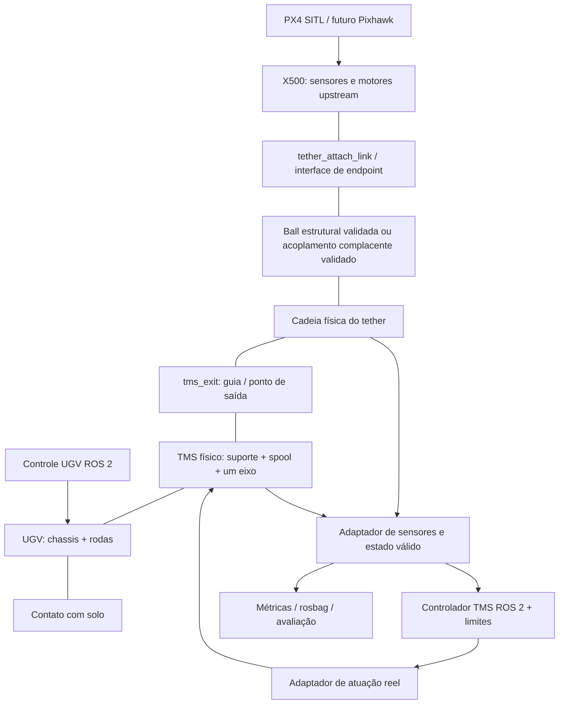

# Plano incremental do sistema marsupial próprio — X500/PX4, tether, TMS e UGV

**Data:** 2026-09-05. **Projeto-alvo:** `/home/lima/codes/ic/drone-cabo`, commit `e573c0d1f8b0ec00e000a5dddfa8ed824bf9c14a`. **Natureza:** análise arquitetural e handoff; nenhuma implementação executada. Somente este documento foi criado. Não houve alteração de PX4, tether, configuração, modelos ou controladores; não houve commit/push.

## 1. Decisão executiva e escopo

Preservar PX4 v1.14.4, X500 upstream, os geradores locais, a conexão angularmente livre, os cálculos de ângulo e a infraestrutura de avaliação. O projeto já superou o primeiro voo com cabo livre e já possui um protótipo ancorado por forças. Não reiniciar essas frentes nem substituir o tether pelo SDF marsupial de referência.

A sequência proposta é **consolidar medição e baseline → validar os dois endpoints com comprimento fixo → estação estática → reel isolado/instrumentado/atuado → controlador em bancada → comprimento variável → TMS no UGV parado → movimento lento → movimento combinado**. O controlador de tensão só será validado no cabo real simulado depois que existir uma relação física entre atuação e comprimento/tração; antes disso, sua validação será em uma planta de bancada explicitamente identificada.

O maior risco de longo prazo é liberar/recolher cabo mantendo massa, continuidade de constraints, energia e contatos. O bloqueio imediato original era anterior: confiabilidade da instrumentação e do acoplamento ancorado. O erro no parser de saturação foi corrigido em 2026-09-06; a inconsistência de ponto de aplicação de força segue identificada por confronto com a API 7.9.0 (§4).

**Estado atual:** A0 foi executada e aprovada. A próxima fase marsupial deve aguardar instrução explícita.

### Convenção de evidência

- **C — código:** fonte atual, XML, bibliotecas/versões instaladas ou cálculo reproduzido nesta auditoria.
- **R — resultado registrado:** ensaio descrito na documentação anterior. Não foi repetido nesta rodada; arquivos ULog existem, mas a vinculação de cada tabela a hashes de modelo/configuração ainda não está completa.
- **I — inferência:** consequência técnica sustentada pela fonte, sem comprovação dinâmica local nesta rodada.
- **P — proposta:** trabalho futuro, tolerância inicial ou opção arquitetural; não confundir com funcionalidade entregue.

C tem precedência sobre README quanto a configuração. R sustenta apenas a configuração realmente ensaiada, não todos os requisitos de aceitação atuais. Relatórios com adendos devem ser lidos até o fim: alguns corrigem explicitamente seu próprio texto original.

## 2. Referências analisadas e reconciliação

O diretório inicial da sessão era o checkout da referência. O alvo foi identificado pelo conteúdo do pedido e pelos arquivos locais em `drone-cabo/refs/`.

| Fonte local | Uso e limites |
|---|---|
| [Análise de referência](../refs/MARSUPIAL_TETHER_REFERENCE_ANALYSIS.md), integral, incluindo revisão cruzada | Arquitetura, parâmetros, fluxo, APIs Classic, limitações de reprodução; análise inicial Codex e comentários Claude Code |
| [Análise cabo/carretel/UGV](../refs/MARSUPIAL_TETHER_UGV_CODEBASE_ANALYSIS.md), integral, incluindo D1–D16 e A1–A11 | Aprofundamento físico e correções posteriores; o append esclarece que sua revisão independente não representa outro processo de simulação |
| [Handoff](../refs/MARSUPIAL_TETHER_HANDOFF.md), integral | Resumo útil, porém anterior às correções detalhadas do segundo documento |
| [README da referência](../refs/README.md) | Intenção, cenários e resultados alegados pelos autores; parâmetros não substituem o SDF |
| Checkout `../refs/marsupial_simulator_ros2`, SHA `d9046774cada2f0b679fb0dfdc1857516fc36936` | Confronto direto de Dockerfile, CMake, SDFs ativos, controller e attach |
| `../refs/marsupial_analysis_support/gazebo_ros_link_attacher`, SHA `2879cf838565a2603bf03ba4f1ea202965ad0304` | Confronto direto da implementação de attach/detach |

As análises reportam leitura do PDF local arXiv `2412.12776v3`, de 2025. Nesta rodada o artigo é evidência mediada por essas análises e pelo README; não se afirma nova reprodução do artigo nem equivalência com a publicação IEEE anunciada em 2026. O build integrado da referência havia falhado em `gazebo_dev`; não há validação dinâmica independente da referência nestes relatórios.

### 2.1 Concordâncias sustentadas pelo código

- ROS 2 Humble, Gazebo Classic, ODE; UAV SJTU sem PX4; três modelos spawnados separadamente.
- Cabo ativo: 125 links, 124 universal, massa declarada 0,0015 kg/link e 0,1875 kg total; 123 colisões cilíndricas; 125 instâncias de LiftDragPlugin. Inércias próprias isotrópicas de 0,01 kg·m² não correspondem à geometria física.
- Comprimento entre origens inicial calculado nas análises: aproximadamente 17,862586 m. Não usar `125 × 0,15 = 18,75 m` como comprimento livre medido. Trecho final tem geometria/massa por metro diferente.
- Dois attaches criam `revolute` bloqueado em zero. Não há ball de endpoint, reparenting da cadeia nem forças substituindo essas conexões.
- O tambor `box_central` recebe dois joints com o mesmo child. Separar modelos não elimina esse loop nem resolve o segundo parent na stack atual.
- O comprimento total e o número de corpos são constantes. O giro redistribui a cadeia inicialmente helicoidal; não há criação, remoção ou ativação de links durante payout.
- `/cable_length` é estimativa de rotação/comando, não medição geométrica; inexiste sensor/publicação de tensão no fluxo local da referência.
- Há UGV móvel e contato roda-solo; a plataforma de decolagem não é uma conexão rígida UAV–UGV.

### 2.2 Divergências e interpretação adotada

| Questão / versões em conflito | Melhor evidência e resolução | Consequência para este projeto |
|---|---|---|
| Primeira análise: steering 15 kg e roda 10 kg; segunda: 18,75/6,25 kg | **C:** parsing atual de `models/rs_robot/rs_robot.sdf` confirma 18,75/6,25; base 175 kg. Soma explícita 275 kg em ambos os cálculos | Não copiar massas do UGV. Os 282 kg incluindo sete defaults unitários são inferência dependente do backend, não massa medida |
| Handoff/revisão antiga: “nenhuma divergência”; relatório posterior apresenta correções | São documentos de momentos distintos. Usar as correções explícitas, sem apagar o histórico | O resumo antigo não encerra a auditoria |
| Python de controle/catenária “reutilizável diretamente” versus “adaptar” | D14 e os contratos concretos prevalecem: caminhos, nomes, densidade, CSV, filtragem e PoseStamped/PoseArray diferem | Reutilizar matemática/metodologia; adaptar código somente se superar o equivalente local |
| URDF “só TF” versus URDF também hardware | D1 inspeciona `parse_control_resources_from_urdf` na dependência fixada | Para essa versão de gazebo_ros2_control, URDF também é fonte de interfaces. Runtime original não fixado |
| Universal transmite momento “só nos eixos livres” | D2 corrige a mecânica: reação na combinação angular restringida; mola/amortecimento nos eixos livres | Não transplantar universal supondo cabo puramente tracionado |
| Parâmetros de contato “ausentes em todo sistema” | D3 restringe a ausência ao cabo; o world tem máscara, max_contacts e obstáculos com kp/kd | Fixar world e propriedades de ambos os membros do par |
| Atrito 1 implica auto-colisão / min_depth limita penetração | D4/D5: self-collide não habilitado no fluxo; min_depth é tolerância para correção, não limite máximo | Exigir testes de contatos; não herdar garantias sobre nós/espiras |
| Massa total constante implica massa enrolada constante | D6: corpos mudam de posição; massa de um subconjunto espacial e seu segundo momento podem mudar | Conservar massa total é desejável. Instrumentar separadamente reserva e trecho exposto |
| `L=L0−rΔθ` versus fórmula com wind_sign | **C:** controller usa `L=L0−wind_sign·rΔθ`; default -1 dá sinal positivo | Calibrar sinal e unwrap, não copiar fórmula resumida |
| Centro do tambor = saída = link_0 | D8/A3 distinguem centro, ponta enrolada e saída livre; há deslocamento entre hélice e tambor | Criar frame de saída explícito; offsets transformados por pose completa |
| Identidade “no request”; fixed impossível; detach destrói | **C:** request só nomes; identidade em `Load`, `physics->CreateJoint("revolute")`; `Detach` mantém registro para reutilização. Não há teste de impossibilidade de fixed | Não atribuir ao hack capacidades ou necessidades que a fonte não demonstra |
| Toda lógica num único follower | **C/R:** experiment, to_point e manual usam controladores distintos; to_point mistura unidades | Adaptar somente o conceito do encoder e feedback, não o conjunto de nós |
| “Não há modelagem de tensão” / “não há enrolamento físico” | D12/A11: há reações e redistribuição por dinâmica/contato normal; faltam medição e fidelidade demonstrada | Separar modelagem, observabilidade e validação |
| Custo linear com N | D13: contagem de objetos é linear; custo de solver/contatos não foi demonstrado linear | Benchmark local, sem extrapolar RTF da referência |
| Fórmula cilíndrica Izz axial aplicada ao link X | D15: tensor precisa de rotação e COM coerentes | Auditar também geradores locais; fórmula correta em frame errado continua errada |
| Comentários/figuras equivalem a validação física | D16 e limites de ambos os relatórios rejeitam essa equivalência | Resultados do paper, intenção de autor e execução do checkout são evidências distintas |

Para correções de semântica externa, a evidência detalhada está nos links fixados e seções D/A do segundo relatório; esta rodada reconfirmou diretamente massas, topologia, código de attach e equação ativa. Não afirma ter reexecutado cada ensaio ou cada cálculo do append.

## 3. Stack real e compatibilidade

### 3.1 Inventário confirmado nesta sessão

| Camada | Referência | Projeto atual / trilha PX4 | Baseline ROS local anterior |
|---|---|---|---|
| ROS | ROS **2 Humble**, Docker `osrf/ros:humble-desktop`; não ROS 1 | ROS 2 Humble disponível, dois pacotes ament_python; voo PX4 independe deles | Humble, rclpy, ros_gz_sim/bridge |
| Gazebo | **Classic 11**; patch não fixado no Docker. Classic local 11.14.0 não prova a versão dos ensaios dos autores | **Gazebo Sim 7.9.0 / Garden**, `gz sim --versions` | Ignition Gazebo **6.18.0 / Fortress**; `start_sim` inclui launcher ROS cujo default instalado é `gz_version=6`, sem sobrescrevê-lo. Esse é o caminho default atual; não presumir o binário de um ensaio histórico sem log |
| PX4 | Não existe; propulsão/controlador SJTU simplificados | **v1.14.4**, SHA `1555f2bd2229544c43966ab5f94879c41d8e1e01`, detached HEAD limpo | `meu_drone` com MulticopterVelocityControl, sem PX4 |
| API/plugin | `gazebo::ModelPlugin`, WorldPlugin, `gazebo_ros`, physics pointers, ros2_control Classic | `gz::sim::System`, Configure/PreUpdate/ECM; gz_bridge PX4; SDF 1.9 nas variantes | Sistemas Sim/Ignition, SDF 1.8, bridge ROS |
| Física | **ODE** explícito em theatre e demais worlds | DART padrão do Physics; **gz-physics6 6.7.0**, DART **6.12.1** instalados; falhas DART registradas nos ensaios | ignition-physics5 **5.4.0** disponível para Fortress; histórico relata DART |
| Passo configurado | theatre 0,004 s (250 Hz), outros 0,001/0,002 s | default PX4 0,004 s (250 Hz); probe inter-model 0,001 s | `start_sim` gera 0,0004 s (2500 Hz), apesar do nome “1ms” |

Ignition Gazebo e Gazebo Sim pertencem à linhagem nova; a mudança de nome não torna Classic compatível. “ODE” usado como detector de colisão dentro de DART não significa que a dinâmica seja a stack Classic/ODE. O default e a seleção de engine são documentados na [API de física Sim 7](https://gazebosim.org/api/sim/7/physics.html). Não extrapolar funcionalidades de Sim 9/10 ou gz-physics recentes para 7/6.

**Inconsistências locais a resolver incrementalmente:**

- `ldd` do bridge ROS instalado aponta para ignition-transport11/msgs8, enquanto PX4/CMake e o plugin binário local usam gz-transport12/msgs9. Isso não prova falha de comunicação, mas exige teste explícito Garden↔ROS antes de reaproveitar o launch.
- `tools/build_tether_force_plugin.sh` pede transport13/msgs10 junto com sim7. O binário existente aponta para transport12/msgs9. A receita atual não demonstra reprodução do binário ensaiado. Adotar futuramente dependências coerentes com sim7 e build local isolado, sem mudar PX4.
- O world default do PX4 tem Physics, sensores de voo e Contact, mas não carrega ForceTorque. A biblioteca `libgz-sim7-forcetorque-system.so.7.9.0` existe. A falta histórica de wrench não demonstra ausência da funcionalidade: testar um world externo com esse sistema e o sensor já declarado antes de escrever plugin de sensor novo. A [API ForceTorque 7](https://gazebosim.org/api/sim/7/classgz_1_1sim_1_1systems_1_1ForceTorque.html) confirma publicação via Gazebo Transport.
- A referência não fixa todos os SHAs/versões externos. Registrar essa lacuna é mais exato que inventar uma versão patch ou solver runtime dos autores.

### 3.2 Portabilidade dos componentes da referência

Classificação técnica é distinta da decisão de incorporar. Algo portável pode ser desnecessário porque já existe equivalente local.

| Componente | Classificação solicitada | Justificativa |
|---|---|---|
| Fórmulas gerais de encoder, incrementos positivos/negativos de comprimento | REUTILIZÁVEL DIRETAMENTE | Matemática com unidades/sinais explicitados; não implica copiar o nó que as contém |
| Scripts Python de winch | REUTILIZÁVEL COM ADAPTAÇÃO | ROS 2 compatível em princípio; separar UGV/TMS, corrigir tempo, frames, validação de amostras, limites e contratos |
| Catenária/pós-processamento | REUTILIZÁVEL COM ADAPTAÇÃO | Entradas/parâmetros/seleção de links distintos; priorizar `cabo_avaliacao` existente |
| Discretização, hélice e estratégia de reserva física | APENAS CONCEITO/ALGORITMO | Geradores locais já existem; parâmetros e topologia da referência não são baseline própria |
| SDF de rodas/tambor/obstáculos | REUTILIZÁVEL COM ADAPTAÇÃO | Primitivas aproveitáveis; revisar massa, eixos, contatos, recursos e remover loop. Modelos locais/Garden preferíveis |
| `gazebo_ros_link_attacher`, plugins ModelPlugin locais, LiftDragPlugin Classic | INCOMPATÍVEL COM A STACK ATUAL | API/ABI e ciclo de vida diferentes; usar equivalentes nativos antes de criar implementação ECS |
| Duplo rolamento estrutural | INCOMPATÍVEL COM A STACK ATUAL | Não corresponde à árvore de joints ordinários já demonstrada no caminho DART atual |
| `gazebo_ros2_control/GazeboSystem` | INCOMPATÍVEL COM A STACK ATUAL | Binário Classic; contratos ros2_control são adaptáveis, mas sua adoção não é necessária inicialmente |
| Launch Classic e scripts de spawn | APENAS CONCEITO/ALGORITMO | Não usar gazebo_ros/spawn_entity para Garden; aproveitar readiness como requisito, não os delays |
| SJTU e controlador UAV; msgs não geradas; plataforma de pouso complexa | DESNECESSÁRIO | PX4/X500 e comandos existentes atendem ao objetivo; nenhuma necessidade de substituir autopiloto |
| Tension controller da referência | DESNECESSÁRIO | Não existe implementação a portar; requisito novo com sensores nativos/localmente existentes |

## 4. Estado atual confirmado e lacunas descobertas

Fontes centrais: [gerador original](../src/pacote_do_drone/models/gerar_cabo.py), [parâmetros](../src/pacote_do_drone/tether_parameters.json), [gerador X500](../tools/generate_x500_tethered.py), [gerador ancorado](../tools/generate_tether_anchor_chain.py), [constraint](../src/pacote_do_drone/gz_plugins/TetherForceConstraint.cc), [launch original](../src/pacote_do_drone/launch/start_sim.launch.py), [plano X500 anterior](X500_TETHER_INTEGRATION_PLAN.md), [guia de testes](TEST_EXECUTION_GUIDE.md).

### 4.1 Existem três configurações de tether; não são equivalentes

| Configuração atual em disco | Física e parâmetros confirmados | Estado de validação |
|---|---|---|
| `cabo.sdf`, gerado por `gerar_cabo.py` | 50 segmentos +50 dummies +raiz+ponta = **102 links**, 100 revolute +1 fixed; L=2,5 m; λ=0,06 kg/m; segmentos 0,15 kg + auxiliares 0,006 kg; raio 0,002 m. Ball é a conexão ao drone no launch, não as juntas internas | R: testes cardeais/hover no `meu_drone`; sensor tangente coerente, redundância metrológica pendente |
| `x500_tethered/model.sdf` | 50 `tether_link_i` + attachment +base+4 rotores =56 links; 50 ball +1 fixed attachment +4 revolute motores; L=2,5 m, massa cabo=0,15 kg, raio=0,003 m, inicialização -Z; **sem colisões nos segmentos** | R: etapas 0–4 aprovadas para voo; forças/momentos não medidos diretamente |
| `tether_anchor_chain/model.sdf` | 5 segmentos +anchor_link=6 links; 5 ball +1 fixed ao world; L=2,5 m, λ=0,06, massa cabo=0,15 kg; anchor_link=1 kg fixo; `folded_ground`; **sem colisões nos segmentos**; plugin K=5, C=0,5, Fmax=3 | R: voo com X500 puro, acoplamento bilateral complacente e erro finito. Validação mínima, não cabo tensionado definitivo |

O protótipo ancorado conectava por forças `x500_0::base_link` com offset `(0,0,-0,12)`, sem exigir a presença do link físico `tether_attach_link`. **Superado em A0.3:** a baseline oficial passou a usar `x500_tether_attach_0::tether_attach_link`, um link físico na mesma pose, e o offset virtual está depreciado. Não lançar simultaneamente a cadeia livre embutida e a cadeia ancorada como se formassem um único cabo — por isso a variante `x500_tether_attach` não embute cabo algum. A variante embutida preserva o attachment físico de 5 g e a ligação fixa à base; motores, sensores e controle PX4 permanecem upstream.

### 4.2 Etapas X500 realmente implementadas / resultado disponível

| Etapa anterior | C: implementação / R: resultado registrado | Limite da conclusão |
|---|---|---|
| 0: X500 puro | PX4 compilado, arm/takeoff/hover/land, RTF≈0,992 | Baseline de voo registrada, não teste novo desta rodada |
| 1: attachment | `tether_attach_link`, offset -0,12 m, massa 0,005 kg; RTF≈0,993 | A variante mínima antiga não está preservada como artefato separado pelo gerador atual |
| 2: ball +carga mínima | R: voo aprovado, RTF≈0,991 | Sensor SDF declarado, wrench indisponível no ensaio |
| 3: cadeia livre 5/10 links | R: L=0,30 m, massa 0,018 kg, RTF≈0,994; inicializações horizontais anteriores abortaram | Não extrapolar a colisões nem ao cabo ancorado |
| 4: livre 50 links | R: L=2,5 m, roll/pitch máximos 0,75°/1,09°, RTF≈0,988 | Sem colisões; ausência de torque foi inferida da atitude, não medida |
| 5: âncora adicional no último child | C: opção `--anchored` cria segundo parent; R: FAIL DART | Não executar essa opção como solução futura |
| Probe ball inter-model | SDF mínimo existe; R: 1000 iterações sem erro | Dois corpos genéricos, não integração PX4 completa |
| 5: acoplamento por forças | Plugin/gerador existem; R: configuração no solo com erro RMS/max 0,199/0,210 m, força RMS/max 0,993/1,061 N, atitude≈0,9°, RTF≈0,99 | Conexão complacente, sem contato dos segmentos; “0% saturação” requer nova coleta confiável |
| Sensor angular no X500 | Matemática reutilizável; LeitorCabo ainda usa nomes `segment_i`, `ponta_cabo` e odometria `/meu_drone` | Integração específica X500 não entregue |
| TMS/payout/UGV | Há modelo local parcial de reel; não há sistema marsupial móvel integrado | Não implementados/validados |

`CURRENT_STATUS.md` ainda diz que o tether não foi integrado ao PX4. Isso está superado por código e pelo plano X500 atualizado. `ARCHITECTURE.md` mistura tabelas históricas de 40/50 segmentos. Este novo documento distingue estado em disco e histórico sem modificar aqueles arquivos.

### 4.3 Achados que condicionam o planejamento

1. **C — parser de saturação incorreto.** `parse_vector3d_stream()` finaliza a amostra assim que recebe x/y, antes de z. Execução isolada em memória com duas mensagens `x:0.2,y:3,z:1` e `x:0.3,y:3,z:1` retorna flags `[0,1]`, em vez de `[1,1]`: primeira amostra perde z e as seguintes podem herdar o anterior. Campos zero omitidos pelo formato textual também exigem delimitação correta de mensagens. Um “0%” histórico não é prova de segurança. Não houve correção nesta sessão.
2. **C+I — ponto de força não coincide com ponto observado.** O plugin calcula posição/velocidade com offset da origem do link, mas passa o mesmo vetor a `AddWorldForce`. Na fonte tag 7.9.0 essa sobrecarga soma a posição do COM ao argumento. No último segmento horizontal de 0,50 m: endpoint desejado x=0,50, COM x=0,25; força acaba aplicada em x=0,75 local. A discrepância de 0,25 m afeta o momento quando a força não é axial. Corrigir somente em etapa futura com teste de wrench; não chamar a implementação presente de acoplamento metrologicamente validado. Evidência: [Link.cc 7.9.0, AddWorldForce](https://raw.githubusercontent.com/gazebosim/gz-sim/gz-sim7_7.9.0/src/Link.cc), e header instalado `Link.hh:196–205,298–306`.
3. **C+I — rotação duplicada da inércia nas variantes X.** Os dois geradores novos montam `diag(Iaxial,Itransverse,Itransverse)` e também rotacionam `inertial/pose` por pitch=π/2 junto com a geometria. Para cilindro ao longo de X, basta tensor em X com pose inertial sem essa rotação, ou tensor em Z com rotação; a combinação atual troca o eixo físico. A variante livre -Z evita esse problema; `folded_ground` o contém. Registrar e testar antes de atribuir fidelidade ao caso ancorado.
4. **C — gerador original não garante densidade uniforme local na senóide.** `segment_lengths` varia pela amostragem uniforme em parâmetro; `mass=λL/N` é igual em todos. A massa total está correta, mas λ_i=m_i/l_i varia. Manter a baseline e documentar; uniformizar arco ou massa local somente em experimento separado, não silenciosamente.
5. **C — `folded_ground` só aceita N=5.** Não há sweep 10/20/30 desse caso por mera mudança da CLI. Generalizar geometria preservando comprimento, endpoints e folga é subetapa necessária.
6. **C — sensor e métricas já existem, mas são de outra trilha.** WrenchStamped `/cabo/tensao_drone`, `/cabo/tensao_carretel`, `/cabo/conexao_drone` estão no launch antigo; não existem automaticamente no processo PX4. `hover_metrics` usa norma da força, não projeção axial, e inicializa valores em zero; adicionar validade/freshness antes de usá-lo como gate.
7. **C — ForceTorque nativo está instalado.** Primeiro testar sistema de mundo ausente e nomes/frame/direção do sensor. Criar um extrator ECS de reação apenas se o sensor nativo não atender após teste mínimo.
8. **C — usar modelo existente já é previsto no PX4 atual.** `px4-rc.simulator:119–142` contém `PX4_GZ_MODEL_NAME` com `gz_bridge start -n`, desde que `PX4_GZ_MODEL` esteja vazio. Isso reduz a lacuna antiga sobre spawn duplicado. **P:** ensaiar world externo com X500 predeclarado, nomes preservados, depois ball inter-model. Não modificar o autopiloto nem presumir sucesso físico dessa composição.
9. **C — proteção do plugin é parcial.** Existe clamp de força e respeito a pausa; não há tratamento completo de NaN, reset/recriação de entidades, estados de conexão, tempo limite de aquisição ou telemetria estampada. A mola é bilateral e vetorial; não modela ruptura nem garante cabo unilateral. Forças iguais/opostas não bastam para provar consistência de momentos/energia com endpoints separados.

## 5. Reaproveitamento do tether e matriz consolidada

### 5.1 Decisão por elemento já existente

| Elemento | Decisão | Justificativa / trabalho posterior |
|---|---|---|
| Geração programática e CLI local | MANTER | Fonte própria já disponível; adicionar configurações/saídas por ensaio futuramente, evitando sobrescrever baseline |
| Cadeia multibody e discretização | MANTER | Reusar ball das variantes PX4 e manter baseline de pares revolute como comparação; não trocar por universal da referência |
| Geometria senoidal/-Z/folded_ground | ADAPTAR | Preservar casos aprovados; generalizar folded para N e contatos, com soma de arcos/endpoints validada |
| Massa total e λ=0,06 kg/m | MANTER | 0,15 kg em 2,5 m, parâmetro explícito; não importar 0,01 kg/m da referência |
| Massa local e auxiliares | ADAPTAR | Explicitar reserva/massa exposta e a variação de λ_i na senóide; não misturar 0,150 e 0,156 kg |
| Fórmulas de inércia/COM | ADAPTAR | Preservar fórmulas cilíndricas; corrigir futuramente frame X dos novos geradores mediante comparação isolada |
| Ball no attachment e ponto -0,12 m | MANTER | Liberdade angular já sustentada pelo histórico; força com braço de alavanca físico ainda produz momento sobre o UAV |
| Juntas internas/spring/damping antigos | MANTER | Não retunar nem igualar a ball ideal; benchmark físico separado decide uso por configuração |
| `--anchored` que dá segundo parent ao último elo | SUBSTITUIR | Futura composição de árvore válida/constraint compatível; preservar cenário somente como regressão negativa identificada |
| Colisões dos segmentos | ADAPTAR | Manter antigas; variantes PX4 sem colisão são baseline de voo, habilitar progressivamente chão→obstáculo→UGV |
| Funções `cabo_angulos.py` e convenção | MANTER | Testes passaram; preservar azimuth/elevation e janela física |
| LeitorCabo/adaptação de poses | ADAPTAR | Nomes, direção da cadeia, frames, comprimento não uniforme e estado válido; janela 0,15 m não equivale a um elo de 0,50 m |
| Sensores force_torque já declarados | MANTER | Conectar sistema nativo e calibrar saída; não duplicar sensor por falta de tópico |
| Plugin de força e coletor | ADAPTAR | Conservar como alternativa experimental; corrigir ponto de força, parser, ABI e observabilidade antes de novos ganhos |
| Métricas, monitor, testes/catenária locais | ADAPTAR | Reusar cálculos; adaptar nomes e validade, manter distinção ground truth/estimativa |
| Componentes removidos nesta rodada | REMOVER: nenhum | Não há motivo para eliminar uma baseline para produzir este plano |

### 5.2 Matriz de reaproveitamento solicitada

| Componente | Projeto atual | Referência marsupial | Decisão |
|---|---|---|---|
| UAV | X500 e `meu_drone` para regressão | SJTU simplificado | MANTER ATUAL |
| PX4 | v1.14.4/SITL | Ausente | MANTER ATUAL |
| tether generator | Três geradores locais | Jinja helicoidal com overrides ineficazes | MANTER ATUAL |
| joints | Ball no X500; pares revolute no original | Universal +constraints Classic | MANTER ATUAL |
| attachment | Link/offset local; force-based; probe ball | Attach Classic rígido | INVESTIGAR — corrigir/validar composição própria |
| sensor angular | Matemática testada e nós existentes | Poses, sem sensor equivalente dedicado | MANTER ATUAL — adaptar entrada X500 |
| tension sensing | FT original; FT X500 declarado; força de acoplamento | Não implementado | INVESTIGAR — integrar nativo antes de criar |
| reel | `carretel.sdf`: suporte, tambor, junta, comando | Duplo rolamento, inércias omitidas | MANTER ATUAL — adaptar ao TMS |
| reel controller | JointController de velocidade; sem supervisor TMS | PD geométrico misturado ao UGV | IMPLEMENTAR NOVO — sobre atuação existente |
| variable length | Ausente nas três cadeias | Redistribuição da cadeia toda | INVESTIGAR — seleção experimental em H |
| UGV | Sem modelo próprio; exemplos Garden instalados | `rs_robot` com quatro direções | IMPLEMENTAR NOVO — composição a partir de modelo nativo existente |
| launch | ROS antigo e receitas PX4/probes | gazebo_ros +delays | MANTER ATUAL — estender entrada PX4 externa |
| evaluation | hover_metrics, monitor, testes, cenários | Bags/catenária com contratos divergentes | MANTER ATUAL — incorporar metodologia de comparação |
| Metodologia de cenários coordenados | Ensaios de voo/cardinais | UAV sobe; UGV translada; ambos se afastam | ADAPTAR REFERÊNCIA |
| Controlador SJTU/mensagens órfãs | Equivalentes desnecessários ao PX4 | Controle de voo alternativo | NÃO NECESSÁRIO |

## 6. Arquitetura-alvo modular



O diagrama representa interfaces físicas, não a direção obrigatória dos parents SDF. Cada child deve ter um único parent estrutural no caminho escolhido; não adicionar uma segunda âncora à cadeia livre já enraizada no UAV. O controle PX4, controle UGV e controle TMS são processos com responsabilidades separadas.

**Estratégia imediata:** manter as duas árvores do protótipo ancorado e aprimorar o acoplamento existente como bancada. **Alternativa estrutural preferencial a investigar em B:** cadeia enraizada na estação com um único caminho até a raiz do X500 predeclarado; adaptar o probe e a opção nativa PX4 de modelo existente. Se uma ball ligar o cabo à raiz do X500, a pose deve representar o attachment sem dar novo parent ao `tether_attach_link` já fixo à base. Só adotar após verificar IMU, rotores, canonical link, nomes de tópicos e voo.

`DetachableJoint` não é ball: usa fixed e exige árvore na versão 7. Não corrige automaticamente o caso de segundo parent. Usá-lo apenas para uma conexão rígida cujo child realmente seja raiz elegível, se necessária; [restrições oficiais Sim 7](https://gazebosim.org/api/sim/7/detachablejoints.html).

### 6.1 TMS mínimo: físico versus abstrato

| Parte | Representação inicial | Evolução |
|---|---|---|
| Suporte/base e `tms_exit` | Frame fixo com geometria simples em C | Fixo ao chassi, carga/COM contabilizados em I |
| Spool | Visual em C; link com massa/inércia e **um** revolute em D | Contato/wrapping só se H justificar |
| Motor/atuador | Abstração de torque limitado ou malha de velocidade limitada | Modelo elétrico/corrente e hardware podem esperar |
| Encoder | Posição/velocidade real da junta, não integral do comando | Unwrap, offset, direção e calibração reproduzíveis |
| Comprimento | `L_encoder_estimated` e qualidade; até H marcado “sem correspondência ao cabo livre” | Encoder reconciliado com mecanismo de payout e reserva |
| Tensão | Sensor nativo/reação na saída; carregamento conhecido para calibração | Estimador por motor apenas secundário, com dinâmica/atrito compensados |
| Controlador | Nó ROS 2 de TMS independente | Real e sim compartilham contratos; sem leitura direta de ECM pelo controlador |
| Limites/estado | Configuração +máquina de estados desde bancada | Watchdog e interrupção de movimento nos adaptadores |

O modelo local `carretel.sdf` já tem `base_suporte` (12 kg), `cilindro_carretel` (3 kg), raio 0,07 m, largura 0,40 m, junta `junta_eixo`, damping=0,01, friction=0,02 e comando Gazebo `/carretel/velocidade`. Seu tensor 0,02 isotrópico não é calibração de cilindro. Suportes já são geometrias do mesmo link, evitando duplo rolamento. Não é carregado pelo caminho diagnóstico normal de `start_sim`; o world legado gerado é outro caminho. Não há ensaio atual que o qualifique como TMS funcional.

**C→D→E→F:** reutilizar essa geometria, depois massa/inércia coerentes e joint passivo, depois encoder/tensão e só depois habilitar atuador. Desabilitar o controlador para o ensaio passivo. Um tambor que gira desacoplado do cabo não libera cabo: chamar sua metragem apenas de estimativa de bancada.

Em F, preferir torque limitado ou o modo por força da malha de velocidade nativa, com saturação demonstrada. O [JointController Sim 7](https://gazebosim.org/api/sim/7/classgz_1_1sim_1_1systems_1_1JointController.html) oferece controle de velocidade e modo por forças. Verificar parâmetros no exemplo instalado antes de depender dos limites. Não introduzir ros2_control inteiro para comandar apenas um eixo quando o sistema nativo já atende; manter a interface ROS independente dessa escolha.

## 7. Comprimento variável: decisão experimental, não importação da referência

### 7.1 Grandezas que não podem ser confundidas

```text
L_total = L_stored + L_released                     [m de material]
L_path  = comprimento geométrico do trecho exposto  [m]
D      = distância reta entre endpoints            [m]
L_encoder_estimated = L0 + s * integral(r_eff(theta) dtheta)
v_payout = dL_released/dt                          [m/s], positivo libera
m_total = m_stored + m_released = lambda * L_total
```

Comprimento fixo permite mudança de forma, não mudança de material disponível. Em cadeia inextensível, L_path aproxima L_released respeitando os offsets físicos, não apenas origens de links; erro do acoplamento deve ser reportado separadamente. Distância reta é só limite geométrico inferior e falha como comando completo com obstáculos. Massas de raiz/dummies/attachment/guia não pertencem automaticamente a `lambda*L`.

`N_active` significa corpos que participam da dinâmica exposta; `N_total_simulated` inclui a reserva ainda física. Na solução de referência N_total é sempre 125. Comprimento livre pode mudar mesmo com N_total constante. É preciso uma regra explícita de classificação pela passagem na guia, não somente distância radial ao tambor.

### 7.2 Alternativas na stack 7.9.0 / physics6

Avaliações são **P/I**, não benchmarks já executados. “Compatível” significa presença de primitivas/API básicas; mutação robusta da cadeia deve ser demonstrada.

| Alternativa | Fidelidade | Complexidade | Estabilidade numérica | Custo | Compatibilidade atual | Integração / reprodutibilidade |
|---|---|---|---|---|---|---|
| Comprimento fixo, gerenciamento de forma/posição | Alta para cabo fixo; não implementa payout | Baixa | Melhor baseline conhecida | Proporcional ao cenário/contatos | Já implementado parcialmente | Alta; excelente controle experimental, insuficiente ao requisito final |
| Cadeia inteira armazenada/enrolada no reel | Pode capturar reserva, massa e contato; fidelidade depende das espiras/guia | Alta | Risco alto por contatos concentrados | Alto mesmo com pouco cabo exposto | Primitivas disponíveis; solver diferente da referência | Média/baixa sem estado inicial e seleção de contatos determinísticos |
| Reserva inteira em caixa/guia simples, sem espiras realistas | Intermediária; massa física conservada | Média/alta | Menos geometria de espiras, mas acúmulo/atrito continuam | Alto, pois todos os corpos existem | Investigável com corpos/joints atuais | Boa bancada comparativa; validar transporte pela saída |
| Criar/remover segmentos | Alta potencial para trecho exposto, se conservar massa/momento | Muito alta | Transições podem injetar impulsos e romper constraints | Pode cair com N exposto | `/world/create` cria modelos, não arbitrary joint runtime; troca da cadeia não demonstrada | Baixa inicialmente; exige plugin e protocolo transacional |
| Ativar/desativar links pré-alocados | Intermediária | Alta | Desativar colisão não desativa massa/constraint; risco de salto de estado | Economia incerta se solver conserva todos os corpos | Não há toggle completo de “link armazenado” demonstrado | Exige verificar API e medir custo, não prometer simplificação automática |
| Juntas prismáticas / seção telescópica | Boa bancada de curso; não é cabo alimentado por si só | Média | Curso limitado mais simples que troca topológica; grandes razões de massa são risco | Baixo/médio | Prismatic é primitiva disponível; massa/geometria variável não vem automaticamente | Alta para bancada; média para cabo híbrido; não alegar conservação sem correção |
| Alterar cadeia/joints/comprimentos em runtime | Alta potencial | Muito alta | Segundo parent, detach/contact e rebuild são riscos centrais | Variável, com picos de reconstrução | ECM não garante alteração equivalente no solver; precisa prova em physics6 | Baixa até ensaios de ciclo/reset; evitar respawn integral a cada tick |
| Híbrida: trecho exposto multibody +reserva abstrata +seção de transição | Intermediária controlável; aproxima reserva, mantém contatos externos | Alta, porém separável | Melhor candidata se transições forem suaves e conservativas | Pode acompanhar só N exposto | Requer adaptador local, não recurso pronto do Sim | Boa se versionar eventos, massa e energia; candidata inicial de H, sem seleção definitiva |
| Cabo totalmente analítico/catenária/força unilateral | Útil para controlador/quase-estática; perde dinâmica multibody e contatos gerais | Baixa/média | Dependente da rigidez e integração | Baixo | Já há matemática de catenária e mecanismo de força reutilizáveis | Excelente planta de teste; não substitui tether físico requerido |

**Decisão:** manter comprimento fixo até G; em H0 comparar uma reserva física simplificada e uma representação híbrida com transição de curso limitado. Não adotar criação/destruição como primeira implementação. H0 deve poder rejeitar ambas se o balanço físico falhar; nenhuma opção é “pronta” só porque SDF aceita o tipo de joint.

### 7.3 Protocolo mínimo de payout/retraction

- Estados do transporte: HOLD, PAYOUT, RETRACT, TRANSITION, LIMIT, FAULT. Transição de segmento tem ID, sentido, instante simulado, material transferido e validade.
- Antes de transitar: saída e segmento alinhados, posição/velocidade finitas, reserva disponível, sem interpenetração e erro de conexão dentro da tolerância; histerese impede chattering.
- Introduzir segmento com pose e velocidade compatíveis com o ponto móvel de saída (`v_exit = v_base + omega_base × r_exit`), incluindo velocidade relativa de alimentação. Nunca inicializar velocidade em zero arbitrariamente.
- Em híbrido, transferir `delta_m=lambda*delta_L` da reserva ao trecho exposto; compensar massa/COM/inércia na estação sem duplicar nem eliminar peso. Preservar momento linear/angular com a reação correspondente sobre o TMS.
- Contabilizar potência de motor, variação de energia cinética/potencial, atrito, amortecimento e fluxo de energia do material. Um segmento surgindo em altura altera energia potencial; registrar de onde vem esse trabalho.
- No recolhimento, só retirar da dinâmica o material que realmente atravessou a saída, resolvendo contatos antes; não teletransportar segmento que esteja enrolado num obstáculo.
- Caso a transição não possa ser concluída: interromper alimentação, permanecer no último estado consistente e emitir FAULT. Sem condição válida, não continuar “integrando comprimento” no software.
- Raio efetivo constante é aceitável inicialmente se explicitamente calibrado; geometria multicamada, motor real e guia de espiras são decisões posteriores.

## 8. UGV progressivo e software

Há exemplos nativos instalados em `/usr/share/gz/gz-sim7/worlds/diff_drive.sdf`, `diff_drive_skid.sdf` e `ackermann_steering.sdf`. O primeiro contém `vehicle_blue/green`, chassis, rodas, DiffDrive e odometria. **P:** adaptar uma única base desse exemplo para I, com massa/COM recalculados para o TMS; não copiar o world inteiro nem os valores de massa cegamente. Isso é menor escopo que o `rs_robot` da referência. Nenhum UGV próprio foi localizado no fluxo `src/` ou entre os modelos gz do PX4 auditados.

Começar com base diferencial, rodas e apoio passivo, comando de velocidade e odometria. Bancada separada prova reta/parada/retorno sem tether. Depois montar TMS com um fixed ao chassi e remover a ligação TMS→world. Uma trava temporária da **base** ao mundo pode isolar I, mas deve ser retirada em J; não deixar âncora residual fixando o cabo ao chão.

Critério essencial: mover chassis deve mover suporte, `tms_exit` e aplicação de carga, sem offsets congelados em coordenadas mundo. Suspensão, navegação autônoma, terreno irregular e pouso sobre plataforma não são pré-requisitos.

A estrutura física de pastas proposta no pedido não exige reorganizar o workspace. Recomenda-se manter:

```text
px4/PX4-Autopilot/                         upstream local intacto
src/pacote_do_drone/models/               tether, x500_tethered, carretel e futuras variantes
src/pacote_do_drone/gz_plugins/           somente adaptações específicas da física
src/pacote_do_drone/pacote_do_drone/      cálculos, adaptadores, métricas existentes
src/pacote_do_drone/launch/ e config/     composição e receitas por fase
src/cabo_avaliacao/                       validação geométrica existente
tools/                                   geradores e coletores existentes
docs/                                    planos e resultados
```

Quando surgirem módulos com dependências próprias: novos pacotes `tms_control` (ROS puro), `marsupial_sim` (adaptação/modelos/launch), `ugv_bringup` e, somente se necessário, `tms_interfaces`. Não mover arquivos apenas para coincidir com uma árvore conceitual. Não criar pacote separado para cada sensor. O plugin C++ deve ganhar build reproduzível quando for alterado; não exige remodelar todos os pacotes Python.

Para Sim2Real, controlar tensão/comprimento/velocidade por mensagens com tempo, unidades e qualidade. Ground truth de links, energia e ECS ficam no adaptador/avaliação. Drivers reais de encoder/load-cell/motor substituem o adaptador Gazebo. PX4 uXRCE-DDS/px4_msgs ou outro adaptador oficial devem preservar a versão v1.14.4 e conversões ENU/FLU↔NED/FRD; essa ponte ainda não está configurada no projeto. Evitar enviar `/meu_drone/cmd_vel` ao PX4 como se fosse interface de voo existente.

## 9. Interfaces, taxas e métricas comuns

### 9.1 Interfaces propostas, respeitando nomes existentes

| Interface | Estado / tipo / semântica |
|---|---|
| `/cabo/tensao_drone`, `/cabo/tensao_carretel` | Existentes na trilha antiga: WrenchStamped. Reusar e explicitar origem/frame/sinal/calibração; não criar `/tether/tension` redundante |
| `/cabo/conexao_drone` | WrenchStamped da conexão antiga; mapear sensor equivalente se houver, distinguindo-o da junta interna do último segmento |
| `/cabo/conexao/force`, `/error`, `/stats` | Existentes somente Gazebo Transport Vector3d no plugin. Força **sobre o tether**, erro tether−drone, stats misturam m/N/flag. Manter como diagnóstico legado; novo adaptador publica estado estampado e validade |
| `/cabo/drone/*_graus`, `/cabo/ancora/*_graus` | Existentes; adaptar poses X500. Âncora antiga é mundo; futura saída deve ter tópico/frame explicitamente TMS, sem mudar significado silenciosamente |
| `/tms/state` | Proposto: Header, modo, enabled, fault, source, valid, idade/amostragem; theta rad, omega rad/s, torque Nm, tensão N, comprimento liberado/estimado/armazenado/total m, payout m/s |
| `/tms/command` | Proposto: Header, ID, modo (disabled/velocity/torque/tension/length), referência em campo nomeado, prazo de validade. Uma única autoridade de comando |
| `/tms/enable`, `/tms/reset_fault` | Propostos: confirmação explícita da máquina de estados; reset só com condições normais; nenhuma reativação automática após falha |
| `/tms/reel/joint_states` | Proposto JointState com junta nomeada, position/velocity e effort apenas se significado conhecido; único publisher autoritativo |
| `/carretel/velocidade` | Já existe no SDF local como comando Gazebo; adaptador TMS encaminha velocidade permitida ou seleciona backend de torque |
| `/ugv/cmd_vel`, `/ugv/odom` | Propostos TwistStamped na entrada de hardware/adaptador e Odometry na saída. Adaptar ao Twist do DiffDrive; frames odom/base_link, x frente, y esquerda |
| `/clock`, `/tf`, diagnósticos | Reusar clock; TF com namespaces UAV/UGV/TMS. Não fazer bridge de toda Pose_V como TF autoritativo sem revisar frames |
| `/evaluation/...` | Ground truth de poses dos segmentos, N ativo/total, contatos, energia e erro de fechamento; não entrada obrigatória do controlador real |

Pode-se iniciar com tipos ROS padrão nos sensores e JointState, mais diagnóstico, sem mensagem própria. Antes de controle integrado, os campos mistos do estado/comando devem ter contrato versionado e timestamp; não multiplexar unidades em Vector3d/MultiArray como interface de produção.

Tensão axial local: para força exercida pelo cabo sobre o suporte e tangente unitária saindo do suporte em direção ao cabo, `T=max(0,F·t)`, com sinal validado por carga conhecida. Publicar também `||F||`, vetor e componentes transversais, sem esconder compressão/erro usando apenas clamp. Nos dois extremos, forças não são iguais/opostas instantaneamente: peso, aceleração e contatos do cabo entram no balanço. A reação par-a-par de uma única conexão é outro teste.

### 9.2 Taxas

| Domínio | Configuração atual | Proposta inicial |
|---|---|---|
| Física PX4 | 250 Hz /4 ms | Manter A; em B medir 4,2,1 ms sem alterar simultaneamente N, K e geometria; assumir 1 ms em H só se benchmark justificar |
| Constraint de força | PreUpdate a cada passo | Continuar a cada passo; nenhum laço ROS deve substituir integração da força |
| FT original /FT X500 declarado | 50 Hz /100 Hz | 100 Hz se sustentado pela física; medir taxa efetiva e timestamps |
| Encoder | Sem fluxo X500/TMS pronto | 100 Hz inicial, derivada em sim-time; leitura física por passo quando necessário |
| Controlador TMS | Ausente | 50 Hz de tempo simulado; malha interna de torque/velocidade no passo físico |
| Publicação ROS de estado | Variável/evento nos componentes antigos | 50 Hz, estado de falha também por transição; guardar amostras brutas a 100 Hz ou por passo na bancada |
| UGV | Ausente | Comando/odometria 50 Hz, força/tração resolvida pelo solver |
| Logging /RTF | Coletores distintos | Estatística RTF a 1 Hz de parede, demais grandezas estampadas em sim-time |

Com física de 250 Hz, sensor solicitado a 100 Hz pode sofrer quantização de amostragem; reportar a taxa medida, não só configurada. Pausa não integra nem avança prazo em simulação. Watchdog externo usa relógio monotônico para detectar travamento do processo, distinguindo pausa autorizada. Reset de `/clock` limpa derivadas/integradores e desabilita comandos antigos.

QoS: sensor data best-effort com depth pequeno e contagem de perdas; comandos reliable/volatile, depth 1 e timeout; estados de falha reliable, eventualmente transient-local para estado atual. Não fazer latch de comando de motor. Todos os nós de controle/avaliação usam sim-time em simulação e relógio real no hardware.

### 9.3 Registro mínimo por ensaio

| Grupo | Variáveis / unidades |
|---|---|
| Proveniência | SHA projeto/PX4, hashes SDF/JSON/plugin/world, versões/ldd, parâmetros, hardware, GUI/headless, seed, duração sim/wall, configuração de contatos |
| Desempenho | RTF médio, mediana, p05, mínimo e janela; CPU/RSS; número de contatos/constraints; perda de amostras e latência |
| UAV | x,y,z m; roll,pitch,yaw rad ou graus identificados; velocidade; erro RMS/95%/max, estado PX4, saturação de atuadores/failsafe |
| UGV | x,y,yaw, v, omega, erro de odometria/ground truth, aceleração e parada |
| Tether | T nos dois extremos, forças/vetores, momento na junta e no COM, L_total/stored/released/encoder/path, N_active e N_total_simulated, ângulos de saída, erro de fechamento |
| Reel | theta unwrap, omega, torque medido/estimado e sua origem, comando, saturação, potência, limite/estado |
| Qualidade física | massa total e exposta, balanço de forças, energia/trabalho/dissipação, interpenetração, continuidade de eventos de payout/retract |

Não tratar ausência de mensagem como zero. Comparar ângulo da **tangente local** com estimador independente da mesma geometria, não reta endpoint–âncora em cabo com folga. Perto da vertical, azimuth é singular: marcar inválido com tolerância horizontal definida, não reprovar porque azimuth oscilou.

## 10. Limites físicos/numéricos desde o início

Valores abaixo são **P**, limites conservadores de bancada e não especificações certificadas do cabo/hardware. Fixá-los por configuração e registrar qualquer ajuste. O clamp de 3 N do protótipo não é resistência real do cabo.

| Limite inicial | Aplicação |
|---|---|
| `T_min=0,1 N`, `T_target=0,5 N`, `T_max=2,0 N` | Bancada TMS; validar resolução/ruído antes. Reta sem folga pode produzir força muito maior; não usar posição para forçar esse regime |
| `L_min=0,30 m`, `L_max=L_total−L_reserva_min`; exemplo `L_total=2,50`, reserva=0,10 →2,40 m | Somente fase de material variável; baseline fixa continua 2,50 m e não é alterada por esse exemplo |
| `omega_reel_max=0,5 rad/s` | Primeiro reel atuado; a r=0,07 dá 0,035 m/s |
| `tau_reel_max=0,14 Nm` | Limite inicial de atuação, derivado de 2 N×0,07 m como escala; não garante T≤2 N em transiente/inércia/contato |
| `v_ugv_max=0,10 m/s`, `a_ugv_max=0,05 m/s²` | Movimento J, plano e sem obstáculos |
| Idade máxima sensor/comando=0,10 s sim | Inibir comando dependente quando exceder; testar atraso/dropout e relógio parado |

Comportamento exigido:

- `T>T_max`: bloquear recolhimento, interromper aumento de separação UAV–UGV; permitir liberação limitada **somente** com comprimento variável validado e reserva disponível. Até H, solicitar parada/hold do ensaio. Persistência >0,1 s é FAIL; pico acima do limite rígido de bancada provoca interrupção imediata do ensaio.
- `T<T_min`: não apertar automaticamente sem dados válidos. Com H validada, recolher lentamente dentro de L_min; caso contrário registrar SLACK e manter teste controlado.
- `L` no limite: bloquear comando para fora da faixa, permitir retorno seguro. Nunca continuar estimativa além da reserva real.
- Omega/torque excessivos: saturação no controlador **e** adaptador de atuação, anti-windup, rampa de referência e FAULT se medição persistir fora da faixa.
- Sensor inválido, entidade removida, NaN/Inf, perda de comando ou reset: DISABLED/FAULT, sem estimar por integração cega. Freio/torque seguro deve respeitar tensão; “travar reel” não é resposta universal se o UAV continua se afastando.
- Falha numérica severa: pausar/encerrar o cenário de teste e preservar log; não teletransportar corpos para esconder violação. Em hardware futuro, resposta passa pelo supervisor de segurança e autopiloto, sem depender de pause Gazebo.

## 11. Plano incremental com PASS/FAIL e dependências

Todos os números de aceitação abaixo são **P**, pré-registrados para a próxima execução; podem ser revistos com justificativa antes do teste, nunca depois apenas para obter PASS. Cada fase é uma unidade de handoff. Incluir um manifesto, dados brutos, resumo e motivo de PASS/FAIL. Não avançar se faltar a grandeza que a fase pretende validar.

**Protocolo comum:** três repetições por configuração, warmup 10 s simulados e janela estacionária 20 s, salvo teste unitário ou bancada com duração própria. Estados finitos, sem crash/failsafe não solicitado e sem topologia ambígua são obrigatórios. RTF inicial utilizável: mediana≥0,8 e p05≥0,5 nos cenários pequenos; queda >20% contra controle idêntico exige investigação. Esses valores não são exigência de HIL e não aprovam a baseline antiga pesada. Para testes físicos quase-estáticos, erro de força≤10% ou 0,05 N (o maior), após compensar massa e contato conhecidos. Timeout de parede≈`2*T_sim/RTF_p05 + margem_startup`, com deadline explícito.

### A0 — Corrigir a medição de saturação existente

- **Objetivo:** obter contagem de mensagens/flags confiável antes de usar o coletor como gate.
- **Pré-requisitos:** leitura da função atual e reprodução mínima do defeito (§4.3); nenhuma simulação necessária.
- **Alteração:** somente parser/coletor e testes focados; preservar CLI e schema JSON. Delimitar mensagens completas ou consumir protobuf estruturado; não usar presença de x/y como término. Timeout, stream incompleto e dado inválido não podem gerar PASS.
- **Teste:** duas mensagens saturadas; sequência 0/1/0; campos zero omitidos; várias mensagens; truncamento; NaN/Inf; erro/timeout do subprocesso.
- **Variáveis:** samples, erro/força RMS e máximos, saturation_fraction, returncode, validade.
- **PASS:** valores iguais ao oráculo por mensagem; duas saturadas dão 1,0; primeira/última não perdidas; flags não vazam entre mensagens; insuficiência de dados sinalizada.
- **FAIL:** associação temporal errada, emissão de zero válido para dado ausente ou aceitação silenciosa de stream malformado.
- **Dependências:** nenhuma fase física; habilita A1 e a recoleta em B. Não corrigir K/C, inércia ou geometria nesse patch.

Resultado executado em 2026-09-06:

```text
Problema:
parse_vector3d_stream() encerrava uma amostra assim que encontrava x/y.
Quando z=1 vinha na linha seguinte, a primeira amostra era registrada como z=0
e o campo z podia vazar para a amostra seguinte.

Causa raiz:
delimitacao incorreta das mensagens de texto do Gazebo Transport. A ausencia de
z e valida somente quando a mensagem termina; nao quando x/y aparecem.

Correcao:
o parser agora fecha amostras por delimitador de mensagem, trata z ausente como
0 somente ao finalizar a mensagem, rejeita mensagens truncadas ou nao finitas e
o JSON do coletor informa invalid_messages, timed_out e valid.

Teste de regressao:
test/test_collect_tether_force_stats.py cobre duas mensagens saturadas,
sequencia 0/1/0, z omitido, mensagem truncada e NaN.

Validacao real:
PX4/Gazebo headless + tether_anchor_chain + /cabo/conexao/stats.
120 amostras coletadas, invalid_messages=0, timed_out=false, valid=true,
saturation_fraction=0.0.

Resultado:
PASS
```

### A0.1 — Auditoria e baseline ancorado force-based existente

Rodada executada em 2026-09-06, apos a correcao do parser. O estado herdado do coletor permaneceu **PASS**: a simulacao real e os testes automatizados usaram o JSON com `valid=true`, `timed_out=false` e `invalid_messages=0`.

Objetivo desta rodada: reutilizar o `tether_anchor_chain` ja existente para estabelecer uma baseline `PX4/X500 + tether + fixed anchor`, sem reel, spool, TMS, motor, encoder, payout/retraction, UGV, sensor angular definitivo ou mudancas de controlador.

Arquitetura auditada:

```text
WORLD
├── x500_0
│   └── base_link + offset (0, 0, -0.12)
└── tether_anchor_chain
    ├── anchor_link
    ├── anchor_world_fixed: world -> anchor_link
    ├── tether_joint_1: anchor_link -> tether_link_1
    └── tether_joint_2..5: tether_link_i -> tether_link_(i+1)
```

Parametros encontrados:

| Item | Valor atual | Onde esta definido |
| --- | --- | --- |
| Modelo ancorado | `tether_anchor_chain` | `src/pacote_do_drone/models/tether_anchor_chain/model.sdf` |
| Gerador | `tools/generate_tether_anchor_chain.py` | `tools/generate_tether_anchor_chain.py` |
| Numero de segmentos | 5 | `--links 5` / `tether_link_1..5` |
| Comprimento total | 2,50 m | `--length 2.50` |
| Comprimento por segmento | 0,50 m | `L/N` |
| Densidade linear | 0,06 kg/m | `--rho 0.06` |
| Massa total do cabo | 0,150 kg | `rho * L` |
| Massa por segmento | 0,030 kg | `<mass>0.03</mass>` em cada segmento |
| Raio visual | 0,003 m | `--radius 0.003` |
| Massa da ancora | 1,0 kg | `anchor_link` |
| Junta da ancora | `fixed`, `world -> anchor_link` | `anchor_world_fixed` |
| Juntas internas | `ball` | `tether_joint_1..5` |
| Posicao da ancora no teste | modelo spawnado em `z=0.035`; `anchor_link` local em zero | comando `gz service /world/default/create` |
| Forma inicial | `folded_ground` | gerador, somente para N=5 |
| Colisoes dos segmentos | desabilitadas | ausencia de `<collision>` nos `tether_link_*` |
| Conexao com X500 | force-based, nao estrutural | plugin `drone_cabo::TetherForceConstraint` |
| Corpo conectado no X500 | `x500_0::base_link + (0,0,-0.12)` | campos `drone_model`, `drone_link`, `drone_offset` |
| Ponta conectada no cabo | `tether_link_5 + (0.5,0,0)` | campos `tether_link`, `tether_offset` |
| K/C/Fmax | 5 N/m, 0,5 N.s/m, 3 N | `stiffness`, `damping`, `max_force` |

Observacao importante: esta baseline **nao usa fisicamente** o `tether_attach_link` do `x500_tethered`; ela usa o `base_link` com offset local equivalente. Isso preserva a topologia independente que evita o closed kinematic loop, mas ainda precisa ser revisitado se o requisito passar a ser aplicar a forca exatamente no link fisico de attachment. A capacidade de tether livre do `x500_tethered` permanece preservada.

Instrumentacao disponivel:

- `/cabo/conexao/error`: erro vetorial entre a ponta do cabo e o ponto virtual no X500.
- `/cabo/conexao/force`: forca aplicada ao lado do cabo pela constraint; o X500 recebe a forca oposta.
- `/cabo/conexao/stats`: norma do erro, norma da forca e flag de saturacao.

Interpretacao: `|F|` e a magnitude da forca da constraint force-based no ponto de conexao. Ela **nao e**, por si so, a tensao axial distribuida do cabo e **nao mede** a reacao na ancora. Forca/momento diretamente na ancora ainda estao N/D nesta baseline. A constraint nao aplica torque corretivo explicito de orientacao.

Testes executados:

| Teste | Resultado | Evidencia |
| --- | --- | --- |
| Parser/coletor | PASS | `test/test_collect_tether_force_stats.py`: 4 passed |
| Funcionais + configuracao | PASS | testes de angulos/cenarios/coletor/modelo: 23 passed |
| SDF ancorado | PASS | `gz sdf -k .../tether_anchor_chain/model.sdf`: `Valid.` |
| Build plugin | PASS | `tools/build_tether_force_plugin.sh` gerou `build/gz_plugins/libTetherForceConstraint.so` |
| A - assentamento sem voo | PASS | 200/200 amostras, `valid=true`, `timed_out=false`, `invalid_messages=0`, `saturation_fraction=0.0` |
| B - baseline estatica | PASS | mesmo cenario de assentamento, erro limitado e sem saturacao |
| C - takeoff/hover/land vertical | PASS | PX4 armou/decolou/pousou; 300/300 amostras validas; sem saturacao |
| D - pequeno deslocamento horizontal | FAIL | tentativa OFFBOARD nao entrou de forma confiavel; PX4 registrou failsafe/flight task incapaz; nao houve saturacao persistente da constraint |

Metricas principais coletadas:

| Cenario | Erro RMS | Erro max | Forca RMS | Forca max | Saturacao | Roll max | Pitch max | RTF |
| --- | --- | --- | --- | --- | --- | --- | --- | --- |
| Assentamento/estatico | 0,167 m | 0,188 m | 0,841 N | 0,971 N | 0,0% | N/D | N/D | ~0,99 |
| Vertical takeoff/hover/land | 0,196 m | 0,197 m | 0,979 N | 0,986 N | 0,0% | 1,67 deg | 0,86 deg | ~1,00 |
| Horizontal OFFBOARD tentativa | 0,276 m / 0,201 m | 0,279 m / 0,206 m | 1,378 N / 1,005 N | 1,393 N / 1,041 N | 0,0% | 2,94 deg | 0,83 deg | ~1,00 |

Comparacao resumida com baselines anteriores:

| Baseline | Estado | RTF | Observacao |
| --- | --- | --- | --- |
| Etapa 0 - X500 puro | PASS historico | ~0,99 | hover de referencia sem tether |
| Etapa 3 - tether curto livre | PASS historico | N/D | sem ancora, sem closed loop |
| Etapa 4 - tether completo livre | PASS historico | ~0,99 | tether livre preservado |
| Baseline ancorado force-based N=5 | PASS vertical / FAIL horizontal | ~0,99-1,00 | topologia aceita pelo DART; deslocamento horizontal ainda bloqueado pela interface OFFBOARD/teste |

Decisao: **reutilizar** `tether_anchor_chain` como baseline minima ancorada force-based. **Adaptar** antes de promover para B definitivo: ponto de aplicacao no attachment real ou equivalencia demonstrada, medicao de wrench na ancora, criterio de erro de fechamento mais apertado e comando horizontal PX4 reproduzivel. **Nao substituir** por closed loop estrutural.

Para futura TMS/UGV: tratar `anchor_link` como a ancora fixa provisoria e `tether_joint_1` como o ponto semantico de saida do cabo. Ao trocar a ancora por TMS/UGV, preservar nomes/frames de saida, unidades, topicos `/cabo/conexao/*` e comparabilidade das metricas.

Status desta rodada: **FAIL no gate completo**, porque o teste horizontal D nao foi aprovado e ainda nao ha wrench/momento na ancora. O marco parcial `X500 + tether ancorado force-based + takeoff/hover/land vertical` esta aprovado.

### A0.2 — Isolamento do OFFBOARD, instrumentacao da ancora e fechamento da baseline horizontal

Rodada executada em 2026-09-06/07, retomando a execucao interrompida por limite de uso. Objetivo: descobrir por que o deslocamento horizontal falhou em A0.1, instrumentar (ou caracterizar a impossibilidade de instrumentar) o endpoint terrestre e fechar a baseline horizontal ancorada. K/C/Fmax, colisoes dos segmentos e o ponto de conexao no X500 foram mantidos inalterados de proposito.

#### A0.2.1 Causa raiz da falha horizontal de A0.1 — FATO + INFERENCIA

**Fato observado.** Nao existia no repositorio nenhuma pipeline OFFBOARD versionada e reproduzivel. O teste D de A0.1 foi conduzido por comandos manuais no console `pxh>`, que nao mantem o stream continuo de setpoints exigido pelo PX4 para aceitar e sustentar o modo OFFBOARD.

**Alteracao.** Foi criada `tools/px4_offboard_horizontal_mission.py` (MAVLink via pymavlink), com a sequencia exigida pelo PX4:

```text
pre-stream de setpoints (2 s) -> SET_MODE OFFBOARD -> settle (1 s) -> ARM
-> climb/hover (12 s) -> translacao dx (10 s) -> retorno (10 s) -> NAV_LAND (8 s)
```

O stream de `SET_POSITION_TARGET_LOCAL_NED` roda a 20 Hz sem interrupcao em todas as fases; a mascara mantem posicao+yaw ativos e ignora velocidade/aceleracao/yaw_rate. Testes unitarios cobrem a mascara e o encoding `custom_mode = main_mode << 16`.

**Inferencia suportada pelos dados.** A falha de A0.1 era da interface de comando, nao da fisica do tether: com a mesma configuracao ancorada de A0.1 e a nova ferramenta, o deslocamento horizontal passou (H2 abaixo). A causa **nao** pode ser atribuida ao tether.

#### A0.2.2 Isolamento em tres cenarios

| Cenario | Configuracao | Resultado | Artefatos |
| --- | --- | --- | --- |
| H0 | X500 puro, sem tether | **PASS** | `results/a0_2/h0_x500_puro/` (evidencia reutilizada da execucao anterior) |
| H1 | `x500_tethered`, tether livre, sem ancora | **PASS** | `results/a0_2/h1_tether_livre/` (evidencia reutilizada) |
| H2 | X500 + `tether_anchor_chain` + ancora fixa + constraint force-based | **PASS** | `results/a0_2/h2_tether_ancorado/` (medido nesta retomada) |

H1 falhou uma vez no startup apenas porque `GZ_SIM_RESOURCE_PATH` nao continha `src/pacote_do_drone/models`; relancado com o path correto, passou. Isso e uma questao de ambiente, nao de fisica.

#### A0.2.3 Regressao DART causada por `TransmittedWrench` — FATO + LIMITACAO

**Fato observado.** A tentativa de instrumentar o endpoint terrestre lendo o wrench transmitido pelo joint `anchor_world_fixed` (`Joint::EnableTransmittedWrenchCheck` + `Joint::TransmittedWrench`) **aborta o Gazebo Sim** em codigo do backend DART, em `BallJoint::updateRelativeTransform`. A API existe e compila; o crash ocorre em runtime, ao habilitar a consulta, com a cadeia `fixed(world->anchor_link) + 5 ball joints` desta baseline.

**Correcao aplicada.** A leitura invasiva foi removida do plugin. Nao ha nenhuma ocorrencia de `EnableTransmittedWrenchCheck` no codigo atual (apenas um comentario explicando a limitacao). O plugin foi recompilado e H2 foi reiniciado: o `tether_anchor_chain` volta a ser inserido e simulado sem abortar (`gz sim` e `px4` sobreviveram a missao completa de ~43 s de voo mais ~60 s de gravacao).

**Regressao apos a correcao: NAO.** Nenhum crash observado em toda a rodada.

**Classificacao.** `instrumentacao direta do endpoint terrestre: NAO SUPORTADA pela abordagem testada`. Nao e um FAIL da baseline; e uma limitacao tecnica caracterizada da API sobre esta topologia.

#### A0.2.4 Como a indisponibilidade e representada — DECISAO ARQUITETURAL

O topico `/cabo/anchor/stats` continua sendo publicado, mas **nunca fabrica um zero**:

```text
x = NaN   -> |F_anchor| indisponivel (nao 0 N)
y = NaN   -> |M_anchor| indisponivel (nao 0 N.m)
z = 0     -> flag explicito de "medicao indisponivel"
```

Os publishers `/cabo/anchor/force` e `/cabo/anchor/moment`, que existiam sem nenhuma fonte de dado, foram removidos. O campo SDF `<anchor_joint>` foi mantido como reserva, com comentario explicito de que **o plugin nao o le** nesta versao.

Consequencia verificada na coleta: `samples=0`, `invalid_messages=300`, `valid=false`. O coletor recusa o dado em vez de reportar forca zero — que e o comportamento correto.

#### A0.2.5 Sanity check estatico de H2 (sem voo) — FATO

Cenario levantado, tether inserido, sem decolagem.

| Topico | samples | invalid_messages | timed_out | valid | saturation_fraction | Arquivo |
| --- | --- | --- | --- | --- | --- | --- |
| `/cabo/conexao/stats` | 300/300 | 0 | false | **true** | 0,0 | `sanity_conexao_stats.json` |
| `/cabo/anchor/stats` | 0/300 | 300 | false | **false** (esperado) | N/D | `sanity_anchor_stats.json` |

Erro RMS estatico 0,160 m; forca RMS 0,801 N; sem saturacao. DART estavel.

Coleta pos-voo (`posflight_conexao_stats.json`): 300/300, `valid=true`, erro RMS 0,151 m, forca RMS 0,753 N, saturacao 0,0 — a constraint permanece saudavel depois da missao.

#### A0.2.6 Resultado horizontal de H2 — FATO

Mesma missao de H0/H1: `dx=0,5 m`, altitude 2,0 m, 20 Hz, mesma ferramenta.

| Item | Resultado |
| --- | --- |
| PX4 inicializa | sim |
| Arm | `Armed by external command` |
| Takeoff | `Takeoff detected` |
| OFFBOARD aceito e mantido | sim, `custom_mode = 393216 = 6 << 16` em todas as fases de voo |
| Failsafe | nenhum; `system_status` percorreu apenas STANDBY(3) -> ACTIVE(4) -> STANDBY(3) |
| Deslocamento | 0,484 m realizados de 0,500 m comandados |
| Retorno | erro de -0,050 m |
| Land | `Landing at current position` -> `Landing detected` -> `Disarmed by landing` |
| Tether conectado | sim, `anchor_link` + `tether_link_1..5` intactos ao final |
| Constraint estavel | sim, sem saturacao, forca limitada |
| RTF | medio 0,996; p05 0,972; minimo 0,945 |

Controle: RMS XY (translacao+retorno) 0,183 m; RMS Z no hover estacionario 0,150 m; roll max 4,80 deg; pitch max 0,645 deg.

**Gate H2: PASS.**

Observacao honesta sobre o pouso: a estimativa `z` do PX4 estabiliza em -0,647 m depois do toque, e nao em 0. O mesmo padrao aparece em H0 (-0,104 m) e H1 (-0,504 m), com valores diferentes a cada corrida, e o PX4 registrou `Landing detected` + `Disarmed by landing`. Isso e deriva do estimador apos o toque, nao um hover residual.

#### A0.2.7 Comparacao H0 x H1 x H2 — FATO

Extraida dos CSV/JSON ja gravados por `tools/compare_a0_2_runs.py`, sem repetir simulacoes. `N/D` marca grandeza nao gravada na corrida correspondente (H0 nao tem tether; H1 tem tether livre sem constraint instrumentada; RTF nao foi gravado em H0/H1).

| Metrica | H0 X500 puro | H1 tether livre | H2 tether ancorado |
| --- | --- | --- | --- |
| OFFBOARD mantido | sim | sim | sim |
| failsafe | nao | nao | nao |
| dx comandado [m] | 0,500 | 0,500 | 0,500 |
| dx realizado [m] | 0,437 | 0,457 | 0,484 |
| erro de retorno [m] | -0,048 | -0,089 | -0,050 |
| RMS XY [m] | 0,163 | 0,169 | 0,183 |
| RMS Z fase climb_hover [m] | 1,303 | 1,053 | 1,062 |
| RMS Z hover estacionario [m] | 0,128 | 0,213 | 0,150 |
| roll max [deg] | 4,801 | 4,346 | 4,802 |
| pitch max [deg] | 2,269 | 0,815 | 0,645 |
| \|F_uav\| RMS [N] | N/D | N/D | 0,970 |
| \|F_uav\| max [N] | N/D | N/D | 1,350 |
| \|e\| RMS [m] | N/D | N/D | 0,194 |
| saturation_fraction | N/D | N/D | 0,000 |
| RTF medio | N/D | N/D | 0,996 |
| RTF p05 | N/D | N/D | 0,972 |

Leitura: as tres corridas sao praticamente equivalentes em qualidade de voo. O tether ancorado nao degradou o rastreamento de forma perceptivel nesta escala de manobra (0,5 m, 2,0 m de altitude). A coluna "RMS Z fase climb_hover" e dominada pelo transiente de subida do solo ate 2 m e nao deve ser lida como erro de hover.

#### A0.2.8 Caracterizacao da constraint force-based — FATO + INFERENCIA

Lei confirmada na versao atual de `TetherForceConstraint.cc`:

```text
error      = p_tether - p_drone
errorDot   = v_tether - v_drone
F_tether   = -K * error - C * errorDot,  saturada em |F| <= Fmax
F_drone    = -F_tether
```

Parametros desta rodada, inalterados: `K = 5 N/m`, `C = 0,5 N.s/m`, `Fmax = 3 N`.

Medidas na janela de voo (10 722 amostras a 250 Hz):

| Grandeza | Valor |
| --- | --- |
| \|e\| RMS | 0,194 m |
| \|e\| max | 0,267 m |
| \|F\| RMS | 0,970 N |
| \|F\| max | 1,350 N |
| saturation_fraction | 0,000 |
| ex RMS / ey RMS / ez RMS | 0,0098 m / 0,0128 m / 0,182 m |
| Fx RMS / Fy RMS / Fz RMS | 0,054 N / 0,070 N / 0,911 N |

**Regiao linear.** O erro e quase inteiramente vertical e quase-estatico. Regressao de `|F|` contra `|e|` em todas as amostras da a rigidez efetiva **4,9994 N/m**, contra `K = 5 N/m` configurado — 0,01% de desvio. O plot `h2_force_vs_error.png` mostra a nuvem colada sobre a reta `K|e|`.

**Efeito do damping.** O termo `-C*errorDot` aparece como as pequenas hysteresis loops em torno da reta durante os transientes de subida, translacao e pouso; em regime quase-estatico sua contribuicao e desprezivel. A verificacao foi feita **componente a componente** (nao entre normas), com `de/dt` reconstruido offline por diferencas centradas sobre `t_sim`:

| Modelo | Residuo RMS | Residuo max |
| --- | --- | --- |
| `-K e - C de/dt`, janela estabilizada (14 687 amostras) | **0,0090 N** | 0,130 N |
| `-K e - C de/dt`, incluindo o primeiro instante gravado | 0,112 N | 3,153 N |
| `-K e` apenas, janela estabilizada | 0,0430 N | 0,447 N |

Percentis do residuo do modelo completo: p50 = 0,0074 N, p95 = 0,0135 N, p99 = 0,0260 N.

O residuo de 3,15 N vem de **19 amostras, todas no mesmo instante `t_sim = 56,732 s`**, que e a primeira mensagem gravada: ali a derivada central nao tem historico. Descartado esse transiente de verificacao, a lei publicada reproduz `F = -K e - C de/dt` com residuo RMS de 0,009 N, ~0,9% da forca RMS de 0,970 N. Incluir o termo de damping melhora o ajuste por um fator de ~4,8 contra o modelo so de rigidez, ou seja: o damping e pequeno mas mensuravel e esta correto. Nenhuma amostra atingiu a saturacao, entao o ramo `Fmax` nao foi exercitado nesta rodada.

**Saturacao.** Nunca ocorreu: `|F|` max de 1,350 N contra `Fmax = 3 N`, folga de 2,2x. `saturation_fraction = 0,000` em toda a missao.

#### A0.2.9 Relacao forca x erro: o erro de ~0,2 m e complacencia, nao erro numerico — INFERENCIA CONFIRMADA

A hipotese herdada de A0.1 (erro RMS 0,196 m com forca RMS 0,979 N, compativel com `K*e ~ 0,98 N`) foi testada com os dados reais de H2 e **confirmada quantitativamente**:

```text
media de ez             = -0,17952 m
-K * media(ez)          =  0,89760 N
media de Fz publicado   =  0,89684 N
desvio                  =  0,085 %
```

A interpretacao fisica fecha: a mola precisa sustentar o peso do trecho suspenso do cabo. `0,897 N / 9,81 = 91,4 g`, que a `rho = 0,06 kg/m` corresponde a **1,52 m** de cabo suspenso — coerente com um hover a 2 m tendo `L_total = 2,50 m` com o restante dobrado no solo.

**Conclusao:** o deslocamento de ~0,2 m entre a ponta do cabo e o ponto virtual no X500 e **complacencia estrutural da constraint force-based**, exatamente `e = F/K`, e nao erro de integracao. Reduzi-lo exige aumentar `K` (ou trocar por acoplamento estrutural), o que e explicitamente **fora do escopo desta rodada**.

#### A0.2.10 Ferramentas e testes adicionados

| Arquivo | Papel |
| --- | --- |
| `tools/px4_offboard_horizontal_mission.py` | missao OFFBOARD reproduzivel via MAVLink; CSV+JSON |
| `tools/record_tether_timeseries.py` | grava `/cabo/*` e o relogio `/stats`, com `t_sim` reconstruido por interpolacao wall->sim |
| `tools/analyze_a0_2_h2.py` | verificacao da lei da constraint componente a componente e plots headless |
| `tools/compare_a0_2_runs.py` | comparacao H0/H1/H2 a partir dos artefatos ja gravados |
| `test/test_px4_offboard_horizontal_mission.py` | mascara de setpoint e encoding do modo PX4 |
| `test/test_record_tether_timeseries.py` | delimitacao de mensagem, NaN preservado, mensagem truncada, relogio sim |
| `test/test_compare_a0_2_runs.py` | decodificacao de `custom_mode`, `N/D` nunca vira zero |
| `test/test_collect_tether_force_stats.py` | parser de saturacao (herdado de A0, sem alteracao nesta rodada) |
| `test/test_tether_anchor_chain_model.py` | topologia, massas e configuracao do force constraint |

Plots gerados em `results/a0_2/h2_tether_ancorado/plots/`: `h2_position_tracking.png`, `h2_position_error.png`, `h2_attitude.png`, `h2_constraint_error_force.png`, `h2_force_vs_error.png`, `h2_law_components.png`, `h2_saturation.png`, `h2_rtf.png`.

#### A0.2.11 Alternativas futuras para o endpoint terrestre — RECOMENDACAO

Como `TransmittedWrench` esta descartado nesta topologia, as opcoes nao invasivas sao:

| Opcao | Avaliacao |
| --- | --- |
| Endpoint force-based simetrico (segunda constraint no lado terrestre, publicando a propria forca) | **Recomendada.** Reutiliza codigo ja validado, nao toca no solver, da forca e erro no mesmo formato de `/cabo/conexao/*` e permanece comparavel com o endpoint do UAV. |
| Forca derivada da dinamica do `tether_link_1` (m*a menos gravidade) | Viavel como verificacao cruzada, mas exige aceleracao numerica ruidosa e nao da momento. |
| Plugin de ForceTorque sensor dedicado no lado terrestre | Depende de inserir um corpo/joint extra entre `world` e `anchor_link`, o que muda a topologia que hoje esta estavel; adiar. |
| Reabilitar `EnableTransmittedWrenchCheck` | **Descartado nesta configuracao** ate haver evidencia de correcao upstream. |

Recomendacao para etapa futura: **endpoint force-based simetrico**, implementado isoladamente, com seu proprio gate.

#### A0.2.12 Limitacoes remanescentes

- Forca e momento no endpoint terrestre continuam `N/D`. Nao ha medida; **nao** ha forca zero.
- A conexao com o X500 continua em `base_link + (0,0,-0.12)`, nao no `tether_attach_link` fisico.
- Colisoes dos segmentos permanecem desabilitadas; contato tether-solo, tether-UGV e self-collision nao foram estudados.
- Os ~0,2 m de complacencia nao atendem o criterio de fidelidade de B (`erro max <= 0,02 m`); fechar isso exige tuning de `K` em etapa propria e controlada.
- Os testes de lint `ament_*` de `src/pacote_do_drone/test` nao coletam neste ambiente (`ament_copyright`, `ament_flake8`, `ament_pep257` ausentes) — condicao preexistente, independente de A0.2.
- H0 e H1 nao gravaram RTF nem series `/cabo/*`; as celulas correspondentes ficam `N/D` e **nao** foram preenchidas retroativamente.

#### A0.2.13 Gate de A0.2

| Criterio | Resultado |
| --- | --- |
| H0 X500 puro | PASS |
| H1 tether livre | PASS |
| H2 tether ancorado | PASS |
| Pipeline OFFBOARD reproduzivel | PASS |
| Parser de saturacao | PASS |
| Constraint UAV instrumentada | PASS |
| Instrumentacao terrestre | limitacao caracterizada, nao bloqueante |
| Constraint force-based caracterizada | PASS |
| DART sem crash apos remocao da instrumentacao invasiva | PASS |
| RTF | PASS (medio 0,996; p05 0,972) |
| Testes sem regressao | PASS (37 passed) |

**Status de A0.2: PASS.**

### A0.3 — Endpoint fisico do UAV: `tether_attach_link`

Rodada executada em 2026-09-07, imediatamente apos A0.2 PASS. Variavel estrutural unica desta etapa: o ponto de aplicacao da forca no UAV. `N`, `L`, `rho`, `K`, `C`, `Fmax`, forma inicial, colisoes dos segmentos, ancora e pipeline OFFBOARD permaneceram inalterados.

#### A0.3.1 Auditoria do link fisico — FATO

`tether_attach_link` existia apenas dentro de `x500_tethered`, que **tambem** embute uma cadeia de cabo propria. Usar aquele modelo junto com `tether_anchor_chain` colocaria dois cabos sobre o X500, o que este plano proibe explicitamente.

| Item | Valor auditado |
| --- | --- |
| Arquivo de origem | `src/pacote_do_drone/models/x500_tethered/model.sdf` |
| Modelo pai | `x500_tethered` (variante com cabo livre embutido) |
| Pose relativa a `base_link` | `0 0 -0.12 0 0 0` |
| Massa | 0,005 kg |
| Inercia | 2e-07 kg.m^2 (diagonal) |
| Visual | esfera r = 0,025 m |
| Collision | esfera r = 0,015 m |
| Junta com o X500 | `tether_attach_fixed`, tipo `fixed`, `base_link -> tether_attach_link` |

Diferenca geometrica contra o offset historico:

```text
p_attach_link  = base_link + (0, 0, -0.12)
p_offset_antigo= base_link + (0, 0, -0.12)

dp = p_attach_link - p_offset_antigo = (0, 0, 0)   exatamente zero
```

Confirmado em runtime pelo topico `/world/default/pose/info`: `tether_attach_link` reportou `(0, 0, -0.12)` relativo a `base_link`, com rotacao nula.

#### A0.3.2 Implementacao — DECISAO ARQUITETURAL

Foi criada a variante local **`x500_tether_attach`**: X500 upstream do PX4 + `tether_attach_link` + `tether_attach_fixed`, **sem cabo embutido**. Gerador: `tools/generate_x500_tether_attach.py`. O modelo upstream do PX4 e apenas lido; `git status` do clone PX4 permaneceu limpo.

Nome do modelo em runtime: **`x500_tether_attach_0`** (`gz_bridge` compoe `${PX4_GZ_MODEL}_${instance}`), confirmado no log e em `gz model --list`.

A constraint passou a referenciar o link fisico. O plugin **nao precisou de alteracao de logica**: ja era totalmente parametrizado. Mudaram a configuracao SDF e os defaults:

| Campo | A0.2 | A0.3 |
| --- | --- | --- |
| `drone_model` | `x500_0` | `x500_tether_attach_0` |
| `drone_link` | `base_link` | `tether_attach_link` |
| `drone_offset` | `0 0 -0.12` | `0 0 0` |

Os defaults compilados em `TetherForceConstraint.cc` tambem migraram, para nao deixar o endpoint depreciado como fallback silencioso. A configuracao antiga continua reproduzivel por flags explicitas de `tools/generate_tether_anchor_chain.py`.

**Colisao do attach link removida.** O `x500_tethered` da uma esfera de colisao ao attach link porque ali o cabo pende fisicamente dele. Aqui a conexao e force-based, e uma esfera 0,12 m abaixo do `base_link` fica **sob o trem de pouso** (pes em -0,2195 m) e cria um contato com o solo que a baseline A0.2 nao tinha. Um teste preliminar com a colisao presente mostrou o modelo subindo continuamente (`z` do modelo indo de 0,073 a 0,083 m e crescendo). A esfera foi retirada para manter A0.3 como mudanca de variavel unica; `--collision-radius` continua disponivel no gerador.

#### A0.3.3 Nao ha duplicacao de torque — VERIFICACAO

`gz::sim::Link::AddWorldForce(_ecm, F, p)` documenta `p` como "the point of application of the force expressed in the link-fixed frame" e deriva sozinha o momento resultante em torno do CoM daquele link. Auditoria do plugin:

- existem exatamente **duas** aplicacoes de wrench, uma por lado (`tetherLink` e `droneLink`);
- **nenhum** torque e adicionado manualmente;
- **nenhuma** forca continua sendo aplicada ao `base_link` antigo;
- `WorldLinearVelocity(_ecm, offset)` usa a mesma convencao (offset a partir da origem do link), entao pose, velocidade e ponto de aplicacao ficam coerentes entre si.

Com `drone_offset = 0 0 0`, a forca e aplicada na origem do `tether_attach_link`, que coincide com o CoM daquele link. O momento sobre a aeronave passa a ser transmitido pela junta `tether_attach_fixed`, resolvida pelo solver — nao por aritmetica do plugin.

#### A0.3.4 Teste A — estatico, sem voo — PASS

| Grandeza | Valor |
| --- | --- |
| samples `/cabo/conexao/stats` | 300/300 |
| invalid_messages | 0 |
| timed_out | false |
| valid | **true** |
| `\|e\|` RMS / max | 0,1446 m / 0,1555 m |
| `\|F\|` RMS / max | 0,721 N / 0,800 N |
| saturation_fraction | 0,000 |
| RTF medio / min | 0,9963 / 0,9617 |
| `/cabo/anchor/stats` | 0/200 validos, 200 invalid_messages, `valid=false` (indisponibilidade correta) |

Nenhuma falha de lookup de entidade, nenhum link desconectado, nenhum crash DART. Todos os 4 topicos `/cabo/*` anunciados e publicando.

#### A0.3.5 Teste B — vertical — PASS

Missao identica a de A0.2 com `dx = 0`, altitude 2,0 m, 20 Hz.

| Grandeza | Valor |
| --- | --- |
| OFFBOARD | `custom_mode = 393216` em todas as fases de voo |
| failsafe | nenhum; `system_status` 3 -> 4 -> 3 |
| arm / takeoff / land / disarm | `Armed by external command` -> `Takeoff detected` -> `Landing detected` -> `Disarmed by landing` |
| RMS XY | 0,059 m |
| RMS Z hover estacionario | 0,172 m |
| roll max / pitch max | 2,010 deg / 1,601 deg |
| `\|e\|` RMS / max | 0,237 m / 0,321 m |
| `\|F\|` RMS / max | 1,187 N / 1,617 N |
| saturation_fraction | 0,000 |
| K estimado | 5,0016 N/m |
| RTF medio / p05 | 0,9963 / 0,9739 |

#### A0.3.6 Teste C — horizontal — PASS

Mesma ferramenta, `dx = 0,5 m`, altitude 2,0 m, 20 Hz, mesmos timings.

| Grandeza | Valor |
| --- | --- |
| OFFBOARD | `custom_mode = 393216` em prestream, climb, translacao e retorno |
| failsafe | nenhum |
| dx comandado / realizado | 0,500 m / 0,4954 m |
| erro de retorno | -0,0170 m |
| land | `Landing at current position` -> `Landing detected` -> `Disarmed by landing` |
| RMS XY | 0,151 m |
| RMS Z hover estacionario | 0,162 m |
| roll max / pitch max | 4,489 deg / 0,797 deg |
| `\|e\|` RMS / max | 0,231 m / 0,346 m |
| `\|F\|` RMS / max | 1,156 N / 1,747 N |
| saturation_fraction | 0,000 |
| RTF medio / p05 | 0,9962 / 0,9740 |

#### A0.3.7 Comparacao controlada com A0.2 — FATO + INFERENCIA

As metricas de constraint de A0.3 ficaram ~19% acima das de A0.2. Para nao atribuir isso a mudanca de endpoint sem evidencia, foi executada uma **corrida de controle**: mesmo modelo `x500_tether_attach_0`, mesma sessao do simulador, mesma missao, com o endpoint **antigo** (`base_link` + offset `0 0 -0.12`) reposto por flags do gerador.

| Metrica | A0.2 offset virtual | A0.3 link fisico | controle offset (sessao A0.3) |
| --- | --- | --- | --- |
| OFFBOARD mantido | sim | sim | sim |
| failsafe | nao | nao | nao |
| dx comandado [m] | 0,500 | 0,500 | 0,500 |
| dx realizado [m] | 0,484 | 0,495 | 0,537 |
| erro de retorno [m] | -0,050 | -0,017 | 0,041 |
| RMS XY [m] | 0,183 | 0,151 | 0,158 |
| RMS Z hover estacionario [m] | 0,150 | 0,162 | 0,166 |
| roll max [deg] | 4,802 | 4,489 | 4,217 |
| pitch max [deg] | 0,645 | 0,797 | 1,091 |
| constraint \|e\| RMS [m] | 0,194 | **0,231** | **0,233** |
| constraint \|e\| max [m] | 0,267 | 0,346 | 0,294 |
| \|F\| RMS [N] | 0,970 | **1,156** | **1,165** |
| \|F\| max [N] | 1,350 | 1,747 | 1,503 |
| saturation_fraction | 0,000 | 0,000 | 0,000 |
| K estimado [N/m] | 4,9994 | 5,0011 | 5,0017 |
| residuo da lei [N] | 0,0090 | 0,0253 | 0,0255 |
| residuo da lei [%] | 0,93 | 2,19 | 2,19 |
| \|r x F\| RMS [N.m] | N/D | 0,01363 | 0,01516 |
| RTF medio | 0,996 | 0,996 | 0,996 |
| RTF p05 | 0,972 | 0,974 | 0,975 |

**Inferencia.** A0.3 e o controle da mesma sessao concordam dentro de 0,8% em `|e|` RMS (0,231 vs 0,233) e em `|F|` RMS (1,156 vs 1,165), e o residuo da lei e identico (2,19%). O afastamento em relacao a A0.2 aparece **igualmente** nas duas configuracoes de endpoint. Portanto a diferenca **nao e causada pela troca de endpoint**: e variacao entre sessoes, ligada a como a cadeia `folded_ground` assenta no spawn e a quanto de cabo acaba suspenso. Coerente com a fisica ja estabelecida em A0.2 (`|F| = K|e|`, forca proporcional ao peso do trecho suspenso): 1,156 N / 9,81 = 118 g = 1,96 m de cabo suspenso em A0.3, contra 1,52 m em A0.2.

Isso tambem era o esperado analiticamente: com `dp = 0`, deslocamento de CoM de 1,6 mm e 0,005 kg adicionais, o wrench liquido sobre a aeronave e praticamente o mesmo nas duas formulacoes. A0.3 **nao corrige um torque errado**; ela torna o ponto de aplicacao uma entidade fisica enderecavel.

#### A0.3.8 Momento `r x F` — FATO

Geometria obtida do SDF (nao estimada):

```text
massa total do veiculo = 2,069308 kg
CoM composto rel. base_link = (0, 0, +0,001575) m
p_attach     rel. base_link = (0, 0, -0,120000) m
r = p_attach - CoM          = (0, 0, -0,121575) m,  |r| = 0,121575 m
```

`tau = r x F_drone` foi calculado **offline**, com `F_drone = -F_publicado` e `r` rotacionado para o mundo pela atitude medida. Nenhum sensor de momento foi adicionado ao plugin.

| Grandeza (teste horizontal) | Valor |
| --- | --- |
| `\|tau\|` RMS | 0,01363 N.m |
| `\|tau\|` max | 0,03310 N.m |
| `\|F_xy\|` no corpo, RMS | 0,1121 N |
| `\|F_xy\|` no corpo, max | 0,2723 N |
| `F_z` no corpo, media | -1,0127 N (traciona o UAV para baixo) |

Verificacao de coerencia: `|r| * |F_xy|_RMS = 0,121575 * 0,1121 = 0,01363 N.m`, exatamente o `|tau|` RMS medido. Isso confirma a interpretacao mecanica: como `r` esta ao longo de `-z` do corpo, a componente **vertical** da forca do tether e paralela a `r` e nao gera momento; todo o torque vem da componente **horizontal**. O plot `horizontal_attitude_vs_torque.png` mostra `|tau|` acompanhando `|F_xy|` e subindo durante a translacao, com as excursoes de roll/pitch correlacionadas. Contra `Ixx = 0,0217 kg.m^2` do X500, um disturbio de ~0,014 N.m e pequeno, o que explica roll/pitch abaixo de 5 deg.

#### A0.3.9 Lei da constraint — FATO

Inalterada e reconfirmada:

```text
F = -K e - C de/dt,  saturada em |F| <= Fmax
K = 5 N/m, C = 0,5 N.s/m, Fmax = 3 N
```

- K estimado por regressao `|F| ~ K|e|`: **5,0011 N/m** (horizontal) e **5,0016 N/m** (vertical), contra 5 N/m configurados.
- Residuo da verificacao componente a componente, janela estabilizada: **0,0253 N = 2,19%** de `|F|` RMS. A0.2 obteve 0,93%.
- A corrida de controle com o endpoint antigo deu **2,19%**, identico. O aumento em relacao a A0.2 vem da sessao (mais dinamica no sinal, portanto mais ruido na derivada reconstruida offline), nao do endpoint.
- Saturacao **nunca** ocorreu: `|F|` max 1,747 N contra `Fmax = 3 N`.

#### A0.3.10 Incidente operacional registrado — FATO

Uma primeira tentativa de subir o cenario A0.3 travou: o `gz sim` desapareceu apos o spawn do tether, os topicos `/cabo/*` ficaram anunciados sem publicar e o PX4 ficou girando em lockstep a 100% de CPU. **Nenhuma mensagem de erro ou de aborto do DART foi capturada.** O encerramento anterior tinha retornado codigo 144 e so o processo `ruby` fora conferido, deixando um `gz sim` residual — conflito de processo/porta e a explicacao mais provavel. Apos limpeza completa, o mesmo cenario subiu e sustentou tres voos completos sem qualquer incidente. Registrado como ocorrencia operacional, **nao** como regressao de fisica; o procedimento de encerramento no guia de testes deve ser seguido ate a confirmacao de que nao ha `gz sim` residual.

#### A0.3.11 Endpoint terrestre

Inalterado em relacao a A0.2: `|F_anchor| = N/D`, `|M_anchor| = N/D`. `EnableTransmittedWrenchCheck` **nao** foi reaberto. `/cabo/anchor/stats` continua publicando `NaN, NaN, 0`, e o coletor continua recusando o dado (`valid=false`) em vez de reportar forca zero.

#### A0.3.12 Gate de A0.3

| Criterio | Resultado |
| --- | --- |
| 1. `tether_attach_link` realmente usado pela constraint | PASS |
| 2. offset virtual antigo deixou de ser a interface ativa | PASS (SDF e defaults do plugin migrados) |
| 3. modelo/SDF valido | PASS (`tether_anchor_chain`, `x500_tether_attach`, `x500_tethered`: `Valid.`) |
| 4. assentamento estatico | PASS |
| 5. vertical | PASS |
| 6. horizontal OFFBOARD | PASS |
| 7. nenhum failsafe novo | PASS |
| 8. nenhum crash DART | PASS |
| 9. constraint estavel | PASS |
| 10. saturation_fraction aceitavel | PASS (0,000) |
| 11. lei force-based consistente | PASS (K estimado 5,001; residuo 2,19%, igual ao controle) |
| 12. resposta angular fisicamente coerente | PASS (`|r||F_xy|` reproduz `|tau|`; roll/pitch < 5 deg) |
| 13. RTF aceitavel | PASS (medio 0,996; p05 0,974) |
| 14. testes anteriores sem regressao | PASS (29 + 16 = 45 passed) |

**Status de A0.3: PASS.**

#### A0.3.13 Baseline oficial

A partir desta etapa, a baseline oficial passa a ser:

```text
PX4/X500 (x500_tether_attach)
   |
tether_attach_link  (link fisico, fixed a base_link em (0,0,-0.12))
   |
constraint force-based  (K=5 N/m, C=0,5 N.s/m, Fmax=3 N)
   |
tether_anchor_chain  (N=5, L=2,50 m, rho=0,06 kg/m, folded_ground, sem colisoes)
   |
ancora fixa  (anchor_world_fixed: world -> anchor_link)
```

`base_link + offset (0,0,-0.12)` fica **depreciado**: mantido apenas como configuracao historica reproduzivel por flags explicitas do gerador, usada como controle experimental. Nao e mais a interface ativa e nao deve ser usada em novas etapas.

#### A0.3.14 Limitacoes remanescentes

- Forca e momento na ancora continuam `N/D`.
- Colisoes dos segmentos do cabo continuam desabilitadas; o cabo atravessa o solo.
- Os ~0,23 m de complacencia continuam acima do criterio de fidelidade de B (`erro max <= 0,02 m`); o tuning de `K` continua sendo etapa propria e ainda nao executada.
- A variacao entre sessoes das metricas de constraint (0,194 vs 0,231 m de `|e|` RMS) mostra que o assentamento inicial do `folded_ground` nao e repetivel o bastante para comparacoes finas entre sessoes. Comparacoes de tuning devem ser feitas **dentro** da mesma sessao, como foi feito aqui.
- Os testes de lint `ament_*` continuam sem coletar neste ambiente.

### A1 — Consolidar X500 +attachment +ball +cabo livre

- **Objetivo:** qualificar os artefatos já aprovados em voo, preenchendo a observabilidade.
- **Pré-requisitos:** A0; PX4/variantes atuais preservados; stack e hashes registrados.
- **Alteração:** receita externa reproduzível de mundo/launch/sensores e adaptadores de métricas; usar ForceTorque nativo já instalado, sem modificar PX4. Verificar build coerente de plugins somente se necessário. Preservar a variante livre -Z.
- **Teste:** repetir X500 puro e livre N=5/10 (L=0,30), depois N=50 (L=2,50), como receitas existentes; bancada de carga conhecida para FT antes do voo. Para comparar força com peso total, suspender todo o cabo sem apoio no chão; o caso livre sem colisões atravessando o solo não valida contato nem distribuição de carga apoiada.
- **Variáveis:** FT válido/sinal/frame, endpoint, atitude/posição, RTF, clock, dados perdidos.
- **PASS:** força de referência dentro do critério comum; posição RMS de hover≤0,15 m; roll/pitch≤5° na janela; fechamento ball≤5 mm; momento de constraint ball≤0,005 Nm, distinguindo r×F no COM; taxas válidas em ≥99% da janela; critérios comuns atendidos.
- **FAIL:** sensor continua ausente, frame errado, regressão de voo, momento imposto ou erro de fechamento. Registrar separadamente PASS voo e FAIL instrumentação se aplicável.
- **Dependências:** A0→A1→B. Não repetir do zero a construção do attachment.

### B — Cabo ancorado com comprimento fixo

- **Objetivo:** conexão física/força confiável entre X500 e âncora no solo, sem TMS/UGV.
- **Pré-requisitos:** A1; coletor confiável; N=5/folded e histórico disponíveis.
- **Alteração:** B1 corrigir ponto de aplicação e frame da inércia em mudanças separadas, com testes próprios; B2 repetir protótipo ancorado; B3 comparar opcionalmente ball inter-model +X500 preexistente via PX4_GZ_MODEL_NAME; B4 generalizar geometria para sweep N sem mudar massa/L.
- **Teste:** carga estática e impulso lateral em bancada; assentar no solo, arm/takeoff/hover/land; repetir 4/2/1 ms; depois um obstáculo simples. Uma variável por experimento. Força no ponto correto deve ter momento analítico r×F.
- **Variáveis:** erro endpoint, wrench em ambos os lados, balanço peso/forças/aceleração, energia, contatos, RTF, atitude e saturação.
- **PASS:** novo acoplamento complacente com erro max≤0,02 m, sem saturação persistente, ou ball estrutural≤5 mm; momento/força no teste de bancada dentro de 5%; variação de métricas de carga≤10% ao refinar passo; voo conforme A1; contato sem atravessar obstáculo e sem explosão.
- **FAIL:** segundo parent, consumo de força no ponto errado, regressão numérica ou impossibilidade de alcançar tolerância sem mascarar deformação. Os 0,210 m históricos não passam este gate de fidelidade.
- **Dependências:** A1→B1→B2; B3 é alternativa se B2 não alcançar o erro com estabilidade; B4 após geometria/força corretas. Só avançar a C após aceitar um endpoint.

### C — Plataforma estática / frame de saída

- **Objetivo:** substituir âncora ideal por ground_station imóvel mantendo o experimento B.
- **Pré-requisitos:** B; dimensões e posição de saída registradas.
- **Alteração:** adaptar suporte local, frame/link `tms_exit`, reel somente visual; não habilitar motor ou comprimento variável.
- **Teste:** repetir B na mesma pose de saída; deslocar/rotacionar a estação antes do startup para conferir transformações.
- **Variáveis:** pose world de tms_exit, vetor de força, geometria/contato e métricas B.
- **PASS:** pose calculada versus solver≤1 mm/0,1°; métricas de carga/hover variam≤5% sem mudança física de endpoint; não há colisão inicial nova.
- **FAIL:** força continua na âncora antiga, offsets mundo hardcoded, duplicação de constraints ou contatos com suporte desestabilizam cabo.
- **Dependências:** B→C→D; futura I reutiliza exatamente a interface de saída.

### D — Reel passivo, dinâmica isolada

- **Objetivo:** validar um rotor físico sem controle/payout.
- **Pré-requisitos:** C; massa/inércia/eixo do reel especificados.
- **Alteração:** reutilizar tambor local com um revolute, inércia cilíndrica coerente; controlador desligado. O cabo continua fixo na saída, desacoplado da rotação durante esta bancada.
- **Teste:** velocidade inicial conhecida e decaimento livre com damping/atrito; outra execução com cabo/voo B como controle de ausência de interferência.
- **Variáveis:** theta, omega, energia rotacional, torque resistivo, orientação do eixo, RTF.
- **PASS:** curva de decaimento dentro de 10% do modelo de bancada; energia não aumenta sem entrada além de tolerância numérica 1%; junta única sem loop; voo mantém B.
- **FAIL:** tambor recebe comando, eixo errado, ganho de energia ou perda da ancoragem.
- **Dependências:** C→D→E. Não afirmar que o giro alterou L_released.

### E — Reel e tether instrumentados

- **Objetivo:** publicar encoder, comprimento estimado e tensão com validade/frame/tempo.
- **Pré-requisitos:** D e sensores de B válidos; ponte ROS Garden testada.
- **Alteração:** adaptador de estado ROS 2 e encoder unwrap; reutilizar FT e cálculo angular. Sensor no TMS ligado à carga do cabo fixo; comprimento do encoder continua estimativa de bancada.
- **Teste:** rotação calibrada ±2π, cruzamento de wrap, carga 0/0,5/1 N em bancada, yaw da estação; dropouts/reset de clock.
- **Variáveis:** theta/omega, L_encoder, T, tangente, timestamps/freshness/source.
- **PASS:** volta corresponde a 2πr com erro≤1%; forças no critério comum; angular≤2° fora de singularidade contra geometria independente; latência/idade≤0,10 s em ≥99%; falha detectada ao perder amostra.
- **FAIL:** esforço de motor reportado como tensão sem calibração, frames errados ou zero para sensor ausente.
- **Dependências:** D→E→F. L_released físico permanece constante e explicitamente distinto de L_encoder.

### F — Reel atuado em bancada

- **Objetivo:** comandar um eixo com velocidade/torque e limites demonstrados.
- **Pré-requisitos:** E; limites §10 configurados; uma autoridade de comando.
- **Alteração:** habilitar atuador nativo por adaptador TMS; priorizar torque limitado ou servo de velocidade por força, limites/rampas e watchdog.
- **Teste:** degraus pequenos de ±0,2 rad/s ou ±0,02 Nm, carga conhecida, saturação e perda de comando; cabo de voo ainda sem transmissão de payout.
- **Variáveis:** comando, omega, torque, energia/trabalho, timeout e estados.
- **PASS:** erro de velocidade estacionário≤10% no ensaio de velocidade; no de torque, aceleração compatível com J/atrito≤10%; nenhum limite violado, timeout desabilita em≤0,10 s sim.
- **FAIL:** velocidade ideal ignora limite de torque, esforço não observável, runaway ou reinício com comando antigo.
- **Dependências:** E→F→G; o motor sozinho não aprova TMS automático.

### G — Controlador TMS básico, UGV parado

- **Objetivo:** validar algoritmo e proteções sem exigir payout ainda inexistente.
- **Pré-requisitos:** E/F; planta de bancada explicitamente definida.
- **Alteração:** nó ROS independente; planta de teste com relação de curso/força conhecida (massa/mola ou modelo abstrato validado), feedforward geométrico limitado e feedback de T. Rotação de tambor desacoplado do tether de voo não é planta de tensão.
- **Teste:** T_target=0,5 N, perturbações de ±0,1 N, limite de comprimento, perda de sensor, saturação, pause/reset. Sem movimento do UGV.
- **Variáveis:** T/T_target, theta/omega/torque, integrador, estado e comprimento de bancada.
- **PASS:** erro estacionário≤0,05 N em 5 s, overshoot≤20%, sem ultrapassar limites; anti-windup e falhas corretos; repetir com RTF diferente mantém resultado em sim-time dentro de 5%.
- **FAIL:** “controle” só altera L estimado, depende de tempo de parede, comando age sem realimentação válida.
- **Dependências:** F→G→H; PASS apenas controlador/bancada, validação no tether físico fica em H2.

### H — Comprimento efetivamente variável

- **Objetivo:** material realmente atravessa a saída e retorna; tensão responde à atuação.
- **Pré-requisitos:** B físico e G; conservação/contatos mensuráveis; nenhum voo combinado.
- **Alteração:** H0 selecionar alternativa por prova física; H1 implantar uma transição reversível de material; H2 conectar controlador ao mecanismo aprovado. Configurações externas preservam cabo fixo como controle.
- **Teste:** bancada com extremos controlados, 10 ciclos ±0,10 m ou um segmento quando maior; depois 20 ciclos com passagem de limites/transição, pausa/reset e obstrução; repetir discretização/passo. Só então hover com estação parada.
- **Variáveis:** L_total/stored/released/encoder/path, m_total/exp/m_stored, N_active, impulso e trabalho de transferência, tensão e estado.
- **PASS:** erro L≤1% ou 5 mm (maior); massa contabilizada≤0,1%; sem deriva de L ao retornar; descontinuidade de endpoint≤5 mm; balanço de energia≤5% do trabalho/escala de energia do ensaio com denominador mínimo pré-fixado; impulso de transição e T permanecem no envelope de B/G; sem oscilação de estados; loop T passa G na planta física.
- **FAIL:** payout só numérico, massa nasce/desaparece, teleport de link em contato, novo parent, picos de tensão ou custo inviável.
- **Dependências:** H0→H1→H2→I. Se transição discreta não passar, manter bancada fixa e investigar a alternativa; não aprovar só por animação visual.

### I — TMS sobre UGV parado

- **Objetivo:** montagem e transmissão de carga ao chassi real simulado.
- **Pré-requisitos:** H; base diferencial validada sem tether em bancada independente.
- **Alteração:** adaptar exemplo Garden e montar o TMS por fixed; remover a antiga ancoragem world do TMS; manter UGV parado por freio/controlador, ou trava da base apenas no subteste inicial identificado.
- **Teste:** B/H repetidos com UGV em yaw 0°/90°, freio e pequena carga lateral conhecida.
- **Variáveis:** pose relativa tms_exit/base, COM conjunto, reação no chassi, odometria, T e RTF.
- **PASS:** transformação relativa≤1 mm/0,1°; deriva parado≤0,02 m/20 s no teste sem trava; força/momento alcançam o UGV; limites H mantidos.
- **FAIL:** tether continua ligado ao mundo, TMS não acompanha yaw, massa duplicada ou roda/chassi falha sob carga.
- **Dependências:** H→I→J. Não adicionar suspensão/navegação.

### J — UGV em movimento lento com UAV em hover

- **Objetivo:** comprovar UGV se move +TMS/saída acompanham +cabo/TMS respondem.
- **Pré-requisitos:** I sem trava ao mundo; H2 controlando fisicamente tensão.
- **Alteração:** habilitar movimentos limitados; nenhuma nova física do tether.
- **Teste:** 0,5 m em reta a até 0,10 m/s, parada 5 s, retorno; três repetições, depois dropout de comando.
- **Variáveis:** UGV x,y,yaw,v; saída e UAV; T/L/omega/torque; folga, saturação e RTF.
- **PASS:** erro UGV≤0,05 m, parada≤0,02 m/s após 2 s; erro UAV RMS≤0,15 m e roll/pitch≤5°; T entre limites exceto slack controlado identificado; saída rigidamente acompanha base; nenhum FAIL H.
- **FAIL:** comando linear enviado como rad/s sem raio, pico de T, acoplamento perdido ou movimento com dados vencidos.
- **Dependências:** I→J→K.

### K — Movimento combinado UAV–UGV–TMS

- **Objetivo:** validar coordenação limitada com os subsistemas já aceitos.
- **Pré-requisitos:** J; adaptador de comandos/estado PX4 e frames validado separadamente, sem trocar controlador de voo.
- **Alteração:** sequenciador de missões simples e supervisor; controles PX4/UGV/TMS continuam separados.
- **Teste:** UAV translada até 0,10 m/s, UGV até 0,10 m/s; primeiro mesmo sentido, depois afastamento, parada e aproximação; sem obstáculos inicialmente. Obstáculo simples só após caso livre passar.
- **Variáveis:** métricas completas §9, geometrias viáveis/reserva, modo PX4 e faults.
- **PASS:** limites de J/H, erro UAV RMS≤0,20 m no trecho móvel, sem esgotar reserva; parada coordenada com falha injetada; três repetições consistentes.
- **FAIL:** trajetória exige L>L_max, supervisor tenta compensar erro de modelo retunando PX4, momento artificial, oscilação sustentada ou watchdog ineficaz.
- **Dependências:** J→K; navegação avançada/HIL ficam fora deste plano inicial.

## 12. Benchmark de discretização e convergência

Executar quando B4/H exigirem, sem alterar o cabo baseline original. Série **N=5,10,20,30,50** (mais somente se necessário), mesma L=2,50 m e λ=0,06; links de 0,50/0,25/0,125/≈0,0833/0,05 m. A janela angular de 0,15 m é sub-resolvida nos dois primeiros: marcar resolução real e não afirmar equivalência metrológica.

Matriz mínima: cabo livre, ancorado, contato com chão, obstáculo simples; reel/UGV entram apenas nas fases correspondentes. Comparar colisões desligadas/ligadas separadamente, passos 4/2/1 ms, sensores/render fixados e mesma máquina. Para cada caso usar protocolo comum e uma referência mais refinada; comparar tensão RMS/picos, forma/catenária quase-estática sem chão quando cabível, ângulo, erro de fechamento e energia. Avaliar média de tensão/ângulo versus convergência e também extremos/oscilações; RTF sozinho não seleciona N.

A configuração escolhida deve atender critérios físicos de B/E e envelope computacional comum. Não transferir limite de 0,2 m dos autores para a nossa base: é empírico do seu winch. Não comparar RTF≈0,05 do cabo antigo com≈0,99 do X500 como ganho causado apenas por ball: número real de corpos, passo (0,4 vs4 ms), contatos, sensores e controlador mudaram.

## 13. Riscos priorizados

| Risco | Nível | Tratamento / fase |
|---|---|---|
| Material variável, massa/momento/energia nas transições | alto | H0/H1, balanços antes de voo; maior risco final |
| Segundo parent /loop de constraints | alto | B: árvore válida ou acoplamento próprio; não portar attach Classic |
| Força aplicada com offset de COM errado | alto | B1, teste analítico de wrench; não aumentar K antes |
| Inércia rotacionada incorretamente em folded/X | alto | B1, comparar tensor transformado, movimento passivo |
| Saturação/ausência de sensor interpretada como segura | alto | A0/A1/E, validade e parsing por mensagem |
| ABI/build/bridge entre Fortress/Garden/transport13 | alto | A1, versões/ldd e round-trip medido, ambiente isolado |
| Tensão excessiva, momento no UAV e limites de motor | alto | B/E/F/H, força bruta e projeção, limites no adaptador |
| RTF e divergência entre relógios | alto | A1/B4/H/J, sim-time e benchmark separado de wall-time |
| Colisões e estado inicial incompatível | alto | B4/H/I, chão→obstáculo→UGV, excluir apenas pares justificados |
| Controle de reel sem autoridade física sobre L | alto | G planta de bancada explícita; H2 gate físico |
| Movimento combinado/contato/esgotamento de cabo | alto | J/K, taxas lentas, reserva/supervisor e teste de falhas |
| Sensor angular singular/sub-resolvido | médio | A1/E/B4; validade perto da vertical e janela física real |
| Massa/COM do UGV e eixos/raio das rodas | médio | I, adaptar exemplo nativo e calibrar velocidade |
| Lançamento com delays, nomes duplicados, reset | médio | A1/B/I, readiness e identidade de entidades |
| Detalhe visual/geometria cosmética | baixo | C/D; adiar antes de fidelidade física |

## 14. Decisões que NÃO precisam ser tomadas ainda

UGV definitivo, suspensão/terreno, motor real e redutor do reel, arquitetura elétrica, geometria final/multicamadas do spool, load-cell/encoder físicos definitivos, guia de espiras, planejamento autônomo do UGV, pouso/engate do UAV, coordenação avançada, HIL e migração de versão PX4/Gazebo. Não decidir upgrade de stack só para supor suporte a loops.

**Decisões necessárias antes de cada gate:** A0 formato de amostra completo; A1 perfil de bibliotecas/bridge e sensor válido; B ponto de força/inércia e conexão aceitável; E unidades/frames/qualidade; F atuador e limites; H0 mecanismo de material e conservação; I massa/COM/raio da base escolhida. Adiar as outras decisões não autoriza ignorar estas.

## 15. Verificações desta rodada e handoff operacional

Foram feitos: leitura das análises, inspeção do código atual e referência; CodeGraph consultado antes da localização de código (índice não localizou adequadamente os novos tools/plugin, seguida leitura direta); parsing XML em memória; consultas de versões/dpkg/pkg-config/ldd; execução isolada do parser por AST; consulta às fontes oficiais da API 7.9.0. **16 testes existentes de ângulos/cenários passaram** via pytest sem cache/bytecode. Nenhum simulador foi iniciado, nenhum modelo regenerado, nenhum build executado; métricas de voo nesta página são R, não novas medições.

A conferência de hashes dos 148 arquivos rastreados/não ignorados preexistentes mostrou nenhum alterado ou removido, com apenas este documento adicionado. Links locais e estrutura das fases foram conferidos. `commands.sh` e `refs/MARSUPIAL_TETHER_UGV_CODEBASE_ANALYSIS.md` já eram não rastreados e foram preservados. O clone PX4 permaneceu limpo.

Comando unitário efetivamente executado, a partir da raiz:

```bash
PYTHONDONTWRITEBYTECODE=1 PYTHONPATH=src/pacote_do_drone:src/cabo_avaliacao \
python3 -m pytest -p no:cacheprovider \
src/pacote_do_drone/test/test_angulos_cabo.py \
src/cabo_avaliacao/test/test_cenarios.py -q
```

Uma sessão futura deve ler este documento, `AGENTS.md` e as fontes da fase; conferir Git/versões; implementar **uma** subetapa; executar seu teste; registrar artefatos e decisão. Os comandos de geração no guia anterior sobrescrevem modelos locais: não executá-los como inspeção de leitura. Não usar `--anchored` da variante livre como solução e não lançar simultaneamente dois cabos sobre o X500.

### Próxima tarefa pronta para execução

**A0 concluida:** `tools/collect_tether_force_stats.py` foi corrigido e validado com testes unitarios, testes funcionais existentes e coleta real minima.

**A0.1 concluida parcialmente:** o `tether_anchor_chain` existente foi auditado e reutilizado como baseline ancorada force-based. O caso estatico e o takeoff/hover/land vertical passaram com `valid=true`, `timed_out=false`, `invalid_messages=0` e sem saturacao da constraint. O gate completo permaneceu **FAIL** ao final daquela rodada porque o pequeno deslocamento horizontal falhou por interface/comando OFFBOARD e porque forca/momento na ancora permaneciam N/D.

**A0.2 concluida: PASS.** A falha horizontal de A0.1 foi isolada e atribuida a ausencia de uma pipeline OFFBOARD reproduzivel, nao ao tether: H0 (X500 puro), H1 (tether livre) e H2 (tether ancorado) executam a mesma missao horizontal com a nova ferramenta `tools/px4_offboard_horizontal_mission.py`. A instrumentacao direta do endpoint terrestre via `TransmittedWrench` foi demonstrada como incompativel com o backend DART nesta topologia, removida, e substituida por sinalizacao explicita de indisponibilidade (`NaN` + flag), sem fabricar forca zero. A constraint force-based foi caracterizada: rigidez efetiva medida 4,9994 N/m contra 5 N/m configurados, sem saturacao, e os ~0,2 m de erro de conexao sao complacencia estrutural (`e = F/K`) confirmada por equilibrio estatico com 0,085% de desvio. Detalhes em **A0.2**.

**A0.3 concluida: PASS.** O endpoint virtual `base_link + (0,0,-0.12)` foi substituido pelo link fisico `tether_attach_link`, materializado na nova variante local `x500_tether_attach` (X500 upstream + attach link, sem cabo embutido; PX4 upstream nao foi modificado). A diferenca geometrica contra o offset historico e **exatamente zero**. Estatico, vertical e horizontal passaram, sem failsafe, sem crash DART e sem saturacao. Uma corrida de controle na mesma sessao com o endpoint antigo concordou com A0.3 dentro de 0,8%, provando que a mudanca e neutra no wrench liquido e que a diferenca contra A0.2 e variacao entre sessoes. O momento `r x F` foi caracterizado offline a partir da geometria: `r = (0,0,-0,121575) m` e `|tau| = |r||F_xy|`, confirmando que so a componente horizontal da forca gera torque. Detalhes em **A0.3**.

**Baseline oficial:** `PX4/X500 (x500_tether_attach) + tether_attach_link + constraint force-based + tether_anchor_chain + ancora fixa`. O endpoint `base_link + offset` esta **depreciado**, preservado apenas como configuracao de controle reproduzivel por flags.

**Proxima etapa recomendada: A1 — static ground station + `tether_exit_point`.** Justificativa: com o endpoint do UAV agora fisico e validado, a limitacao arquitetural restante do lado do UAV foi removida, e a proxima aproximacao do sistema marsupial real e substituir a ancora ideal `world -> anchor_link` por uma estacao estatica com frame de saida explicito, preservando nomes/frames, unidades, topicos `/cabo/*` e comparabilidade das metricas. Reel dinamico, payout e UGV continuam fora de escopo.

**Fora do escopo da proxima etapa:** reel, TMS, payout, retraction e UGV permanecem adiados.

**Fora do escopo desta entrega:** reel, spool, TMS, motor, encoder, payout/retraction, UGV, sensor angular definitivo, mudancas de K/C/Fmax, controle de comprimento, troca de controlador e closed loop estrutural. A proxima etapa permanece aguardando instrucao explicita.
