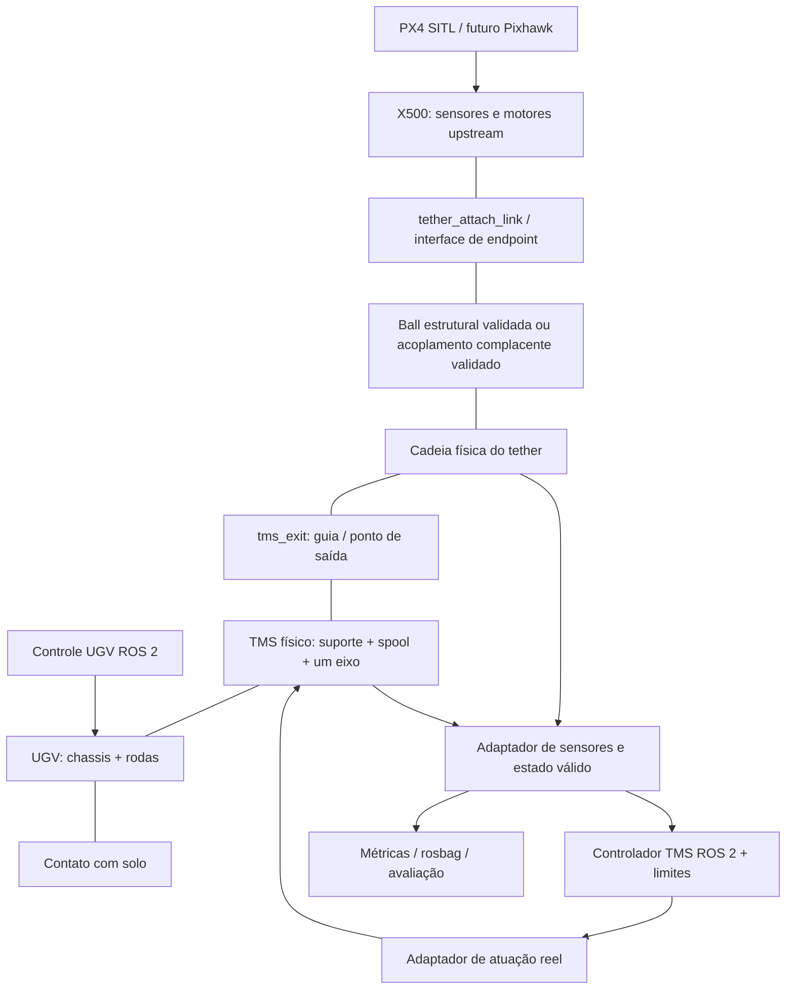

# Plano incremental do sistema marsupial próprio — X500/PX4, tether, TMS e UGV

**Data:** 2026-09-05. **Projeto-alvo:** `/home/lima/codes/ic/drone-cabo`, commit `e573c0d1f8b0ec00e000a5dddfa8ed824bf9c14a`. **Natureza:** análise arquitetural e handoff; nenhuma implementação executada. Somente este documento foi criado. Não houve alteração de PX4, tether, configuração, modelos ou controladores; não houve commit/push.

## 1. Decisão executiva e escopo

Preservar PX4 v1.14.4, X500 upstream, os geradores locais, a conexão angularmente livre, os cálculos de ângulo e a infraestrutura de avaliação. O projeto já superou o primeiro voo com cabo livre e já possui um protótipo ancorado por forças. Não reiniciar essas frentes nem substituir o tether pelo SDF marsupial de referência.

A sequência proposta é **consolidar medição e baseline → validar os dois endpoints com comprimento fixo → estação estática → reel isolado/instrumentado/atuado → controlador em bancada → comprimento variável → TMS no UGV parado → movimento lento → movimento combinado**. O controlador de tensão só será validado no cabo real simulado depois que existir uma relação física entre atuação e comprimento/tração; antes disso, sua validação será em uma planta de bancada explicitamente identificada.

O maior risco de longo prazo é liberar/recolher cabo mantendo massa, continuidade de constraints, energia e contatos. O bloqueio imediato original era anterior: confiabilidade da instrumentação e do acoplamento ancorado. O erro no parser de saturação foi corrigido em 2026-09-06; a inconsistência de ponto de aplicação de força segue identificada por confronto com a API 7.9.0 (§4).

**Estado atual:** A0 foi executada e aprovada. A próxima fase marsupial deve aguardar instrução explícita.

### Convenção de evidência

- **C — código:** fonte atual, XML, bibliotecas/versões instaladas ou cálculo reproduzido nesta auditoria.
- **R — resultado registrado:** ensaio descrito na documentação anterior. Não foi repetido nesta rodada; arquivos ULog existem, mas a vinculação de cada tabela a hashes de modelo/configuração ainda não está completa.
- **I — inferência:** consequência técnica sustentada pela fonte, sem comprovação dinâmica local nesta rodada.
- **P — proposta:** trabalho futuro, tolerância inicial ou opção arquitetural; não confundir com funcionalidade entregue.

C tem precedência sobre README quanto a configuração. R sustenta apenas a configuração realmente ensaiada, não todos os requisitos de aceitação atuais. Relatórios com adendos devem ser lidos até o fim: alguns corrigem explicitamente seu próprio texto original.

## 2. Referências analisadas e reconciliação

O diretório inicial da sessão era o checkout da referência. O alvo foi identificado pelo conteúdo do pedido e pelos arquivos locais em `drone-cabo/refs/`.

| Fonte local | Uso e limites |
|---|---|
| [Análise de referência](../refs/MARSUPIAL_TETHER_REFERENCE_ANALYSIS.md), integral, incluindo revisão cruzada | Arquitetura, parâmetros, fluxo, APIs Classic, limitações de reprodução; análise inicial Codex e comentários Claude Code |
| [Análise cabo/carretel/UGV](../refs/MARSUPIAL_TETHER_UGV_CODEBASE_ANALYSIS.md), integral, incluindo D1–D16 e A1–A11 | Aprofundamento físico e correções posteriores; o append esclarece que sua revisão independente não representa outro processo de simulação |
| [Handoff](../refs/MARSUPIAL_TETHER_HANDOFF.md), integral | Resumo útil, porém anterior às correções detalhadas do segundo documento |
| [README da referência](../refs/README.md) | Intenção, cenários e resultados alegados pelos autores; parâmetros não substituem o SDF |
| Checkout `../refs/marsupial_simulator_ros2`, SHA `d9046774cada2f0b679fb0dfdc1857516fc36936` | Confronto direto de Dockerfile, CMake, SDFs ativos, controller e attach |
| `../refs/marsupial_analysis_support/gazebo_ros_link_attacher`, SHA `2879cf838565a2603bf03ba4f1ea202965ad0304` | Confronto direto da implementação de attach/detach |

As análises reportam leitura do PDF local arXiv `2412.12776v3`, de 2025. Nesta rodada o artigo é evidência mediada por essas análises e pelo README; não se afirma nova reprodução do artigo nem equivalência com a publicação IEEE anunciada em 2026. O build integrado da referência havia falhado em `gazebo_dev`; não há validação dinâmica independente da referência nestes relatórios.

### 2.1 Concordâncias sustentadas pelo código

- ROS 2 Humble, Gazebo Classic, ODE; UAV SJTU sem PX4; três modelos spawnados separadamente.
- Cabo ativo: 125 links, 124 universal, massa declarada 0,0015 kg/link e 0,1875 kg total; 123 colisões cilíndricas; 125 instâncias de LiftDragPlugin. Inércias próprias isotrópicas de 0,01 kg·m² não correspondem à geometria física.
- Comprimento entre origens inicial calculado nas análises: aproximadamente 17,862586 m. Não usar `125 × 0,15 = 18,75 m` como comprimento livre medido. Trecho final tem geometria/massa por metro diferente.
- Dois attaches criam `revolute` bloqueado em zero. Não há ball de endpoint, reparenting da cadeia nem forças substituindo essas conexões.
- O tambor `box_central` recebe dois joints com o mesmo child. Separar modelos não elimina esse loop nem resolve o segundo parent na stack atual.
- O comprimento total e o número de corpos são constantes. O giro redistribui a cadeia inicialmente helicoidal; não há criação, remoção ou ativação de links durante payout.
- `/cable_length` é estimativa de rotação/comando, não medição geométrica; inexiste sensor/publicação de tensão no fluxo local da referência.
- Há UGV móvel e contato roda-solo; a plataforma de decolagem não é uma conexão rígida UAV–UGV.

### 2.2 Divergências e interpretação adotada

| Questão / versões em conflito | Melhor evidência e resolução | Consequência para este projeto |
|---|---|---|
| Primeira análise: steering 15 kg e roda 10 kg; segunda: 18,75/6,25 kg | **C:** parsing atual de `models/rs_robot/rs_robot.sdf` confirma 18,75/6,25; base 175 kg. Soma explícita 275 kg em ambos os cálculos | Não copiar massas do UGV. Os 282 kg incluindo sete defaults unitários são inferência dependente do backend, não massa medida |
| Handoff/revisão antiga: “nenhuma divergência”; relatório posterior apresenta correções | São documentos de momentos distintos. Usar as correções explícitas, sem apagar o histórico | O resumo antigo não encerra a auditoria |
| Python de controle/catenária “reutilizável diretamente” versus “adaptar” | D14 e os contratos concretos prevalecem: caminhos, nomes, densidade, CSV, filtragem e PoseStamped/PoseArray diferem | Reutilizar matemática/metodologia; adaptar código somente se superar o equivalente local |
| URDF “só TF” versus URDF também hardware | D1 inspeciona `parse_control_resources_from_urdf` na dependência fixada | Para essa versão de gazebo_ros2_control, URDF também é fonte de interfaces. Runtime original não fixado |
| Universal transmite momento “só nos eixos livres” | D2 corrige a mecânica: reação na combinação angular restringida; mola/amortecimento nos eixos livres | Não transplantar universal supondo cabo puramente tracionado |
| Parâmetros de contato “ausentes em todo sistema” | D3 restringe a ausência ao cabo; o world tem máscara, max_contacts e obstáculos com kp/kd | Fixar world e propriedades de ambos os membros do par |
| Atrito 1 implica auto-colisão / min_depth limita penetração | D4/D5: self-collide não habilitado no fluxo; min_depth é tolerância para correção, não limite máximo | Exigir testes de contatos; não herdar garantias sobre nós/espiras |
| Massa total constante implica massa enrolada constante | D6: corpos mudam de posição; massa de um subconjunto espacial e seu segundo momento podem mudar | Conservar massa total é desejável. Instrumentar separadamente reserva e trecho exposto |
| `L=L0−rΔθ` versus fórmula com wind_sign | **C:** controller usa `L=L0−wind_sign·rΔθ`; default -1 dá sinal positivo | Calibrar sinal e unwrap, não copiar fórmula resumida |
| Centro do tambor = saída = link_0 | D8/A3 distinguem centro, ponta enrolada e saída livre; há deslocamento entre hélice e tambor | Criar frame de saída explícito; offsets transformados por pose completa |
| Identidade “no request”; fixed impossível; detach destrói | **C:** request só nomes; identidade em `Load`, `physics->CreateJoint("revolute")`; `Detach` mantém registro para reutilização. Não há teste de impossibilidade de fixed | Não atribuir ao hack capacidades ou necessidades que a fonte não demonstra |
| Toda lógica num único follower | **C/R:** experiment, to_point e manual usam controladores distintos; to_point mistura unidades | Adaptar somente o conceito do encoder e feedback, não o conjunto de nós |
| “Não há modelagem de tensão” / “não há enrolamento físico” | D12/A11: há reações e redistribuição por dinâmica/contato normal; faltam medição e fidelidade demonstrada | Separar modelagem, observabilidade e validação |
| Custo linear com N | D13: contagem de objetos é linear; custo de solver/contatos não foi demonstrado linear | Benchmark local, sem extrapolar RTF da referência |
| Fórmula cilíndrica Izz axial aplicada ao link X | D15: tensor precisa de rotação e COM coerentes | Auditar também geradores locais; fórmula correta em frame errado continua errada |
| Comentários/figuras equivalem a validação física | D16 e limites de ambos os relatórios rejeitam essa equivalência | Resultados do paper, intenção de autor e execução do checkout são evidências distintas |

Para correções de semântica externa, a evidência detalhada está nos links fixados e seções D/A do segundo relatório; esta rodada reconfirmou diretamente massas, topologia, código de attach e equação ativa. Não afirma ter reexecutado cada ensaio ou cada cálculo do append.

## 3. Stack real e compatibilidade

### 3.1 Inventário confirmado nesta sessão

| Camada | Referência | Projeto atual / trilha PX4 | Baseline ROS local anterior |
|---|---|---|---|
| ROS | ROS **2 Humble**, Docker `osrf/ros:humble-desktop`; não ROS 1 | ROS 2 Humble disponível, dois pacotes ament_python; voo PX4 independe deles | Humble, rclpy, ros_gz_sim/bridge |
| Gazebo | **Classic 11**; patch não fixado no Docker. Classic local 11.14.0 não prova a versão dos ensaios dos autores | **Gazebo Sim 7.9.0 / Garden**, `gz sim --versions` | Ignition Gazebo **6.18.0 / Fortress**; `start_sim` inclui launcher ROS cujo default instalado é `gz_version=6`, sem sobrescrevê-lo. Esse é o caminho default atual; não presumir o binário de um ensaio histórico sem log |
| PX4 | Não existe; propulsão/controlador SJTU simplificados | **v1.14.4**, SHA `1555f2bd2229544c43966ab5f94879c41d8e1e01`, detached HEAD limpo | `meu_drone` com MulticopterVelocityControl, sem PX4 |
| API/plugin | `gazebo::ModelPlugin`, WorldPlugin, `gazebo_ros`, physics pointers, ros2_control Classic | `gz::sim::System`, Configure/PreUpdate/ECM; gz_bridge PX4; SDF 1.9 nas variantes | Sistemas Sim/Ignition, SDF 1.8, bridge ROS |
| Física | **ODE** explícito em theatre e demais worlds | DART padrão do Physics; **gz-physics6 6.7.0**, DART **6.12.1** instalados; falhas DART registradas nos ensaios | ignition-physics5 **5.4.0** disponível para Fortress; histórico relata DART |
| Passo configurado | theatre 0,004 s (250 Hz), outros 0,001/0,002 s | default PX4 0,004 s (250 Hz); probe inter-model 0,001 s | `start_sim` gera 0,0004 s (2500 Hz), apesar do nome “1ms” |

Ignition Gazebo e Gazebo Sim pertencem à linhagem nova; a mudança de nome não torna Classic compatível. “ODE” usado como detector de colisão dentro de DART não significa que a dinâmica seja a stack Classic/ODE. O default e a seleção de engine são documentados na [API de física Sim 7](https://gazebosim.org/api/sim/7/physics.html). Não extrapolar funcionalidades de Sim 9/10 ou gz-physics recentes para 7/6.

**Inconsistências locais a resolver incrementalmente:**

- `ldd` do bridge ROS instalado aponta para ignition-transport11/msgs8, enquanto PX4/CMake e o plugin binário local usam gz-transport12/msgs9. Isso não prova falha de comunicação, mas exige teste explícito Garden↔ROS antes de reaproveitar o launch.
- `tools/build_tether_force_plugin.sh` pede transport13/msgs10 junto com sim7. O binário existente aponta para transport12/msgs9. A receita atual não demonstra reprodução do binário ensaiado. Adotar futuramente dependências coerentes com sim7 e build local isolado, sem mudar PX4.
- O world default do PX4 tem Physics, sensores de voo e Contact, mas não carrega ForceTorque. A biblioteca `libgz-sim7-forcetorque-system.so.7.9.0` existe. A falta histórica de wrench não demonstra ausência da funcionalidade: testar um world externo com esse sistema e o sensor já declarado antes de escrever plugin de sensor novo. A [API ForceTorque 7](https://gazebosim.org/api/sim/7/classgz_1_1sim_1_1systems_1_1ForceTorque.html) confirma publicação via Gazebo Transport.
- A referência não fixa todos os SHAs/versões externos. Registrar essa lacuna é mais exato que inventar uma versão patch ou solver runtime dos autores.

### 3.2 Portabilidade dos componentes da referência

Classificação técnica é distinta da decisão de incorporar. Algo portável pode ser desnecessário porque já existe equivalente local.

| Componente | Classificação solicitada | Justificativa |
|---|---|---|
| Fórmulas gerais de encoder, incrementos positivos/negativos de comprimento | REUTILIZÁVEL DIRETAMENTE | Matemática com unidades/sinais explicitados; não implica copiar o nó que as contém |
| Scripts Python de winch | REUTILIZÁVEL COM ADAPTAÇÃO | ROS 2 compatível em princípio; separar UGV/TMS, corrigir tempo, frames, validação de amostras, limites e contratos |
| Catenária/pós-processamento | REUTILIZÁVEL COM ADAPTAÇÃO | Entradas/parâmetros/seleção de links distintos; priorizar `cabo_avaliacao` existente |
| Discretização, hélice e estratégia de reserva física | APENAS CONCEITO/ALGORITMO | Geradores locais já existem; parâmetros e topologia da referência não são baseline própria |
| SDF de rodas/tambor/obstáculos | REUTILIZÁVEL COM ADAPTAÇÃO | Primitivas aproveitáveis; revisar massa, eixos, contatos, recursos e remover loop. Modelos locais/Garden preferíveis |
| `gazebo_ros_link_attacher`, plugins ModelPlugin locais, LiftDragPlugin Classic | INCOMPATÍVEL COM A STACK ATUAL | API/ABI e ciclo de vida diferentes; usar equivalentes nativos antes de criar implementação ECS |
| Duplo rolamento estrutural | INCOMPATÍVEL COM A STACK ATUAL | Não corresponde à árvore de joints ordinários já demonstrada no caminho DART atual |
| `gazebo_ros2_control/GazeboSystem` | INCOMPATÍVEL COM A STACK ATUAL | Binário Classic; contratos ros2_control são adaptáveis, mas sua adoção não é necessária inicialmente |
| Launch Classic e scripts de spawn | APENAS CONCEITO/ALGORITMO | Não usar gazebo_ros/spawn_entity para Garden; aproveitar readiness como requisito, não os delays |
| SJTU e controlador UAV; msgs não geradas; plataforma de pouso complexa | DESNECESSÁRIO | PX4/X500 e comandos existentes atendem ao objetivo; nenhuma necessidade de substituir autopiloto |
| Tension controller da referência | DESNECESSÁRIO | Não existe implementação a portar; requisito novo com sensores nativos/localmente existentes |

## 4. Estado atual confirmado e lacunas descobertas

Fontes centrais: [gerador original](../src/pacote_do_drone/models/gerar_cabo.py), [parâmetros](../src/pacote_do_drone/tether_parameters.json), [gerador X500](../tools/generate_x500_tethered.py), [gerador ancorado](../tools/generate_tether_anchor_chain.py), [constraint](../src/pacote_do_drone/gz_plugins/TetherForceConstraint.cc), [launch original](../src/pacote_do_drone/launch/start_sim.launch.py), [plano X500 anterior](X500_TETHER_INTEGRATION_PLAN.md), [guia de testes](TEST_EXECUTION_GUIDE.md).

### 4.1 Existem três configurações de tether; não são equivalentes

| Configuração atual em disco | Física e parâmetros confirmados | Estado de validação |
|---|---|---|
| `cabo.sdf`, gerado por `gerar_cabo.py` | 50 segmentos +50 dummies +raiz+ponta = **102 links**, 100 revolute +1 fixed; L=2,5 m; λ=0,06 kg/m; segmentos 0,15 kg + auxiliares 0,006 kg; raio 0,002 m. Ball é a conexão ao drone no launch, não as juntas internas | R: testes cardeais/hover no `meu_drone`; sensor tangente coerente, redundância metrológica pendente |
| `x500_tethered/model.sdf` | 50 `tether_link_i` + attachment +base+4 rotores =56 links; 50 ball +1 fixed attachment +4 revolute motores; L=2,5 m, massa cabo=0,15 kg, raio=0,003 m, inicialização -Z; **sem colisões nos segmentos** | R: etapas 0–4 aprovadas para voo; forças/momentos não medidos diretamente |
| `tether_anchor_chain/model.sdf` | 5 segmentos +anchor_link=6 links; 5 ball +1 fixed ao world; L=2,5 m, λ=0,06, massa cabo=0,15 kg; anchor_link=1 kg fixo; `folded_ground`; **sem colisões nos segmentos**; plugin K=5, C=0,5, Fmax=3 | R: voo com X500 puro, acoplamento bilateral complacente e erro finito. Validação mínima, não cabo tensionado definitivo |

O protótipo ancorado conectava por forças `x500_0::base_link` com offset `(0,0,-0,12)`, sem exigir a presença do link físico `tether_attach_link`. **Superado em A0.3:** a baseline oficial passou a usar `x500_tether_attach_0::tether_attach_link`, um link físico na mesma pose, e o offset virtual está depreciado. Não lançar simultaneamente a cadeia livre embutida e a cadeia ancorada como se formassem um único cabo — por isso a variante `x500_tether_attach` não embute cabo algum. A variante embutida preserva o attachment físico de 5 g e a ligação fixa à base; motores, sensores e controle PX4 permanecem upstream.

### 4.2 Etapas X500 realmente implementadas / resultado disponível

| Etapa anterior | C: implementação / R: resultado registrado | Limite da conclusão |
|---|---|---|
| 0: X500 puro | PX4 compilado, arm/takeoff/hover/land, RTF≈0,992 | Baseline de voo registrada, não teste novo desta rodada |
| 1: attachment | `tether_attach_link`, offset -0,12 m, massa 0,005 kg; RTF≈0,993 | A variante mínima antiga não está preservada como artefato separado pelo gerador atual |
| 2: ball +carga mínima | R: voo aprovado, RTF≈0,991 | Sensor SDF declarado, wrench indisponível no ensaio |
| 3: cadeia livre 5/10 links | R: L=0,30 m, massa 0,018 kg, RTF≈0,994; inicializações horizontais anteriores abortaram | Não extrapolar a colisões nem ao cabo ancorado |
| 4: livre 50 links | R: L=2,5 m, roll/pitch máximos 0,75°/1,09°, RTF≈0,988 | Sem colisões; ausência de torque foi inferida da atitude, não medida |
| 5: âncora adicional no último child | C: opção `--anchored` cria segundo parent; R: FAIL DART | Não executar essa opção como solução futura |
| Probe ball inter-model | SDF mínimo existe; R: 1000 iterações sem erro | Dois corpos genéricos, não integração PX4 completa |
| 5: acoplamento por forças | Plugin/gerador existem; R: configuração no solo com erro RMS/max 0,199/0,210 m, força RMS/max 0,993/1,061 N, atitude≈0,9°, RTF≈0,99 | Conexão complacente, sem contato dos segmentos; “0% saturação” requer nova coleta confiável |
| Sensor angular no X500 | Matemática reutilizável; LeitorCabo ainda usa nomes `segment_i`, `ponta_cabo` e odometria `/meu_drone` | Integração específica X500 não entregue |
| TMS/payout/UGV | Há modelo local parcial de reel; não há sistema marsupial móvel integrado | Não implementados/validados |

`CURRENT_STATUS.md` ainda diz que o tether não foi integrado ao PX4. Isso está superado por código e pelo plano X500 atualizado. `ARCHITECTURE.md` mistura tabelas históricas de 40/50 segmentos. Este novo documento distingue estado em disco e histórico sem modificar aqueles arquivos.

### 4.3 Achados que condicionam o planejamento

1. **C — parser de saturação incorreto.** `parse_vector3d_stream()` finaliza a amostra assim que recebe x/y, antes de z. Execução isolada em memória com duas mensagens `x:0.2,y:3,z:1` e `x:0.3,y:3,z:1` retorna flags `[0,1]`, em vez de `[1,1]`: primeira amostra perde z e as seguintes podem herdar o anterior. Campos zero omitidos pelo formato textual também exigem delimitação correta de mensagens. Um “0%” histórico não é prova de segurança. Não houve correção nesta sessão.
2. **C+I — ponto de força não coincide com ponto observado.** O plugin calcula posição/velocidade com offset da origem do link, mas passa o mesmo vetor a `AddWorldForce`. Na fonte tag 7.9.0 essa sobrecarga soma a posição do COM ao argumento. No último segmento horizontal de 0,50 m: endpoint desejado x=0,50, COM x=0,25; força acaba aplicada em x=0,75 local. A discrepância de 0,25 m afeta o momento quando a força não é axial. Corrigir somente em etapa futura com teste de wrench; não chamar a implementação presente de acoplamento metrologicamente validado. Evidência: [Link.cc 7.9.0, AddWorldForce](https://raw.githubusercontent.com/gazebosim/gz-sim/gz-sim7_7.9.0/src/Link.cc), e header instalado `Link.hh:196–205,298–306`.
3. **C+I — rotação duplicada da inércia nas variantes X.** Os dois geradores novos montam `diag(Iaxial,Itransverse,Itransverse)` e também rotacionam `inertial/pose` por pitch=π/2 junto com a geometria. Para cilindro ao longo de X, basta tensor em X com pose inertial sem essa rotação, ou tensor em Z com rotação; a combinação atual troca o eixo físico. A variante livre -Z evita esse problema; `folded_ground` o contém. Registrar e testar antes de atribuir fidelidade ao caso ancorado.
4. **C — gerador original não garante densidade uniforme local na senóide.** `segment_lengths` varia pela amostragem uniforme em parâmetro; `mass=λL/N` é igual em todos. A massa total está correta, mas λ_i=m_i/l_i varia. Manter a baseline e documentar; uniformizar arco ou massa local somente em experimento separado, não silenciosamente.
5. **C — `folded_ground` só aceita N=5.** Não há sweep 10/20/30 desse caso por mera mudança da CLI. Generalizar geometria preservando comprimento, endpoints e folga é subetapa necessária.
6. **C — sensor e métricas já existem, mas são de outra trilha.** WrenchStamped `/cabo/tensao_drone`, `/cabo/tensao_carretel`, `/cabo/conexao_drone` estão no launch antigo; não existem automaticamente no processo PX4. `hover_metrics` usa norma da força, não projeção axial, e inicializa valores em zero; adicionar validade/freshness antes de usá-lo como gate.
7. **C — ForceTorque nativo está instalado.** Primeiro testar sistema de mundo ausente e nomes/frame/direção do sensor. Criar um extrator ECS de reação apenas se o sensor nativo não atender após teste mínimo.
8. **C — usar modelo existente já é previsto no PX4 atual.** `px4-rc.simulator:119–142` contém `PX4_GZ_MODEL_NAME` com `gz_bridge start -n`, desde que `PX4_GZ_MODEL` esteja vazio. Isso reduz a lacuna antiga sobre spawn duplicado. **P:** ensaiar world externo com X500 predeclarado, nomes preservados, depois ball inter-model. Não modificar o autopiloto nem presumir sucesso físico dessa composição.
9. **C — proteção do plugin é parcial.** Existe clamp de força e respeito a pausa; não há tratamento completo de NaN, reset/recriação de entidades, estados de conexão, tempo limite de aquisição ou telemetria estampada. A mola é bilateral e vetorial; não modela ruptura nem garante cabo unilateral. Forças iguais/opostas não bastam para provar consistência de momentos/energia com endpoints separados.

## 5. Reaproveitamento do tether e matriz consolidada

### 5.1 Decisão por elemento já existente

| Elemento | Decisão | Justificativa / trabalho posterior |
|---|---|---|
| Geração programática e CLI local | MANTER | Fonte própria já disponível; adicionar configurações/saídas por ensaio futuramente, evitando sobrescrever baseline |
| Cadeia multibody e discretização | MANTER | Reusar ball das variantes PX4 e manter baseline de pares revolute como comparação; não trocar por universal da referência |
| Geometria senoidal/-Z/folded_ground | ADAPTAR | Preservar casos aprovados; generalizar folded para N e contatos, com soma de arcos/endpoints validada |
| Massa total e λ=0,06 kg/m | MANTER | 0,15 kg em 2,5 m, parâmetro explícito; não importar 0,01 kg/m da referência |
| Massa local e auxiliares | ADAPTAR | Explicitar reserva/massa exposta e a variação de λ_i na senóide; não misturar 0,150 e 0,156 kg |
| Fórmulas de inércia/COM | ADAPTAR | Preservar fórmulas cilíndricas; corrigir futuramente frame X dos novos geradores mediante comparação isolada |
| Ball no attachment e ponto -0,12 m | MANTER | Liberdade angular já sustentada pelo histórico; força com braço de alavanca físico ainda produz momento sobre o UAV |
| Juntas internas/spring/damping antigos | MANTER | Não retunar nem igualar a ball ideal; benchmark físico separado decide uso por configuração |
| `--anchored` que dá segundo parent ao último elo | SUBSTITUIR | Futura composição de árvore válida/constraint compatível; preservar cenário somente como regressão negativa identificada |
| Colisões dos segmentos | ADAPTAR | Manter antigas; variantes PX4 sem colisão são baseline de voo, habilitar progressivamente chão→obstáculo→UGV |
| Funções `cabo_angulos.py` e convenção | MANTER | Testes passaram; preservar azimuth/elevation e janela física |
| LeitorCabo/adaptação de poses | ADAPTAR | Nomes, direção da cadeia, frames, comprimento não uniforme e estado válido; janela 0,15 m não equivale a um elo de 0,50 m |
| Sensores force_torque já declarados | MANTER | Conectar sistema nativo e calibrar saída; não duplicar sensor por falta de tópico |
| Plugin de força e coletor | ADAPTAR | Conservar como alternativa experimental; corrigir ponto de força, parser, ABI e observabilidade antes de novos ganhos |
| Métricas, monitor, testes/catenária locais | ADAPTAR | Reusar cálculos; adaptar nomes e validade, manter distinção ground truth/estimativa |
| Componentes removidos nesta rodada | REMOVER: nenhum | Não há motivo para eliminar uma baseline para produzir este plano |

### 5.2 Matriz de reaproveitamento solicitada

| Componente | Projeto atual | Referência marsupial | Decisão |
|---|---|---|---|
| UAV | X500 e `meu_drone` para regressão | SJTU simplificado | MANTER ATUAL |
| PX4 | v1.14.4/SITL | Ausente | MANTER ATUAL |
| tether generator | Três geradores locais | Jinja helicoidal com overrides ineficazes | MANTER ATUAL |
| joints | Ball no X500; pares revolute no original | Universal +constraints Classic | MANTER ATUAL |
| attachment | Link/offset local; force-based; probe ball | Attach Classic rígido | INVESTIGAR — corrigir/validar composição própria |
| sensor angular | Matemática testada e nós existentes | Poses, sem sensor equivalente dedicado | MANTER ATUAL — adaptar entrada X500 |
| tension sensing | FT original; FT X500 declarado; força de acoplamento | Não implementado | INVESTIGAR — integrar nativo antes de criar |
| reel | `carretel.sdf`: suporte, tambor, junta, comando | Duplo rolamento, inércias omitidas | MANTER ATUAL — adaptar ao TMS |
| reel controller | JointController de velocidade; sem supervisor TMS | PD geométrico misturado ao UGV | IMPLEMENTAR NOVO — sobre atuação existente |
| variable length | Ausente nas três cadeias | Redistribuição da cadeia toda | INVESTIGAR — seleção experimental em H |
| UGV | Sem modelo próprio; exemplos Garden instalados | `rs_robot` com quatro direções | IMPLEMENTAR NOVO — composição a partir de modelo nativo existente |
| launch | ROS antigo e receitas PX4/probes | gazebo_ros +delays | MANTER ATUAL — estender entrada PX4 externa |
| evaluation | hover_metrics, monitor, testes, cenários | Bags/catenária com contratos divergentes | MANTER ATUAL — incorporar metodologia de comparação |
| Metodologia de cenários coordenados | Ensaios de voo/cardinais | UAV sobe; UGV translada; ambos se afastam | ADAPTAR REFERÊNCIA |
| Controlador SJTU/mensagens órfãs | Equivalentes desnecessários ao PX4 | Controle de voo alternativo | NÃO NECESSÁRIO |

## 6. Arquitetura-alvo modular



O diagrama representa interfaces físicas, não a direção obrigatória dos parents SDF. Cada child deve ter um único parent estrutural no caminho escolhido; não adicionar uma segunda âncora à cadeia livre já enraizada no UAV. O controle PX4, controle UGV e controle TMS são processos com responsabilidades separadas.

**Estratégia imediata:** manter as duas árvores do protótipo ancorado e aprimorar o acoplamento existente como bancada. **Alternativa estrutural preferencial a investigar em B:** cadeia enraizada na estação com um único caminho até a raiz do X500 predeclarado; adaptar o probe e a opção nativa PX4 de modelo existente. Se uma ball ligar o cabo à raiz do X500, a pose deve representar o attachment sem dar novo parent ao `tether_attach_link` já fixo à base. Só adotar após verificar IMU, rotores, canonical link, nomes de tópicos e voo.

`DetachableJoint` não é ball: usa fixed e exige árvore na versão 7. Não corrige automaticamente o caso de segundo parent. Usá-lo apenas para uma conexão rígida cujo child realmente seja raiz elegível, se necessária; [restrições oficiais Sim 7](https://gazebosim.org/api/sim/7/detachablejoints.html).

### 6.1 TMS mínimo: físico versus abstrato

| Parte | Representação inicial | Evolução |
|---|---|---|
| Suporte/base e `tms_exit` | Frame fixo com geometria simples em C | Fixo ao chassi, carga/COM contabilizados em I |
| Spool | Visual em C; link com massa/inércia e **um** revolute em D | Contato/wrapping só se H justificar |
| Motor/atuador | Abstração de torque limitado ou malha de velocidade limitada | Modelo elétrico/corrente e hardware podem esperar |
| Encoder | Posição/velocidade real da junta, não integral do comando | Unwrap, offset, direção e calibração reproduzíveis |
| Comprimento | `L_encoder_estimated` e qualidade; até H marcado “sem correspondência ao cabo livre” | Encoder reconciliado com mecanismo de payout e reserva |
| Tensão | Sensor nativo/reação na saída; carregamento conhecido para calibração | Estimador por motor apenas secundário, com dinâmica/atrito compensados |
| Controlador | Nó ROS 2 de TMS independente | Real e sim compartilham contratos; sem leitura direta de ECM pelo controlador |
| Limites/estado | Configuração +máquina de estados desde bancada | Watchdog e interrupção de movimento nos adaptadores |

O modelo local `carretel.sdf` já tem `base_suporte` (12 kg), `cilindro_carretel` (3 kg), raio 0,07 m, largura 0,40 m, junta `junta_eixo`, damping=0,01, friction=0,02 e comando Gazebo `/carretel/velocidade`. Seu tensor 0,02 isotrópico não é calibração de cilindro. Suportes já são geometrias do mesmo link, evitando duplo rolamento. Não é carregado pelo caminho diagnóstico normal de `start_sim`; o world legado gerado é outro caminho. Não há ensaio atual que o qualifique como TMS funcional.

**C→D→E→F:** reutilizar essa geometria, depois massa/inércia coerentes e joint passivo, depois encoder/tensão e só depois habilitar atuador. Desabilitar o controlador para o ensaio passivo. Um tambor que gira desacoplado do cabo não libera cabo: chamar sua metragem apenas de estimativa de bancada.

Em F, preferir torque limitado ou o modo por força da malha de velocidade nativa, com saturação demonstrada. O [JointController Sim 7](https://gazebosim.org/api/sim/7/classgz_1_1sim_1_1systems_1_1JointController.html) oferece controle de velocidade e modo por forças. Verificar parâmetros no exemplo instalado antes de depender dos limites. Não introduzir ros2_control inteiro para comandar apenas um eixo quando o sistema nativo já atende; manter a interface ROS independente dessa escolha.

## 7. Comprimento variável: decisão experimental, não importação da referência

### 7.1 Grandezas que não podem ser confundidas

```text
L_total = L_stored + L_released                     [m de material]
L_path  = comprimento geométrico do trecho exposto  [m]
D      = distância reta entre endpoints            [m]
L_encoder_estimated = L0 + s * integral(r_eff(theta) dtheta)
v_payout = dL_released/dt                          [m/s], positivo libera
m_total = m_stored + m_released = lambda * L_total
```

Comprimento fixo permite mudança de forma, não mudança de material disponível. Em cadeia inextensível, L_path aproxima L_released respeitando os offsets físicos, não apenas origens de links; erro do acoplamento deve ser reportado separadamente. Distância reta é só limite geométrico inferior e falha como comando completo com obstáculos. Massas de raiz/dummies/attachment/guia não pertencem automaticamente a `lambda*L`.

`N_active` significa corpos que participam da dinâmica exposta; `N_total_simulated` inclui a reserva ainda física. Na solução de referência N_total é sempre 125. Comprimento livre pode mudar mesmo com N_total constante. É preciso uma regra explícita de classificação pela passagem na guia, não somente distância radial ao tambor.

### 7.2 Alternativas na stack 7.9.0 / physics6

Avaliações são **P/I**, não benchmarks já executados. “Compatível” significa presença de primitivas/API básicas; mutação robusta da cadeia deve ser demonstrada.

| Alternativa | Fidelidade | Complexidade | Estabilidade numérica | Custo | Compatibilidade atual | Integração / reprodutibilidade |
|---|---|---|---|---|---|---|
| Comprimento fixo, gerenciamento de forma/posição | Alta para cabo fixo; não implementa payout | Baixa | Melhor baseline conhecida | Proporcional ao cenário/contatos | Já implementado parcialmente | Alta; excelente controle experimental, insuficiente ao requisito final |
| Cadeia inteira armazenada/enrolada no reel | Pode capturar reserva, massa e contato; fidelidade depende das espiras/guia | Alta | Risco alto por contatos concentrados | Alto mesmo com pouco cabo exposto | Primitivas disponíveis; solver diferente da referência | Média/baixa sem estado inicial e seleção de contatos determinísticos |
| Reserva inteira em caixa/guia simples, sem espiras realistas | Intermediária; massa física conservada | Média/alta | Menos geometria de espiras, mas acúmulo/atrito continuam | Alto, pois todos os corpos existem | Investigável com corpos/joints atuais | Boa bancada comparativa; validar transporte pela saída |
| Criar/remover segmentos | Alta potencial para trecho exposto, se conservar massa/momento | Muito alta | Transições podem injetar impulsos e romper constraints | Pode cair com N exposto | `/world/create` cria modelos, não arbitrary joint runtime; troca da cadeia não demonstrada | Baixa inicialmente; exige plugin e protocolo transacional |
| Ativar/desativar links pré-alocados | Intermediária | Alta | Desativar colisão não desativa massa/constraint; risco de salto de estado | Economia incerta se solver conserva todos os corpos | Não há toggle completo de “link armazenado” demonstrado | Exige verificar API e medir custo, não prometer simplificação automática |
| Juntas prismáticas / seção telescópica | Boa bancada de curso; não é cabo alimentado por si só | Média | Curso limitado mais simples que troca topológica; grandes razões de massa são risco | Baixo/médio | Prismatic é primitiva disponível; massa/geometria variável não vem automaticamente | Alta para bancada; média para cabo híbrido; não alegar conservação sem correção |
| Alterar cadeia/joints/comprimentos em runtime | Alta potencial | Muito alta | Segundo parent, detach/contact e rebuild são riscos centrais | Variável, com picos de reconstrução | ECM não garante alteração equivalente no solver; precisa prova em physics6 | Baixa até ensaios de ciclo/reset; evitar respawn integral a cada tick |
| Híbrida: trecho exposto multibody +reserva abstrata +seção de transição | Intermediária controlável; aproxima reserva, mantém contatos externos | Alta, porém separável | Melhor candidata se transições forem suaves e conservativas | Pode acompanhar só N exposto | Requer adaptador local, não recurso pronto do Sim | Boa se versionar eventos, massa e energia; candidata inicial de H, sem seleção definitiva |
| Cabo totalmente analítico/catenária/força unilateral | Útil para controlador/quase-estática; perde dinâmica multibody e contatos gerais | Baixa/média | Dependente da rigidez e integração | Baixo | Já há matemática de catenária e mecanismo de força reutilizáveis | Excelente planta de teste; não substitui tether físico requerido |

**Decisão:** manter comprimento fixo até G; em H0 comparar uma reserva física simplificada e uma representação híbrida com transição de curso limitado. Não adotar criação/destruição como primeira implementação. H0 deve poder rejeitar ambas se o balanço físico falhar; nenhuma opção é “pronta” só porque SDF aceita o tipo de joint.

### 7.3 Protocolo mínimo de payout/retraction

- Estados do transporte: HOLD, PAYOUT, RETRACT, TRANSITION, LIMIT, FAULT. Transição de segmento tem ID, sentido, instante simulado, material transferido e validade.
- Antes de transitar: saída e segmento alinhados, posição/velocidade finitas, reserva disponível, sem interpenetração e erro de conexão dentro da tolerância; histerese impede chattering.
- Introduzir segmento com pose e velocidade compatíveis com o ponto móvel de saída (`v_exit = v_base + omega_base × r_exit`), incluindo velocidade relativa de alimentação. Nunca inicializar velocidade em zero arbitrariamente.
- Em híbrido, transferir `delta_m=lambda*delta_L` da reserva ao trecho exposto; compensar massa/COM/inércia na estação sem duplicar nem eliminar peso. Preservar momento linear/angular com a reação correspondente sobre o TMS.
- Contabilizar potência de motor, variação de energia cinética/potencial, atrito, amortecimento e fluxo de energia do material. Um segmento surgindo em altura altera energia potencial; registrar de onde vem esse trabalho.
- No recolhimento, só retirar da dinâmica o material que realmente atravessou a saída, resolvendo contatos antes; não teletransportar segmento que esteja enrolado num obstáculo.
- Caso a transição não possa ser concluída: interromper alimentação, permanecer no último estado consistente e emitir FAULT. Sem condição válida, não continuar “integrando comprimento” no software.
- Raio efetivo constante é aceitável inicialmente se explicitamente calibrado; geometria multicamada, motor real e guia de espiras são decisões posteriores.

## 8. UGV progressivo e software

Há exemplos nativos instalados em `/usr/share/gz/gz-sim7/worlds/diff_drive.sdf`, `diff_drive_skid.sdf` e `ackermann_steering.sdf`. O primeiro contém `vehicle_blue/green`, chassis, rodas, DiffDrive e odometria. **P:** adaptar uma única base desse exemplo para I, com massa/COM recalculados para o TMS; não copiar o world inteiro nem os valores de massa cegamente. Isso é menor escopo que o `rs_robot` da referência. Nenhum UGV próprio foi localizado no fluxo `src/` ou entre os modelos gz do PX4 auditados.

Começar com base diferencial, rodas e apoio passivo, comando de velocidade e odometria. Bancada separada prova reta/parada/retorno sem tether. Depois montar TMS com um fixed ao chassi e remover a ligação TMS→world. Uma trava temporária da **base** ao mundo pode isolar I, mas deve ser retirada em J; não deixar âncora residual fixando o cabo ao chão.

Critério essencial: mover chassis deve mover suporte, `tms_exit` e aplicação de carga, sem offsets congelados em coordenadas mundo. Suspensão, navegação autônoma, terreno irregular e pouso sobre plataforma não são pré-requisitos.

A estrutura física de pastas proposta no pedido não exige reorganizar o workspace. Recomenda-se manter:

```text
px4/PX4-Autopilot/                         upstream local intacto
src/pacote_do_drone/models/               tether, x500_tethered, carretel e futuras variantes
src/pacote_do_drone/gz_plugins/           somente adaptações específicas da física
src/pacote_do_drone/pacote_do_drone/      cálculos, adaptadores, métricas existentes
src/pacote_do_drone/launch/ e config/     composição e receitas por fase
src/cabo_avaliacao/                       validação geométrica existente
tools/                                   geradores e coletores existentes
docs/                                    planos e resultados
```

Quando surgirem módulos com dependências próprias: novos pacotes `tms_control` (ROS puro), `marsupial_sim` (adaptação/modelos/launch), `ugv_bringup` e, somente se necessário, `tms_interfaces`. Não mover arquivos apenas para coincidir com uma árvore conceitual. Não criar pacote separado para cada sensor. O plugin C++ deve ganhar build reproduzível quando for alterado; não exige remodelar todos os pacotes Python.

Para Sim2Real, controlar tensão/comprimento/velocidade por mensagens com tempo, unidades e qualidade. Ground truth de links, energia e ECS ficam no adaptador/avaliação. Drivers reais de encoder/load-cell/motor substituem o adaptador Gazebo. PX4 uXRCE-DDS/px4_msgs ou outro adaptador oficial devem preservar a versão v1.14.4 e conversões ENU/FLU↔NED/FRD; essa ponte ainda não está configurada no projeto. Evitar enviar `/meu_drone/cmd_vel` ao PX4 como se fosse interface de voo existente.

## 9. Interfaces, taxas e métricas comuns

### 9.1 Interfaces propostas, respeitando nomes existentes

| Interface | Estado / tipo / semântica |
|---|---|
| `/cabo/tensao_drone`, `/cabo/tensao_carretel` | Existentes na trilha antiga: WrenchStamped. Reusar e explicitar origem/frame/sinal/calibração; não criar `/tether/tension` redundante |
| `/cabo/conexao_drone` | WrenchStamped da conexão antiga; mapear sensor equivalente se houver, distinguindo-o da junta interna do último segmento |
| `/cabo/conexao/force`, `/error`, `/stats` | Existentes somente Gazebo Transport Vector3d no plugin. Força **sobre o tether**, erro tether−drone, stats misturam m/N/flag. Manter como diagnóstico legado; novo adaptador publica estado estampado e validade |
| `/cabo/drone/*_graus`, `/cabo/ancora/*_graus` | Existentes; adaptar poses X500. Âncora antiga é mundo; futura saída deve ter tópico/frame explicitamente TMS, sem mudar significado silenciosamente |
| `/tms/state` | Proposto: Header, modo, enabled, fault, source, valid, idade/amostragem; theta rad, omega rad/s, torque Nm, tensão N, comprimento liberado/estimado/armazenado/total m, payout m/s |
| `/tms/command` | Proposto: Header, ID, modo (disabled/velocity/torque/tension/length), referência em campo nomeado, prazo de validade. Uma única autoridade de comando |
| `/tms/enable`, `/tms/reset_fault` | Propostos: confirmação explícita da máquina de estados; reset só com condições normais; nenhuma reativação automática após falha |
| `/tms/reel/joint_states` | Proposto JointState com junta nomeada, position/velocity e effort apenas se significado conhecido; único publisher autoritativo |
| `/carretel/velocidade` | Já existe no SDF local como comando Gazebo; adaptador TMS encaminha velocidade permitida ou seleciona backend de torque |
| `/ugv/cmd_vel`, `/ugv/odom` | Propostos TwistStamped na entrada de hardware/adaptador e Odometry na saída. Adaptar ao Twist do DiffDrive; frames odom/base_link, x frente, y esquerda |
| `/clock`, `/tf`, diagnósticos | Reusar clock; TF com namespaces UAV/UGV/TMS. Não fazer bridge de toda Pose_V como TF autoritativo sem revisar frames |
| `/evaluation/...` | Ground truth de poses dos segmentos, N ativo/total, contatos, energia e erro de fechamento; não entrada obrigatória do controlador real |

Pode-se iniciar com tipos ROS padrão nos sensores e JointState, mais diagnóstico, sem mensagem própria. Antes de controle integrado, os campos mistos do estado/comando devem ter contrato versionado e timestamp; não multiplexar unidades em Vector3d/MultiArray como interface de produção.

Tensão axial local: para força exercida pelo cabo sobre o suporte e tangente unitária saindo do suporte em direção ao cabo, `T=max(0,F·t)`, com sinal validado por carga conhecida. Publicar também `||F||`, vetor e componentes transversais, sem esconder compressão/erro usando apenas clamp. Nos dois extremos, forças não são iguais/opostas instantaneamente: peso, aceleração e contatos do cabo entram no balanço. A reação par-a-par de uma única conexão é outro teste.

### 9.2 Taxas

| Domínio | Configuração atual | Proposta inicial |
|---|---|---|
| Física PX4 | 250 Hz /4 ms | Manter A; em B medir 4,2,1 ms sem alterar simultaneamente N, K e geometria; assumir 1 ms em H só se benchmark justificar |
| Constraint de força | PreUpdate a cada passo | Continuar a cada passo; nenhum laço ROS deve substituir integração da força |
| FT original /FT X500 declarado | 50 Hz /100 Hz | 100 Hz se sustentado pela física; medir taxa efetiva e timestamps |
| Encoder | Sem fluxo X500/TMS pronto | 100 Hz inicial, derivada em sim-time; leitura física por passo quando necessário |
| Controlador TMS | Ausente | 50 Hz de tempo simulado; malha interna de torque/velocidade no passo físico |
| Publicação ROS de estado | Variável/evento nos componentes antigos | 50 Hz, estado de falha também por transição; guardar amostras brutas a 100 Hz ou por passo na bancada |
| UGV | Ausente | Comando/odometria 50 Hz, força/tração resolvida pelo solver |
| Logging /RTF | Coletores distintos | Estatística RTF a 1 Hz de parede, demais grandezas estampadas em sim-time |

Com física de 250 Hz, sensor solicitado a 100 Hz pode sofrer quantização de amostragem; reportar a taxa medida, não só configurada. Pausa não integra nem avança prazo em simulação. Watchdog externo usa relógio monotônico para detectar travamento do processo, distinguindo pausa autorizada. Reset de `/clock` limpa derivadas/integradores e desabilita comandos antigos.

QoS: sensor data best-effort com depth pequeno e contagem de perdas; comandos reliable/volatile, depth 1 e timeout; estados de falha reliable, eventualmente transient-local para estado atual. Não fazer latch de comando de motor. Todos os nós de controle/avaliação usam sim-time em simulação e relógio real no hardware.

### 9.3 Registro mínimo por ensaio

| Grupo | Variáveis / unidades |
|---|---|
| Proveniência | SHA projeto/PX4, hashes SDF/JSON/plugin/world, versões/ldd, parâmetros, hardware, GUI/headless, seed, duração sim/wall, configuração de contatos |
| Desempenho | RTF médio, mediana, p05, mínimo e janela; CPU/RSS; número de contatos/constraints; perda de amostras e latência |
| UAV | x,y,z m; roll,pitch,yaw rad ou graus identificados; velocidade; erro RMS/95%/max, estado PX4, saturação de atuadores/failsafe |
| UGV | x,y,yaw, v, omega, erro de odometria/ground truth, aceleração e parada |
| Tether | T nos dois extremos, forças/vetores, momento na junta e no COM, L_total/stored/released/encoder/path, N_active e N_total_simulated, ângulos de saída, erro de fechamento |
| Reel | theta unwrap, omega, torque medido/estimado e sua origem, comando, saturação, potência, limite/estado |
| Qualidade física | massa total e exposta, balanço de forças, energia/trabalho/dissipação, interpenetração, continuidade de eventos de payout/retract |

Não tratar ausência de mensagem como zero. Comparar ângulo da **tangente local** com estimador independente da mesma geometria, não reta endpoint–âncora em cabo com folga. Perto da vertical, azimuth é singular: marcar inválido com tolerância horizontal definida, não reprovar porque azimuth oscilou.

## 10. Limites físicos/numéricos desde o início

Valores abaixo são **P**, limites conservadores de bancada e não especificações certificadas do cabo/hardware. Fixá-los por configuração e registrar qualquer ajuste. O clamp de 3 N do protótipo não é resistência real do cabo.

| Limite inicial | Aplicação |
|---|---|
| `T_min=0,1 N`, `T_target=0,5 N`, `T_max=2,0 N` | Bancada TMS; validar resolução/ruído antes. Reta sem folga pode produzir força muito maior; não usar posição para forçar esse regime |
| `L_min=0,30 m`, `L_max=L_total−L_reserva_min`; exemplo `L_total=2,50`, reserva=0,10 →2,40 m | Somente fase de material variável; baseline fixa continua 2,50 m e não é alterada por esse exemplo |
| `omega_reel_max=0,5 rad/s` | Primeiro reel atuado; a r=0,07 dá 0,035 m/s |
| `tau_reel_max=0,14 Nm` | Limite inicial de atuação, derivado de 2 N×0,07 m como escala; não garante T≤2 N em transiente/inércia/contato |
| `v_ugv_max=0,10 m/s`, `a_ugv_max=0,05 m/s²` | Movimento J, plano e sem obstáculos |
| Idade máxima sensor/comando=0,10 s sim | Inibir comando dependente quando exceder; testar atraso/dropout e relógio parado |

Comportamento exigido:

- `T>T_max`: bloquear recolhimento, interromper aumento de separação UAV–UGV; permitir liberação limitada **somente** com comprimento variável validado e reserva disponível. Até H, solicitar parada/hold do ensaio. Persistência >0,1 s é FAIL; pico acima do limite rígido de bancada provoca interrupção imediata do ensaio.
- `T<T_min`: não apertar automaticamente sem dados válidos. Com H validada, recolher lentamente dentro de L_min; caso contrário registrar SLACK e manter teste controlado.
- `L` no limite: bloquear comando para fora da faixa, permitir retorno seguro. Nunca continuar estimativa além da reserva real.
- Omega/torque excessivos: saturação no controlador **e** adaptador de atuação, anti-windup, rampa de referência e FAULT se medição persistir fora da faixa.
- Sensor inválido, entidade removida, NaN/Inf, perda de comando ou reset: DISABLED/FAULT, sem estimar por integração cega. Freio/torque seguro deve respeitar tensão; “travar reel” não é resposta universal se o UAV continua se afastando.
- Falha numérica severa: pausar/encerrar o cenário de teste e preservar log; não teletransportar corpos para esconder violação. Em hardware futuro, resposta passa pelo supervisor de segurança e autopiloto, sem depender de pause Gazebo.

## 11. Plano incremental com PASS/FAIL e dependências

Todos os números de aceitação abaixo são **P**, pré-registrados para a próxima execução; podem ser revistos com justificativa antes do teste, nunca depois apenas para obter PASS. Cada fase é uma unidade de handoff. Incluir um manifesto, dados brutos, resumo e motivo de PASS/FAIL. Não avançar se faltar a grandeza que a fase pretende validar.

**Protocolo comum:** três repetições por configuração, warmup 10 s simulados e janela estacionária 20 s, salvo teste unitário ou bancada com duração própria. Estados finitos, sem crash/failsafe não solicitado e sem topologia ambígua são obrigatórios. RTF inicial utilizável: mediana≥0,8 e p05≥0,5 nos cenários pequenos; queda >20% contra controle idêntico exige investigação. Esses valores não são exigência de HIL e não aprovam a baseline antiga pesada. Para testes físicos quase-estáticos, erro de força≤10% ou 0,05 N (o maior), após compensar massa e contato conhecidos. Timeout de parede≈`2*T_sim/RTF_p05 + margem_startup`, com deadline explícito.

### A0 — Corrigir a medição de saturação existente

- **Objetivo:** obter contagem de mensagens/flags confiável antes de usar o coletor como gate.
- **Pré-requisitos:** leitura da função atual e reprodução mínima do defeito (§4.3); nenhuma simulação necessária.
- **Alteração:** somente parser/coletor e testes focados; preservar CLI e schema JSON. Delimitar mensagens completas ou consumir protobuf estruturado; não usar presença de x/y como término. Timeout, stream incompleto e dado inválido não podem gerar PASS.
- **Teste:** duas mensagens saturadas; sequência 0/1/0; campos zero omitidos; várias mensagens; truncamento; NaN/Inf; erro/timeout do subprocesso.
- **Variáveis:** samples, erro/força RMS e máximos, saturation_fraction, returncode, validade.
- **PASS:** valores iguais ao oráculo por mensagem; duas saturadas dão 1,0; primeira/última não perdidas; flags não vazam entre mensagens; insuficiência de dados sinalizada.
- **FAIL:** associação temporal errada, emissão de zero válido para dado ausente ou aceitação silenciosa de stream malformado.
- **Dependências:** nenhuma fase física; habilita A1 e a recoleta em B. Não corrigir K/C, inércia ou geometria nesse patch.

Resultado executado em 2026-09-06:

```text
Problema:
parse_vector3d_stream() encerrava uma amostra assim que encontrava x/y.
Quando z=1 vinha na linha seguinte, a primeira amostra era registrada como z=0
e o campo z podia vazar para a amostra seguinte.

Causa raiz:
delimitacao incorreta das mensagens de texto do Gazebo Transport. A ausencia de
z e valida somente quando a mensagem termina; nao quando x/y aparecem.

Correcao:
o parser agora fecha amostras por delimitador de mensagem, trata z ausente como
0 somente ao finalizar a mensagem, rejeita mensagens truncadas ou nao finitas e
o JSON do coletor informa invalid_messages, timed_out e valid.

Teste de regressao:
test/test_collect_tether_force_stats.py cobre duas mensagens saturadas,
sequencia 0/1/0, z omitido, mensagem truncada e NaN.

Validacao real:
PX4/Gazebo headless + tether_anchor_chain + /cabo/conexao/stats.
120 amostras coletadas, invalid_messages=0, timed_out=false, valid=true,
saturation_fraction=0.0.

Resultado:
PASS
```

### A0.1 — Auditoria e baseline ancorado force-based existente

Rodada executada em 2026-09-06, apos a correcao do parser. O estado herdado do coletor permaneceu **PASS**: a simulacao real e os testes automatizados usaram o JSON com `valid=true`, `timed_out=false` e `invalid_messages=0`.

Objetivo desta rodada: reutilizar o `tether_anchor_chain` ja existente para estabelecer uma baseline `PX4/X500 + tether + fixed anchor`, sem reel, spool, TMS, motor, encoder, payout/retraction, UGV, sensor angular definitivo ou mudancas de controlador.

Arquitetura auditada:

```text
WORLD
├── x500_0
│   └── base_link + offset (0, 0, -0.12)
└── tether_anchor_chain
    ├── anchor_link
    ├── anchor_world_fixed: world -> anchor_link
    ├── tether_joint_1: anchor_link -> tether_link_1
    └── tether_joint_2..5: tether_link_i -> tether_link_(i+1)
```

Parametros encontrados:

| Item | Valor atual | Onde esta definido |
| --- | --- | --- |
| Modelo ancorado | `tether_anchor_chain` | `src/pacote_do_drone/models/tether_anchor_chain/model.sdf` |
| Gerador | `tools/generate_tether_anchor_chain.py` | `tools/generate_tether_anchor_chain.py` |
| Numero de segmentos | 5 | `--links 5` / `tether_link_1..5` |
| Comprimento total | 2,50 m | `--length 2.50` |
| Comprimento por segmento | 0,50 m | `L/N` |
| Densidade linear | 0,06 kg/m | `--rho 0.06` |
| Massa total do cabo | 0,150 kg | `rho * L` |
| Massa por segmento | 0,030 kg | `<mass>0.03</mass>` em cada segmento |
| Raio visual | 0,003 m | `--radius 0.003` |
| Massa da ancora | 1,0 kg | `anchor_link` |
| Junta da ancora | `fixed`, `world -> anchor_link` | `anchor_world_fixed` |
| Juntas internas | `ball` | `tether_joint_1..5` |
| Posicao da ancora no teste | modelo spawnado em `z=0.035`; `anchor_link` local em zero | comando `gz service /world/default/create` |
| Forma inicial | `folded_ground` | gerador, somente para N=5 |
| Colisoes dos segmentos | desabilitadas | ausencia de `<collision>` nos `tether_link_*` |
| Conexao com X500 | force-based, nao estrutural | plugin `drone_cabo::TetherForceConstraint` |
| Corpo conectado no X500 | `x500_0::base_link + (0,0,-0.12)` | campos `drone_model`, `drone_link`, `drone_offset` |
| Ponta conectada no cabo | `tether_link_5 + (0.5,0,0)` | campos `tether_link`, `tether_offset` |
| K/C/Fmax | 5 N/m, 0,5 N.s/m, 3 N | `stiffness`, `damping`, `max_force` |

Observacao importante: esta baseline **nao usa fisicamente** o `tether_attach_link` do `x500_tethered`; ela usa o `base_link` com offset local equivalente. Isso preserva a topologia independente que evita o closed kinematic loop, mas ainda precisa ser revisitado se o requisito passar a ser aplicar a forca exatamente no link fisico de attachment. A capacidade de tether livre do `x500_tethered` permanece preservada.

Instrumentacao disponivel:

- `/cabo/conexao/error`: erro vetorial entre a ponta do cabo e o ponto virtual no X500.
- `/cabo/conexao/force`: forca aplicada ao lado do cabo pela constraint; o X500 recebe a forca oposta.
- `/cabo/conexao/stats`: norma do erro, norma da forca e flag de saturacao.

Interpretacao: `|F|` e a magnitude da forca da constraint force-based no ponto de conexao. Ela **nao e**, por si so, a tensao axial distribuida do cabo e **nao mede** a reacao na ancora. Forca/momento diretamente na ancora ainda estao N/D nesta baseline. A constraint nao aplica torque corretivo explicito de orientacao.

Testes executados:

| Teste | Resultado | Evidencia |
| --- | --- | --- |
| Parser/coletor | PASS | `test/test_collect_tether_force_stats.py`: 4 passed |
| Funcionais + configuracao | PASS | testes de angulos/cenarios/coletor/modelo: 23 passed |
| SDF ancorado | PASS | `gz sdf -k .../tether_anchor_chain/model.sdf`: `Valid.` |
| Build plugin | PASS | `tools/build_tether_force_plugin.sh` gerou `build/gz_plugins/libTetherForceConstraint.so` |
| A - assentamento sem voo | PASS | 200/200 amostras, `valid=true`, `timed_out=false`, `invalid_messages=0`, `saturation_fraction=0.0` |
| B - baseline estatica | PASS | mesmo cenario de assentamento, erro limitado e sem saturacao |
| C - takeoff/hover/land vertical | PASS | PX4 armou/decolou/pousou; 300/300 amostras validas; sem saturacao |
| D - pequeno deslocamento horizontal | FAIL | tentativa OFFBOARD nao entrou de forma confiavel; PX4 registrou failsafe/flight task incapaz; nao houve saturacao persistente da constraint |

Metricas principais coletadas:

| Cenario | Erro RMS | Erro max | Forca RMS | Forca max | Saturacao | Roll max | Pitch max | RTF |
| --- | --- | --- | --- | --- | --- | --- | --- | --- |
| Assentamento/estatico | 0,167 m | 0,188 m | 0,841 N | 0,971 N | 0,0% | N/D | N/D | ~0,99 |
| Vertical takeoff/hover/land | 0,196 m | 0,197 m | 0,979 N | 0,986 N | 0,0% | 1,67 deg | 0,86 deg | ~1,00 |
| Horizontal OFFBOARD tentativa | 0,276 m / 0,201 m | 0,279 m / 0,206 m | 1,378 N / 1,005 N | 1,393 N / 1,041 N | 0,0% | 2,94 deg | 0,83 deg | ~1,00 |

Comparacao resumida com baselines anteriores:

| Baseline | Estado | RTF | Observacao |
| --- | --- | --- | --- |
| Etapa 0 - X500 puro | PASS historico | ~0,99 | hover de referencia sem tether |
| Etapa 3 - tether curto livre | PASS historico | N/D | sem ancora, sem closed loop |
| Etapa 4 - tether completo livre | PASS historico | ~0,99 | tether livre preservado |
| Baseline ancorado force-based N=5 | PASS vertical / FAIL horizontal | ~0,99-1,00 | topologia aceita pelo DART; deslocamento horizontal ainda bloqueado pela interface OFFBOARD/teste |

Decisao: **reutilizar** `tether_anchor_chain` como baseline minima ancorada force-based. **Adaptar** antes de promover para B definitivo: ponto de aplicacao no attachment real ou equivalencia demonstrada, medicao de wrench na ancora, criterio de erro de fechamento mais apertado e comando horizontal PX4 reproduzivel. **Nao substituir** por closed loop estrutural.

Para futura TMS/UGV: tratar `anchor_link` como a ancora fixa provisoria e `tether_joint_1` como o ponto semantico de saida do cabo. Ao trocar a ancora por TMS/UGV, preservar nomes/frames de saida, unidades, topicos `/cabo/conexao/*` e comparabilidade das metricas.

Status desta rodada: **FAIL no gate completo**, porque o teste horizontal D nao foi aprovado e ainda nao ha wrench/momento na ancora. O marco parcial `X500 + tether ancorado force-based + takeoff/hover/land vertical` esta aprovado.

### A0.2 — Isolamento do OFFBOARD, instrumentacao da ancora e fechamento da baseline horizontal

Rodada executada em 2026-09-06/07, retomando a execucao interrompida por limite de uso. Objetivo: descobrir por que o deslocamento horizontal falhou em A0.1, instrumentar (ou caracterizar a impossibilidade de instrumentar) o endpoint terrestre e fechar a baseline horizontal ancorada. K/C/Fmax, colisoes dos segmentos e o ponto de conexao no X500 foram mantidos inalterados de proposito.

#### A0.2.1 Causa raiz da falha horizontal de A0.1 — FATO + INFERENCIA

**Fato observado.** Nao existia no repositorio nenhuma pipeline OFFBOARD versionada e reproduzivel. O teste D de A0.1 foi conduzido por comandos manuais no console `pxh>`, que nao mantem o stream continuo de setpoints exigido pelo PX4 para aceitar e sustentar o modo OFFBOARD.

**Alteracao.** Foi criada `tools/px4_offboard_horizontal_mission.py` (MAVLink via pymavlink), com a sequencia exigida pelo PX4:

```text
pre-stream de setpoints (2 s) -> SET_MODE OFFBOARD -> settle (1 s) -> ARM
-> climb/hover (12 s) -> translacao dx (10 s) -> retorno (10 s) -> NAV_LAND (8 s)
```

O stream de `SET_POSITION_TARGET_LOCAL_NED` roda a 20 Hz sem interrupcao em todas as fases; a mascara mantem posicao+yaw ativos e ignora velocidade/aceleracao/yaw_rate. Testes unitarios cobrem a mascara e o encoding `custom_mode = main_mode << 16`.

**Inferencia suportada pelos dados.** A falha de A0.1 era da interface de comando, nao da fisica do tether: com a mesma configuracao ancorada de A0.1 e a nova ferramenta, o deslocamento horizontal passou (H2 abaixo). A causa **nao** pode ser atribuida ao tether.

#### A0.2.2 Isolamento em tres cenarios

| Cenario | Configuracao | Resultado | Artefatos |
| --- | --- | --- | --- |
| H0 | X500 puro, sem tether | **PASS** | `results/a0_2/h0_x500_puro/` (evidencia reutilizada da execucao anterior) |
| H1 | `x500_tethered`, tether livre, sem ancora | **PASS** | `results/a0_2/h1_tether_livre/` (evidencia reutilizada) |
| H2 | X500 + `tether_anchor_chain` + ancora fixa + constraint force-based | **PASS** | `results/a0_2/h2_tether_ancorado/` (medido nesta retomada) |

H1 falhou uma vez no startup apenas porque `GZ_SIM_RESOURCE_PATH` nao continha `src/pacote_do_drone/models`; relancado com o path correto, passou. Isso e uma questao de ambiente, nao de fisica.

#### A0.2.3 Regressao DART causada por `TransmittedWrench` — FATO + LIMITACAO

**Fato observado.** A tentativa de instrumentar o endpoint terrestre lendo o wrench transmitido pelo joint `anchor_world_fixed` (`Joint::EnableTransmittedWrenchCheck` + `Joint::TransmittedWrench`) **aborta o Gazebo Sim** em codigo do backend DART, em `BallJoint::updateRelativeTransform`. A API existe e compila; o crash ocorre em runtime, ao habilitar a consulta, com a cadeia `fixed(world->anchor_link) + 5 ball joints` desta baseline.

**Correcao aplicada.** A leitura invasiva foi removida do plugin. Nao ha nenhuma ocorrencia de `EnableTransmittedWrenchCheck` no codigo atual (apenas um comentario explicando a limitacao). O plugin foi recompilado e H2 foi reiniciado: o `tether_anchor_chain` volta a ser inserido e simulado sem abortar (`gz sim` e `px4` sobreviveram a missao completa de ~43 s de voo mais ~60 s de gravacao).

**Regressao apos a correcao: NAO.** Nenhum crash observado em toda a rodada.

**Classificacao.** `instrumentacao direta do endpoint terrestre: NAO SUPORTADA pela abordagem testada`. Nao e um FAIL da baseline; e uma limitacao tecnica caracterizada da API sobre esta topologia.

#### A0.2.4 Como a indisponibilidade e representada — DECISAO ARQUITETURAL

O topico `/cabo/anchor/stats` continua sendo publicado, mas **nunca fabrica um zero**:

```text
x = NaN   -> |F_anchor| indisponivel (nao 0 N)
y = NaN   -> |M_anchor| indisponivel (nao 0 N.m)
z = 0     -> flag explicito de "medicao indisponivel"
```

Os publishers `/cabo/anchor/force` e `/cabo/anchor/moment`, que existiam sem nenhuma fonte de dado, foram removidos. O campo SDF `<anchor_joint>` foi mantido como reserva, com comentario explicito de que **o plugin nao o le** nesta versao.

Consequencia verificada na coleta: `samples=0`, `invalid_messages=300`, `valid=false`. O coletor recusa o dado em vez de reportar forca zero — que e o comportamento correto.

#### A0.2.5 Sanity check estatico de H2 (sem voo) — FATO

Cenario levantado, tether inserido, sem decolagem.

| Topico | samples | invalid_messages | timed_out | valid | saturation_fraction | Arquivo |
| --- | --- | --- | --- | --- | --- | --- |
| `/cabo/conexao/stats` | 300/300 | 0 | false | **true** | 0,0 | `sanity_conexao_stats.json` |
| `/cabo/anchor/stats` | 0/300 | 300 | false | **false** (esperado) | N/D | `sanity_anchor_stats.json` |

Erro RMS estatico 0,160 m; forca RMS 0,801 N; sem saturacao. DART estavel.

Coleta pos-voo (`posflight_conexao_stats.json`): 300/300, `valid=true`, erro RMS 0,151 m, forca RMS 0,753 N, saturacao 0,0 — a constraint permanece saudavel depois da missao.

#### A0.2.6 Resultado horizontal de H2 — FATO

Mesma missao de H0/H1: `dx=0,5 m`, altitude 2,0 m, 20 Hz, mesma ferramenta.

| Item | Resultado |
| --- | --- |
| PX4 inicializa | sim |
| Arm | `Armed by external command` |
| Takeoff | `Takeoff detected` |
| OFFBOARD aceito e mantido | sim, `custom_mode = 393216 = 6 << 16` em todas as fases de voo |
| Failsafe | nenhum; `system_status` percorreu apenas STANDBY(3) -> ACTIVE(4) -> STANDBY(3) |
| Deslocamento | 0,484 m realizados de 0,500 m comandados |
| Retorno | erro de -0,050 m |
| Land | `Landing at current position` -> `Landing detected` -> `Disarmed by landing` |
| Tether conectado | sim, `anchor_link` + `tether_link_1..5` intactos ao final |
| Constraint estavel | sim, sem saturacao, forca limitada |
| RTF | medio 0,996; p05 0,972; minimo 0,945 |

Controle: RMS XY (translacao+retorno) 0,183 m; RMS Z no hover estacionario 0,150 m; roll max 4,80 deg; pitch max 0,645 deg.

**Gate H2: PASS.**

Observacao honesta sobre o pouso: a estimativa `z` do PX4 estabiliza em -0,647 m depois do toque, e nao em 0. O mesmo padrao aparece em H0 (-0,104 m) e H1 (-0,504 m), com valores diferentes a cada corrida, e o PX4 registrou `Landing detected` + `Disarmed by landing`. Isso e deriva do estimador apos o toque, nao um hover residual.

#### A0.2.7 Comparacao H0 x H1 x H2 — FATO

Extraida dos CSV/JSON ja gravados por `tools/compare_a0_2_runs.py`, sem repetir simulacoes. `N/D` marca grandeza nao gravada na corrida correspondente (H0 nao tem tether; H1 tem tether livre sem constraint instrumentada; RTF nao foi gravado em H0/H1).

| Metrica | H0 X500 puro | H1 tether livre | H2 tether ancorado |
| --- | --- | --- | --- |
| OFFBOARD mantido | sim | sim | sim |
| failsafe | nao | nao | nao |
| dx comandado [m] | 0,500 | 0,500 | 0,500 |
| dx realizado [m] | 0,437 | 0,457 | 0,484 |
| erro de retorno [m] | -0,048 | -0,089 | -0,050 |
| RMS XY [m] | 0,163 | 0,169 | 0,183 |
| RMS Z fase climb_hover [m] | 1,303 | 1,053 | 1,062 |
| RMS Z hover estacionario [m] | 0,128 | 0,213 | 0,150 |
| roll max [deg] | 4,801 | 4,346 | 4,802 |
| pitch max [deg] | 2,269 | 0,815 | 0,645 |
| \|F_uav\| RMS [N] | N/D | N/D | 0,970 |
| \|F_uav\| max [N] | N/D | N/D | 1,350 |
| \|e\| RMS [m] | N/D | N/D | 0,194 |
| saturation_fraction | N/D | N/D | 0,000 |
| RTF medio | N/D | N/D | 0,996 |
| RTF p05 | N/D | N/D | 0,972 |

Leitura: as tres corridas sao praticamente equivalentes em qualidade de voo. O tether ancorado nao degradou o rastreamento de forma perceptivel nesta escala de manobra (0,5 m, 2,0 m de altitude). A coluna "RMS Z fase climb_hover" e dominada pelo transiente de subida do solo ate 2 m e nao deve ser lida como erro de hover.

#### A0.2.8 Caracterizacao da constraint force-based — FATO + INFERENCIA

Lei confirmada na versao atual de `TetherForceConstraint.cc`:

```text
error      = p_tether - p_drone
errorDot   = v_tether - v_drone
F_tether   = -K * error - C * errorDot,  saturada em |F| <= Fmax
F_drone    = -F_tether
```

Parametros desta rodada, inalterados: `K = 5 N/m`, `C = 0,5 N.s/m`, `Fmax = 3 N`.

Medidas na janela de voo (10 722 amostras a 250 Hz):

| Grandeza | Valor |
| --- | --- |
| \|e\| RMS | 0,194 m |
| \|e\| max | 0,267 m |
| \|F\| RMS | 0,970 N |
| \|F\| max | 1,350 N |
| saturation_fraction | 0,000 |
| ex RMS / ey RMS / ez RMS | 0,0098 m / 0,0128 m / 0,182 m |
| Fx RMS / Fy RMS / Fz RMS | 0,054 N / 0,070 N / 0,911 N |

**Regiao linear.** O erro e quase inteiramente vertical e quase-estatico. Regressao de `|F|` contra `|e|` em todas as amostras da a rigidez efetiva **4,9994 N/m**, contra `K = 5 N/m` configurado — 0,01% de desvio. O plot `h2_force_vs_error.png` mostra a nuvem colada sobre a reta `K|e|`.

**Efeito do damping.** O termo `-C*errorDot` aparece como as pequenas hysteresis loops em torno da reta durante os transientes de subida, translacao e pouso; em regime quase-estatico sua contribuicao e desprezivel. A verificacao foi feita **componente a componente** (nao entre normas), com `de/dt` reconstruido offline por diferencas centradas sobre `t_sim`:

| Modelo | Residuo RMS | Residuo max |
| --- | --- | --- |
| `-K e - C de/dt`, janela estabilizada (14 687 amostras) | **0,0090 N** | 0,130 N |
| `-K e - C de/dt`, incluindo o primeiro instante gravado | 0,112 N | 3,153 N |
| `-K e` apenas, janela estabilizada | 0,0430 N | 0,447 N |

Percentis do residuo do modelo completo: p50 = 0,0074 N, p95 = 0,0135 N, p99 = 0,0260 N.

O residuo de 3,15 N vem de **19 amostras, todas no mesmo instante `t_sim = 56,732 s`**, que e a primeira mensagem gravada: ali a derivada central nao tem historico. Descartado esse transiente de verificacao, a lei publicada reproduz `F = -K e - C de/dt` com residuo RMS de 0,009 N, ~0,9% da forca RMS de 0,970 N. Incluir o termo de damping melhora o ajuste por um fator de ~4,8 contra o modelo so de rigidez, ou seja: o damping e pequeno mas mensuravel e esta correto. Nenhuma amostra atingiu a saturacao, entao o ramo `Fmax` nao foi exercitado nesta rodada.

**Saturacao.** Nunca ocorreu: `|F|` max de 1,350 N contra `Fmax = 3 N`, folga de 2,2x. `saturation_fraction = 0,000` em toda a missao.

#### A0.2.9 Relacao forca x erro: o erro de ~0,2 m e complacencia, nao erro numerico — INFERENCIA CONFIRMADA

A hipotese herdada de A0.1 (erro RMS 0,196 m com forca RMS 0,979 N, compativel com `K*e ~ 0,98 N`) foi testada com os dados reais de H2 e **confirmada quantitativamente**:

```text
media de ez             = -0,17952 m
-K * media(ez)          =  0,89760 N
media de Fz publicado   =  0,89684 N
desvio                  =  0,085 %
```

A interpretacao fisica fecha: a mola precisa sustentar o peso do trecho suspenso do cabo. `0,897 N / 9,81 = 91,4 g`, que a `rho = 0,06 kg/m` corresponde a **1,52 m** de cabo suspenso — coerente com um hover a 2 m tendo `L_total = 2,50 m` com o restante dobrado no solo.

**Conclusao:** o deslocamento de ~0,2 m entre a ponta do cabo e o ponto virtual no X500 e **complacencia estrutural da constraint force-based**, exatamente `e = F/K`, e nao erro de integracao. Reduzi-lo exige aumentar `K` (ou trocar por acoplamento estrutural), o que e explicitamente **fora do escopo desta rodada**.

#### A0.2.10 Ferramentas e testes adicionados

| Arquivo | Papel |
| --- | --- |
| `tools/px4_offboard_horizontal_mission.py` | missao OFFBOARD reproduzivel via MAVLink; CSV+JSON |
| `tools/record_tether_timeseries.py` | grava `/cabo/*` e o relogio `/stats`, com `t_sim` reconstruido por interpolacao wall->sim |
| `tools/analyze_a0_2_h2.py` | verificacao da lei da constraint componente a componente e plots headless |
| `tools/compare_a0_2_runs.py` | comparacao H0/H1/H2 a partir dos artefatos ja gravados |
| `test/test_px4_offboard_horizontal_mission.py` | mascara de setpoint e encoding do modo PX4 |
| `test/test_record_tether_timeseries.py` | delimitacao de mensagem, NaN preservado, mensagem truncada, relogio sim |
| `test/test_compare_a0_2_runs.py` | decodificacao de `custom_mode`, `N/D` nunca vira zero |
| `test/test_collect_tether_force_stats.py` | parser de saturacao (herdado de A0, sem alteracao nesta rodada) |
| `test/test_tether_anchor_chain_model.py` | topologia, massas e configuracao do force constraint |

Plots gerados em `results/a0_2/h2_tether_ancorado/plots/`: `h2_position_tracking.png`, `h2_position_error.png`, `h2_attitude.png`, `h2_constraint_error_force.png`, `h2_force_vs_error.png`, `h2_law_components.png`, `h2_saturation.png`, `h2_rtf.png`.

#### A0.2.11 Alternativas futuras para o endpoint terrestre — RECOMENDACAO

Como `TransmittedWrench` esta descartado nesta topologia, as opcoes nao invasivas sao:

| Opcao | Avaliacao |
| --- | --- |
| Endpoint force-based simetrico (segunda constraint no lado terrestre, publicando a propria forca) | **Recomendada.** Reutiliza codigo ja validado, nao toca no solver, da forca e erro no mesmo formato de `/cabo/conexao/*` e permanece comparavel com o endpoint do UAV. |
| Forca derivada da dinamica do `tether_link_1` (m*a menos gravidade) | Viavel como verificacao cruzada, mas exige aceleracao numerica ruidosa e nao da momento. |
| Plugin de ForceTorque sensor dedicado no lado terrestre | Depende de inserir um corpo/joint extra entre `world` e `anchor_link`, o que muda a topologia que hoje esta estavel; adiar. |
| Reabilitar `EnableTransmittedWrenchCheck` | **Descartado nesta configuracao** ate haver evidencia de correcao upstream. |

Recomendacao para etapa futura: **endpoint force-based simetrico**, implementado isoladamente, com seu proprio gate.

#### A0.2.12 Limitacoes remanescentes

- Forca e momento no endpoint terrestre continuam `N/D`. Nao ha medida; **nao** ha forca zero.
- A conexao com o X500 continua em `base_link + (0,0,-0.12)`, nao no `tether_attach_link` fisico.
- Colisoes dos segmentos permanecem desabilitadas; contato tether-solo, tether-UGV e self-collision nao foram estudados.
- Os ~0,2 m de complacencia nao atendem o criterio de fidelidade de B (`erro max <= 0,02 m`); fechar isso exige tuning de `K` em etapa propria e controlada.
- Os testes de lint `ament_*` de `src/pacote_do_drone/test` nao coletam neste ambiente (`ament_copyright`, `ament_flake8`, `ament_pep257` ausentes) — condicao preexistente, independente de A0.2.
- H0 e H1 nao gravaram RTF nem series `/cabo/*`; as celulas correspondentes ficam `N/D` e **nao** foram preenchidas retroativamente.

#### A0.2.13 Gate de A0.2

| Criterio | Resultado |
| --- | --- |
| H0 X500 puro | PASS |
| H1 tether livre | PASS |
| H2 tether ancorado | PASS |
| Pipeline OFFBOARD reproduzivel | PASS |
| Parser de saturacao | PASS |
| Constraint UAV instrumentada | PASS |
| Instrumentacao terrestre | limitacao caracterizada, nao bloqueante |
| Constraint force-based caracterizada | PASS |
| DART sem crash apos remocao da instrumentacao invasiva | PASS |
| RTF | PASS (medio 0,996; p05 0,972) |
| Testes sem regressao | PASS (37 passed) |

**Status de A0.2: PASS.**

### A0.3 — Endpoint fisico do UAV: `tether_attach_link`

Rodada executada em 2026-09-07, imediatamente apos A0.2 PASS. Variavel estrutural unica desta etapa: o ponto de aplicacao da forca no UAV. `N`, `L`, `rho`, `K`, `C`, `Fmax`, forma inicial, colisoes dos segmentos, ancora e pipeline OFFBOARD permaneceram inalterados.

#### A0.3.1 Auditoria do link fisico — FATO

`tether_attach_link` existia apenas dentro de `x500_tethered`, que **tambem** embute uma cadeia de cabo propria. Usar aquele modelo junto com `tether_anchor_chain` colocaria dois cabos sobre o X500, o que este plano proibe explicitamente.

| Item | Valor auditado |
| --- | --- |
| Arquivo de origem | `src/pacote_do_drone/models/x500_tethered/model.sdf` |
| Modelo pai | `x500_tethered` (variante com cabo livre embutido) |
| Pose relativa a `base_link` | `0 0 -0.12 0 0 0` |
| Massa | 0,005 kg |
| Inercia | 2e-07 kg.m^2 (diagonal) |
| Visual | esfera r = 0,025 m |
| Collision | esfera r = 0,015 m |
| Junta com o X500 | `tether_attach_fixed`, tipo `fixed`, `base_link -> tether_attach_link` |

Diferenca geometrica contra o offset historico:

```text
p_attach_link  = base_link + (0, 0, -0.12)
p_offset_antigo= base_link + (0, 0, -0.12)

dp = p_attach_link - p_offset_antigo = (0, 0, 0)   exatamente zero
```

Confirmado em runtime pelo topico `/world/default/pose/info`: `tether_attach_link` reportou `(0, 0, -0.12)` relativo a `base_link`, com rotacao nula.

#### A0.3.2 Implementacao — DECISAO ARQUITETURAL

Foi criada a variante local **`x500_tether_attach`**: X500 upstream do PX4 + `tether_attach_link` + `tether_attach_fixed`, **sem cabo embutido**. Gerador: `tools/generate_x500_tether_attach.py`. O modelo upstream do PX4 e apenas lido; `git status` do clone PX4 permaneceu limpo.

Nome do modelo em runtime: **`x500_tether_attach_0`** (`gz_bridge` compoe `${PX4_GZ_MODEL}_${instance}`), confirmado no log e em `gz model --list`.

A constraint passou a referenciar o link fisico. O plugin **nao precisou de alteracao de logica**: ja era totalmente parametrizado. Mudaram a configuracao SDF e os defaults:

| Campo | A0.2 | A0.3 |
| --- | --- | --- |
| `drone_model` | `x500_0` | `x500_tether_attach_0` |
| `drone_link` | `base_link` | `tether_attach_link` |
| `drone_offset` | `0 0 -0.12` | `0 0 0` |

Os defaults compilados em `TetherForceConstraint.cc` tambem migraram, para nao deixar o endpoint depreciado como fallback silencioso. A configuracao antiga continua reproduzivel por flags explicitas de `tools/generate_tether_anchor_chain.py`.

**Colisao do attach link removida.** O `x500_tethered` da uma esfera de colisao ao attach link porque ali o cabo pende fisicamente dele. Aqui a conexao e force-based, e uma esfera 0,12 m abaixo do `base_link` fica **sob o trem de pouso** (pes em -0,2195 m) e cria um contato com o solo que a baseline A0.2 nao tinha. Um teste preliminar com a colisao presente mostrou o modelo subindo continuamente (`z` do modelo indo de 0,073 a 0,083 m e crescendo). A esfera foi retirada para manter A0.3 como mudanca de variavel unica; `--collision-radius` continua disponivel no gerador.

#### A0.3.3 Nao ha duplicacao de torque — VERIFICACAO

`gz::sim::Link::AddWorldForce(_ecm, F, p)` documenta `p` como "the point of application of the force expressed in the link-fixed frame" e deriva sozinha o momento resultante em torno do CoM daquele link. Auditoria do plugin:

- existem exatamente **duas** aplicacoes de wrench, uma por lado (`tetherLink` e `droneLink`);
- **nenhum** torque e adicionado manualmente;
- **nenhuma** forca continua sendo aplicada ao `base_link` antigo;
- `WorldLinearVelocity(_ecm, offset)` usa a mesma convencao (offset a partir da origem do link), entao pose, velocidade e ponto de aplicacao ficam coerentes entre si.

Com `drone_offset = 0 0 0`, a forca e aplicada na origem do `tether_attach_link`, que coincide com o CoM daquele link. O momento sobre a aeronave passa a ser transmitido pela junta `tether_attach_fixed`, resolvida pelo solver — nao por aritmetica do plugin.

#### A0.3.4 Teste A — estatico, sem voo — PASS

| Grandeza | Valor |
| --- | --- |
| samples `/cabo/conexao/stats` | 300/300 |
| invalid_messages | 0 |
| timed_out | false |
| valid | **true** |
| `\|e\|` RMS / max | 0,1446 m / 0,1555 m |
| `\|F\|` RMS / max | 0,721 N / 0,800 N |
| saturation_fraction | 0,000 |
| RTF medio / min | 0,9963 / 0,9617 |
| `/cabo/anchor/stats` | 0/200 validos, 200 invalid_messages, `valid=false` (indisponibilidade correta) |

Nenhuma falha de lookup de entidade, nenhum link desconectado, nenhum crash DART. Todos os 4 topicos `/cabo/*` anunciados e publicando.

#### A0.3.5 Teste B — vertical — PASS

Missao identica a de A0.2 com `dx = 0`, altitude 2,0 m, 20 Hz.

| Grandeza | Valor |
| --- | --- |
| OFFBOARD | `custom_mode = 393216` em todas as fases de voo |
| failsafe | nenhum; `system_status` 3 -> 4 -> 3 |
| arm / takeoff / land / disarm | `Armed by external command` -> `Takeoff detected` -> `Landing detected` -> `Disarmed by landing` |
| RMS XY | 0,059 m |
| RMS Z hover estacionario | 0,172 m |
| roll max / pitch max | 2,010 deg / 1,601 deg |
| `\|e\|` RMS / max | 0,237 m / 0,321 m |
| `\|F\|` RMS / max | 1,187 N / 1,617 N |
| saturation_fraction | 0,000 |
| K estimado | 5,0016 N/m |
| RTF medio / p05 | 0,9963 / 0,9739 |

#### A0.3.6 Teste C — horizontal — PASS

Mesma ferramenta, `dx = 0,5 m`, altitude 2,0 m, 20 Hz, mesmos timings.

| Grandeza | Valor |
| --- | --- |
| OFFBOARD | `custom_mode = 393216` em prestream, climb, translacao e retorno |
| failsafe | nenhum |
| dx comandado / realizado | 0,500 m / 0,4954 m |
| erro de retorno | -0,0170 m |
| land | `Landing at current position` -> `Landing detected` -> `Disarmed by landing` |
| RMS XY | 0,151 m |
| RMS Z hover estacionario | 0,162 m |
| roll max / pitch max | 4,489 deg / 0,797 deg |
| `\|e\|` RMS / max | 0,231 m / 0,346 m |
| `\|F\|` RMS / max | 1,156 N / 1,747 N |
| saturation_fraction | 0,000 |
| RTF medio / p05 | 0,9962 / 0,9740 |

#### A0.3.7 Comparacao controlada com A0.2 — FATO + INFERENCIA

As metricas de constraint de A0.3 ficaram ~19% acima das de A0.2. Para nao atribuir isso a mudanca de endpoint sem evidencia, foi executada uma **corrida de controle**: mesmo modelo `x500_tether_attach_0`, mesma sessao do simulador, mesma missao, com o endpoint **antigo** (`base_link` + offset `0 0 -0.12`) reposto por flags do gerador.

| Metrica | A0.2 offset virtual | A0.3 link fisico | controle offset (sessao A0.3) |
| --- | --- | --- | --- |
| OFFBOARD mantido | sim | sim | sim |
| failsafe | nao | nao | nao |
| dx comandado [m] | 0,500 | 0,500 | 0,500 |
| dx realizado [m] | 0,484 | 0,495 | 0,537 |
| erro de retorno [m] | -0,050 | -0,017 | 0,041 |
| RMS XY [m] | 0,183 | 0,151 | 0,158 |
| RMS Z hover estacionario [m] | 0,150 | 0,162 | 0,166 |
| roll max [deg] | 4,802 | 4,489 | 4,217 |
| pitch max [deg] | 0,645 | 0,797 | 1,091 |
| constraint \|e\| RMS [m] | 0,194 | **0,231** | **0,233** |
| constraint \|e\| max [m] | 0,267 | 0,346 | 0,294 |
| \|F\| RMS [N] | 0,970 | **1,156** | **1,165** |
| \|F\| max [N] | 1,350 | 1,747 | 1,503 |
| saturation_fraction | 0,000 | 0,000 | 0,000 |
| K estimado [N/m] | 4,9994 | 5,0011 | 5,0017 |
| residuo da lei [N] | 0,0090 | 0,0253 | 0,0255 |
| residuo da lei [%] | 0,93 | 2,19 | 2,19 |
| \|r x F\| RMS [N.m] | N/D | 0,01363 | 0,01516 |
| RTF medio | 0,996 | 0,996 | 0,996 |
| RTF p05 | 0,972 | 0,974 | 0,975 |

**Inferencia.** A0.3 e o controle da mesma sessao concordam dentro de 0,8% em `|e|` RMS (0,231 vs 0,233) e em `|F|` RMS (1,156 vs 1,165), e o residuo da lei e identico (2,19%). O afastamento em relacao a A0.2 aparece **igualmente** nas duas configuracoes de endpoint. Portanto a diferenca **nao e causada pela troca de endpoint**: e variacao entre sessoes, ligada a como a cadeia `folded_ground` assenta no spawn e a quanto de cabo acaba suspenso. Coerente com a fisica ja estabelecida em A0.2 (`|F| = K|e|`, forca proporcional ao peso do trecho suspenso): 1,156 N / 9,81 = 118 g = 1,96 m de cabo suspenso em A0.3, contra 1,52 m em A0.2.

Isso tambem era o esperado analiticamente: com `dp = 0`, deslocamento de CoM de 1,6 mm e 0,005 kg adicionais, o wrench liquido sobre a aeronave e praticamente o mesmo nas duas formulacoes. A0.3 **nao corrige um torque errado**; ela torna o ponto de aplicacao uma entidade fisica enderecavel.

#### A0.3.8 Momento `r x F` — FATO

Geometria obtida do SDF (nao estimada):

```text
massa total do veiculo = 2,069308 kg
CoM composto rel. base_link = (0, 0, +0,001575) m
p_attach     rel. base_link = (0, 0, -0,120000) m
r = p_attach - CoM          = (0, 0, -0,121575) m,  |r| = 0,121575 m
```

`tau = r x F_drone` foi calculado **offline**, com `F_drone = -F_publicado` e `r` rotacionado para o mundo pela atitude medida. Nenhum sensor de momento foi adicionado ao plugin.

| Grandeza (teste horizontal) | Valor |
| --- | --- |
| `\|tau\|` RMS | 0,01363 N.m |
| `\|tau\|` max | 0,03310 N.m |
| `\|F_xy\|` no corpo, RMS | 0,1121 N |
| `\|F_xy\|` no corpo, max | 0,2723 N |
| `F_z` no corpo, media | -1,0127 N (traciona o UAV para baixo) |

Verificacao de coerencia: `|r| * |F_xy|_RMS = 0,121575 * 0,1121 = 0,01363 N.m`, exatamente o `|tau|` RMS medido. Isso confirma a interpretacao mecanica: como `r` esta ao longo de `-z` do corpo, a componente **vertical** da forca do tether e paralela a `r` e nao gera momento; todo o torque vem da componente **horizontal**. O plot `horizontal_attitude_vs_torque.png` mostra `|tau|` acompanhando `|F_xy|` e subindo durante a translacao, com as excursoes de roll/pitch correlacionadas. Contra `Ixx = 0,0217 kg.m^2` do X500, um disturbio de ~0,014 N.m e pequeno, o que explica roll/pitch abaixo de 5 deg.

#### A0.3.9 Lei da constraint — FATO

Inalterada e reconfirmada:

```text
F = -K e - C de/dt,  saturada em |F| <= Fmax
K = 5 N/m, C = 0,5 N.s/m, Fmax = 3 N
```

- K estimado por regressao `|F| ~ K|e|`: **5,0011 N/m** (horizontal) e **5,0016 N/m** (vertical), contra 5 N/m configurados.
- Residuo da verificacao componente a componente, janela estabilizada: **0,0253 N = 2,19%** de `|F|` RMS. A0.2 obteve 0,93%.
- A corrida de controle com o endpoint antigo deu **2,19%**, identico. O aumento em relacao a A0.2 vem da sessao (mais dinamica no sinal, portanto mais ruido na derivada reconstruida offline), nao do endpoint.
- Saturacao **nunca** ocorreu: `|F|` max 1,747 N contra `Fmax = 3 N`.

#### A0.3.10 Incidente operacional registrado — FATO

Uma primeira tentativa de subir o cenario A0.3 travou: o `gz sim` desapareceu apos o spawn do tether, os topicos `/cabo/*` ficaram anunciados sem publicar e o PX4 ficou girando em lockstep a 100% de CPU. **Nenhuma mensagem de erro ou de aborto do DART foi capturada.** O encerramento anterior tinha retornado codigo 144 e so o processo `ruby` fora conferido, deixando um `gz sim` residual — conflito de processo/porta e a explicacao mais provavel. Apos limpeza completa, o mesmo cenario subiu e sustentou tres voos completos sem qualquer incidente. Registrado como ocorrencia operacional, **nao** como regressao de fisica; o procedimento de encerramento no guia de testes deve ser seguido ate a confirmacao de que nao ha `gz sim` residual.

#### A0.3.11 Endpoint terrestre

Inalterado em relacao a A0.2: `|F_anchor| = N/D`, `|M_anchor| = N/D`. `EnableTransmittedWrenchCheck` **nao** foi reaberto. `/cabo/anchor/stats` continua publicando `NaN, NaN, 0`, e o coletor continua recusando o dado (`valid=false`) em vez de reportar forca zero.

#### A0.3.12 Gate de A0.3

| Criterio | Resultado |
| --- | --- |
| 1. `tether_attach_link` realmente usado pela constraint | PASS |
| 2. offset virtual antigo deixou de ser a interface ativa | PASS (SDF e defaults do plugin migrados) |
| 3. modelo/SDF valido | PASS (`tether_anchor_chain`, `x500_tether_attach`, `x500_tethered`: `Valid.`) |
| 4. assentamento estatico | PASS |
| 5. vertical | PASS |
| 6. horizontal OFFBOARD | PASS |
| 7. nenhum failsafe novo | PASS |
| 8. nenhum crash DART | PASS |
| 9. constraint estavel | PASS |
| 10. saturation_fraction aceitavel | PASS (0,000) |
| 11. lei force-based consistente | PASS (K estimado 5,001; residuo 2,19%, igual ao controle) |
| 12. resposta angular fisicamente coerente | PASS (`|r||F_xy|` reproduz `|tau|`; roll/pitch < 5 deg) |
| 13. RTF aceitavel | PASS (medio 0,996; p05 0,974) |
| 14. testes anteriores sem regressao | PASS (29 + 16 = 45 passed) |

**Status de A0.3: PASS.**

#### A0.3.13 Baseline oficial

A partir desta etapa, a baseline oficial passa a ser:

```text
PX4/X500 (x500_tether_attach)
   |
tether_attach_link  (link fisico, fixed a base_link em (0,0,-0.12))
   |
constraint force-based  (K=5 N/m, C=0,5 N.s/m, Fmax=3 N)
   |
tether_anchor_chain  (N=5, L=2,50 m, rho=0,06 kg/m, folded_ground, sem colisoes)
   |
ancora fixa  (anchor_world_fixed: world -> anchor_link)
```

`base_link + offset (0,0,-0.12)` fica **depreciado**: mantido apenas como configuracao historica reproduzivel por flags explicitas do gerador, usada como controle experimental. Nao e mais a interface ativa e nao deve ser usada em novas etapas.

#### A0.3.14 Limitacoes remanescentes

- Forca e momento na ancora continuam `N/D`.
- Colisoes dos segmentos do cabo continuam desabilitadas; o cabo atravessa o solo.
- Os ~0,23 m de complacencia continuam acima do criterio de fidelidade de B (`erro max <= 0,02 m`); o tuning de `K` continua sendo etapa propria e ainda nao executada.
- A variacao entre sessoes das metricas de constraint (0,194 vs 0,231 m de `|e|` RMS) mostra que o assentamento inicial do `folded_ground` nao e repetivel o bastante para comparacoes finas entre sessoes. Comparacoes de tuning devem ser feitas **dentro** da mesma sessao, como foi feito aqui.
- Os testes de lint `ament_*` continuam sem coletar neste ambiente.

### A1 — Static ground station + `tether_exit_point`

Rodada executada em 2026-09-07, a partir da baseline oficial de A0.3 (commit `e5537ac`). Mudanca fisica unica: a ancora ideal presa ao `world` passa a ser uma **ground station estatica** com um **ponto de saida explicito**. Reel, motor, encoder, controle de tensao, payout/retraction e UGV continuam fora de escopo.

#### A1.1 Topologia — DECISAO ARQUITETURAL

Antes (A0.3):

```text
world --fixed--> anchor_link --ball--> tether_link_1 ... tether_link_5
```

Depois (A1):

```text
world --fixed(ground_station_world_fixed)--> ground_station_base
      --fixed(tether_exit_fixed)-----------> tether_exit_point
      --ball(tether_joint_1)---------------> tether_link_1 ... tether_link_5
```

A estacao e o cabo continuam num unico modelo spawnado (`tether_anchor_chain`). Isso e deliberado: o Gazebo Sim 7 nao cria juntas entre modelos em runtime, entao dividir estacao e cabo em dois modelos exigiria trocar o vinculo rigido terrestre por uma segunda constraint force-based — mudanca de fisica que A1 nao pretende fazer. O `tether_exit_point` e uma **entidade propria**, filha da estacao: quando o reel entrar, basta trocar o pai do endpoint (base fixa -> tambor) sem tocar no cabo nem na constraint do UAV.

| Elemento | Papel |
| --- | --- |
| `ground_station_base` | plinto estatico, 0,12 x 0,12 x 0,035 m, rigidamente fixo ao `world` |
| `tether_exit_point` | ponto de saida do cabo, fixo a base, massa 0,001 kg, sem colisao |
| `ground_station_world_fixed` | junta `fixed`: `world -> ground_station_base` |
| `tether_exit_fixed` | junta `fixed`: `ground_station_base -> tether_exit_point` |
| `tether_joint_1` | junta `ball`: `tether_exit_point -> tether_link_1` |

**Geometria preservada.** A base fica na origem do modelo e o endpoint na origem da base; com o modelo spawnado em `z = 0,035`, o `tether_exit_point` cai exatamente onde ficava o `anchor_link` de A0.3. O plinto e desenhado meia altura abaixo da origem, de modo que sua face superior coincide com o ponto de saida. Confirmado em runtime: `/cabo/estacao/exit_pose` reporta `position (0, 0, 0.035)`, `orientation (0,0,0,1)`, constante ao longo do tempo.

O nome do modelo `tether_anchor_chain` foi mantido para nao quebrar a comparabilidade com os artefatos de A0.2/A0.3. Ele agora e legado: descreve estacao + cabo, nao mais uma ancora. Renomear e candidato a uma etapa posterior.

#### A1.2 Instrumentacao do endpoint terrestre — FATO

Foi adicionado um topico novo, **nao invasivo**: `/cabo/estacao/exit_pose` (`gz.msgs.Pose`), com a pose mundial do `tether_exit_point`. Serve como interface estavel para reel/TMS/UGV futuros.

Detalhe tecnico encontrado: `Link::WorldPose` devolve `nullopt` para esse link, porque depende de `components::WorldPose`, que a fisica so cria para corpos que ela efetivamente move — e o endpoint esta soldado a uma base fixa ao mundo. A solucao foi usar `gz::sim::worldPose(entity, ecm)`, que compoe a pose subindo a arvore de parentesco. Nenhum sensor novo, nenhuma interacao com o solver.

`EnableTransmittedWrenchCheck` **nao** foi reaberto. Forca e momento no endpoint terrestre continuam `N/D`, e `/cabo/anchor/stats` continua publicando `NaN, NaN, 0`.

#### A1.3 Regressao encontrada e corrigida: collision da estacao derruba o DART — FATO

A primeira versao deu ao plinto uma `<collision>` de caixa. O teste vertical falhou de forma severa:

```text
gz sim: ./dart/dynamics/BallJoint.cpp:159:
  virtual void dart::dynamics::BallJoint::updateRelativeTransform() const:
  Assertion `math::verifyTransform(mT)' failed.
Aborted
```

Cadeia causal reconstruida a partir dos dados:

1. a estacao fica na **origem do mundo**, exatamente onde o PX4 spawna o X500 (`-p 0,0,0`);
2. o plinto (0,12 x 0,12 m) interpenetra o trem de pouso do X500, cujos pes ficam em `z = -0,2195` relativo ao `base_link`;
3. o contato empurra o UAV para fora e para baixo — a telemetria mostrou o veiculo travado em `x = +0,322 m`, `z = +0,448 m` (NED, abaixo da origem);
4. o cabo e esticado ate `|e| = 2,11 m` e a constraint **satura** em `Fmax = 3 N` em 5,5% das amostras;
5. a cadeia de ball joints diverge, um transform fica nao finito e o DART aborta.

**Correcao.** O plinto passou a ser **somente visual**. Nesta baseline nada precisa colidir com a estacao: as colisoes dos segmentos do cabo ja estao desabilitadas, o solo e a estacao sao ambos estaticos e o UAV nao deve tocar a estacao. A colisao continua disponivel por `--station-collision`, mas reabilita-la exige antes **afastar a estacao do ponto de decolagem** — o que A1 nao pode fazer sem quebrar a comparacao geometrica direta com A0.3 exigida nesta etapa. Mesma logica ja aplicada em A0.3 a esfera de colisao do `tether_attach_link`.

Apos a correcao, o cenario sustentou os tres testes sem qualquer aborto.

**Observacao relevante para o historico.** Esta e a **mesma assercao** (`BallJoint::updateRelativeTransform`, `math::verifyTransform(mT)`) que derrubou o simulador em A0.2 ao habilitar `TransmittedWrench`. Isso levanta a hipotese — **nao verificada, e fora do escopo desta etapa** — de que aquele crash tambem tenha sido divergencia numerica da cadeia de ball joints, e nao uma incompatibilidade intrinseca da API de wrench. Nao reabrir aquela abordagem sem um experimento proprio.

#### A1.4 Teste A — estatico — PASS

| Grandeza | A1 | A0.3 (referencia) |
| --- | --- | --- |
| samples `/cabo/conexao/stats` | 300/300 | 300/300 |
| invalid_messages | 0 | 0 |
| timed_out | false | false |
| valid | **true** | true |
| `\|e\|` RMS / max | 0,1595 m / 0,1652 m | 0,1446 m / 0,1555 m |
| `\|F\|` RMS / max | 0,806 N / 0,834 N | 0,721 N / 0,800 N |
| saturation_fraction | 0,000 | 0,000 |
| RTF medio / min | 0,9962 / 0,9213 | 0,9963 / 0,9617 |
| `/cabo/anchor/stats` | 0/200 validos, `valid=false` | idem |

Estacao imovel: tres leituras espacadas de `/cabo/estacao/exit_pose` deram a mesma pose. Modelo spawnado com os 7 links esperados, sem falha de lookup, sem crash.

#### A1.5 Teste B — vertical — PASS

Missao identica a de A0.3, `dx = 0`, altitude 2,0 m, 20 Hz.

| Grandeza | A1 | A0.3 |
| --- | --- | --- |
| OFFBOARD mantido | sim | sim |
| failsafe | nenhum | nenhum |
| arm/takeoff/land/disarm | completos | completos |
| RMS XY | 0,061 m | 0,059 m |
| RMS Z hover estacionario | 0,154 m | 0,172 m |
| roll max / pitch max | 1,258 / 1,091 deg | 2,010 / 1,601 deg |
| `\|e\|` RMS / max | 0,230 m / 0,318 m | 0,237 m / 0,321 m |
| `\|F\|` RMS / max | 1,155 N / 1,608 N | 1,187 N / 1,617 N |
| saturation_fraction | 0,000 | 0,000 |
| K estimado | 5,0063 N/m | 5,0016 N/m |
| residuo da lei | 0,72% | 2,05% |
| RTF medio / p05 | 0,9962 / 0,9709 | 0,9963 / 0,9739 |

#### A1.6 Teste C — horizontal — PASS

Mesma ferramenta, `dx = 0,5 m`, altitude 2,0 m, 20 Hz, mesmos timings. Nada foi retunado.

| Grandeza | A1 | A0.3 |
| --- | --- | --- |
| OFFBOARD | `custom_mode = 393216` em climb, translacao e retorno | idem |
| failsafe | nenhum | nenhum |
| dx comandado / realizado | 0,500 m / 0,4727 m | 0,500 m / 0,4954 m |
| erro de retorno | +0,0485 m | -0,0170 m |
| land | `Landing detected` -> `Disarmed by landing` | idem |
| RMS XY | 0,155 m | 0,151 m |
| RMS Z hover estacionario | 0,195 m | 0,162 m |
| roll max / pitch max | 4,279 / 0,721 deg | 4,489 / 0,797 deg |
| `\|e\|` RMS / max | 0,234 m / 0,343 m | 0,231 m / 0,346 m |
| `\|F\|` RMS / max | 1,175 N / 1,790 N | 1,156 N / 1,747 N |
| saturation_fraction | 0,000 | 0,000 |
| K estimado | 5,0056 N/m | 5,0011 N/m |
| residuo da lei | 1,90% | 2,19% |
| `\|r x F\|` RMS | 0,01444 N.m | 0,01363 N.m |
| RTF medio / p05 | 0,9962 / 0,9716 | 0,9962 / 0,9740 |

**Inferencia.** Todas as grandezas de constraint concordam com A0.3 dentro de ~2%, muito abaixo da variacao entre sessoes ja caracterizada em A0.3 (0,194 vs 0,231 m de `|e|` RMS entre sessoes). A troca da ancora ideal pela ground station e **dinamicamente neutra**, como esperado: o vinculo terrestre continua rigido e o ponto de saida esta na mesma pose.

#### A1.7 Correcao de metrica — `offboard_held_during_flight`

O indicador exigia OFFBOARD em **todas** as amostras de voo. Como o heartbeat chega a ~1 Hz enquanto os setpoints saem a 20 Hz, a primeira amostra de `climb_hover` pode ainda carregar o modo anterior, o que marcava um voo perfeitamente valido como falha. O criterio passou a ser **OFFBOARD continuo a partir da aquisicao do modo**, com `offboard_fraction_of_flight` e `offboard_acquisition_samples` reportados junto. Dois testes cobrem o caso tolerado e a queda real de modo depois da aquisicao. A correcao nao altera nenhuma conclusao de A0.2 ou A0.3, que ja marcavam `sim`.

#### A1.8 Gate de A1

| Criterio | Resultado |
| --- | --- |
| ground station spawn | PASS |
| `tether_exit_point` na pose esperada | PASS (0, 0, 0,035; identica a ancora de A0.3) |
| estacao imovel | PASS |
| estatico | PASS |
| vertical | PASS |
| horizontal | PASS |
| failsafe novo | nenhum |
| constraint estavel | PASS |
| saturation_fraction | PASS (0,000 nos tres testes) |
| RTF sem degradacao | PASS (0,996 medio, igual a A0.3) |
| crash DART | nenhum apos a correcao da colisao |
| testes anteriores | PASS (38 + 16 = 54) |

**Status de A1: PASS.**

#### A1.9 Baseline oficial atualizada

```text
world
  |
ground_station_base        (estatica, fixa ao world)
  |
tether_exit_point          (endpoint terrestre explicito, pertencente a estacao)
  |
tether_anchor_chain        (N=5, L=2,50 m, rho=0,06 kg/m, folded_ground, sem colisoes)
  |
constraint force-based     (K=5 N/m, C=0,5 N.s/m, Fmax=3 N)
  |
tether_attach_link         (link fisico do UAV)
  |
PX4/X500 (x500_tether_attach)
```

O proximo passo incremental e adicionar o **reel** a estacao, trocando o pai do `tether_exit_point` da base fixa para um tambor, sem alterar cabo nem constraint.

#### A1.10 Limitacoes remanescentes

- Forca e momento no endpoint terrestre continuam `N/D`; so a **pose** e observavel.
- A estacao nao tem colisao. Enquanto ela ocupar a origem do mundo, junto ao ponto de decolagem, dar-lhe colisao derruba o DART. Reabilitar a colisao exige antes afastar a estacao do ponto de decolagem — decisao para a etapa em que a geometria deixar de precisar reproduzir a ancora de A0.3.
- Colisoes dos segmentos do cabo continuam desabilitadas; o cabo atravessa o solo.
- A complacencia de ~0,23 m continua acima do criterio de fidelidade de B; o tuning de K/C/Fmax segue sendo etapa propria.
- O modelo ainda se chama `tether_anchor_chain` embora nao haja mais ancora.
- Os testes de lint `ament_*` continuam sem coletar neste ambiente.

### A2 — Reel passivo na ground station

Rodada executada em 2026-09-07, a partir de A1. Mudanca unica: a montagem fixa do `tether_exit_point` na base vira uma montagem num **tambor com junta revolute passiva**. Sem motor, sem controlador, sem payout, sem comprimento variavel, sem UGV. Cabo, constraint do UAV e pipeline OFFBOARD intocados.

#### A2.1 Arquitetura

```text
world --fixed(ground_station_world_fixed)--> ground_station_base
      --revolute(reel_joint, eixo Y)-------> reel_link
      --fixed(tether_exit_fixed)-----------> tether_exit_point
      --ball(tether_joint_1)---------------> tether_link_1 ... tether_link_5
```

O eixo do tambor fica um raio **abaixo** do ponto de saida, de modo que o cabo deixa o tambor pela tangente superior. Consequencia fisica direta: uma forca **vertical** na saida passa pela linha do raio e nao gera torque; uma forca **horizontal** gera torque `reel_radius * Fx` no eixo. E o comportamento esperado de um carretel.

Composicao de poses: `reel_link` em `base + (0,0,-r)` e `tether_exit_point` em `reel + (0,0,+r)`. A composicao devolve exatamente a origem do modelo, ou seja **a pose nominal de A1 e preservada na construcao**.

#### A2.2 Parametros fisicos

> **Geometria revisada em 2026-09-07 (A2.11).** Os numeros desta tabela sao da primeira
> versao, com tambor de 0,0175 m embutido num plinto. A geometria vigente e a da secao
> A2.11: tambor de 0,07 m de raio e 0,16 m de largura sobre um suporte com placa de
> 0,30 x 0,30 m e duas hastes de 0,10 m. Os resultados dos testes A2.5 a A2.8 abaixo
> foram medidos com a geometria antiga e ficam como registro historico.

| Item | Valor (1a versao) | Justificativa |
| --- | --- | --- |
| Raio | 0,0175 m | maior raio que mantem o eixo acima do solo com a saida na pose de A1; razao de dobra ~12:1 para o cabo de 3 mm |
| Largura | 0,050 m | tambor visivel para debug, mais largo que o plinto (0,03 m em Y) |
| Massa | 0,200 kg | cubo/tambor de bancada com capacidade para os 0,150 kg de cabo |
| Inercia axial (Iyy) | 3,0625e-05 kg.m^2 | cilindro solido, `0,5*m*r^2` |
| Inercia transversal (Ixx=Izz) | 5,69792e-05 kg.m^2 | cilindro solido, `m*(3r^2+w^2)/12` |
| Junta | `reel_joint`, `revolute`, eixo `0 1 0`, limites +-1e16 (rotacao continua) | |
| Damping | 5e-3 N.m.s/rad | freio passivo do mancal |
| Friction | 0 N.m | sem termo de Coulomb nesta rodada, para o decaimento ficar puramente exponencial e verificavel |

O damping foi escolhido como **freio passivo**, nao como atrito de mancal ideal, e isso e deliberado. Com `I = 3,06e-05 kg.m^2` e braco de `r = 0,0175 m`, um tambor quase sem atrito atingiria dezenas de rad/s sob a tracao do cabo. Como nesta etapa o comprimento do cabo e fixo, um tambor em roda-livre so serviria para sacudir a raiz do cabo e arriscar exatamente a divergencia de ball joints ja vista em A1. Um reel real sem payout ativo tambem trabalha travado ou freado. Os parametros ficam expostos por CLI (`--reel-radius`, `--reel-width`, `--reel-mass`, `--reel-damping`, `--reel-friction`) e `--no-reel` reproduz a geometria de A1.

#### A2.3 Instrumentacao

Topico novo `/cabo/estacao/reel_state` (`gz.msgs.Vector3d`):

```text
x = theta [rad]
y = omega [rad/s]
z = 1 quando o estado da junta esta disponivel, 0 quando nao esta
```

Usa apenas `Joint::EnablePositionCheck` e `Joint::EnableVelocityCheck`. **`EnableTransmittedWrenchCheck` continua fora**, e por isso o **esforco/torque da junta permanece `N/D`**: nao ha, nesta versao da API, caminho para o esforco medido que nao passe pelo wrench transmitido. Sem medida, publicamos `NaN` e `z=0`, nunca zero fabricado — mesma politica do endpoint terrestre.

A hipotese de que o crash de A0.2 tenha sido divergencia das ball joints, e nao a API de wrench em si, **continua apenas como hipotese documentada**; nao foi testada nesta etapa.

#### A2.4 Descoberta: o endpoint gira para o equilibrio estavel — FATO

Construtivamente o `tether_exit_point` nasce no topo do tambor, na pose de A1. Mas o topo de um tambor livre e um **equilibrio instavel** para um ponto da borda que sustenta uma carga pendurada: qualquer perturbacao o leva para baixo. Foi o que aconteceu.

| | Construcao | Equilibrio medido |
| --- | --- | --- |
| `tether_exit_point` (mundo) | (0, 0, 0,035) | (0,0021, 0, 0,00013) |
| `theta` | 0 rad | ~3,02 rad (~173 deg) |

O endpoint desceu os `2r = 35 mm` esperados e parou pouco antes de `pi`, porque o cabo dobrado no solo puxa ligeiramente para um lado. **Esta e a mudanca geometrica inevitavel prevista pela etapa, e esta documentada aqui.** Ela e fisicamente correta, nao um defeito.

**Implicacao arquitetural para a proxima etapa.** Num carretel real o cabo nao esta preso a um ponto da borda: ele sai por uma **guia/fairlead fixa a estacao**, e a rotacao do tambor troca quanto de cabo esta enrolado — ou seja, **payout**. Prender a raiz do cabo na borda faz do tambor uma manivela, nao um carretel. A topologia pedida nesta etapa e valida para exercitar e instrumentar o grau de liberdade passivo, mas o modelo so vira um carretel de verdade quando o payout existir e o ponto de saida passar a ser a guia fixa. Registrar isso como requisito da etapa de comprimento variavel.

#### A2.5 Teste 1 — reel isolado, sem voo — PASS

Janela de 25 s de tempo simulado, 6215 amostras validas, flag de disponibilidade = 1 em todas.

| Grandeza | Valor |
| --- | --- |
| `theta` | 3,0095 a 3,0314 rad (faixa 0,022 rad) |
| `omega` inicial / final | -0,0139 / -0,0105 rad/s |
| `\|omega\|` max | 0,0496 rad/s |
| aceleracao angular | RMS 0,083, max 0,654 rad/s^2 |
| arco na superficie do tambor | 0,38 mm |
| ground station | imovel (`ground_station_world_fixed` continua `fixed` ao `world`) |
| RTF medio / min | 0,9963 / 0,8631 |

Decaimento de `\|omega\|` medio por janelas de 5 s: **0,0223 -> 0,0176 -> 0,0142 -> 0,0127 -> 0,0095 rad/s**. Monotonico, como esperado com `damping > 0`. Movimento limitado, sem aceleracao angular divergente, sem instabilidade, sem crash.

#### A2.6 Teste 2 — vertical — PASS

| Grandeza | A2 | A1 |
| --- | --- | --- |
| OFFBOARD mantido | sim | sim |
| failsafe | nenhum | nenhum |
| arm/takeoff/land/disarm | completos | completos |
| RMS XY | 0,061 m | 0,061 m |
| RMS Z hover estacionario | 0,173 m | 0,154 m |
| roll max / pitch max | 1,057 / 1,684 deg | 1,258 / 1,091 deg |
| `\|e\|` RMS / max | 0,232 m / 0,312 m | 0,230 m / 0,318 m |
| `\|F\|` RMS / max | 1,159 N / 1,619 N | 1,155 N / 1,608 N |
| saturation_fraction | 0,000 | 0,000 |
| K estimado | 5,0010 N/m | 5,0063 N/m |
| residuo da lei | 1,04% | 0,72% |
| RTF medio / p05 | 0,9962 / 0,9721 | 0,9962 / 0,9709 |
| reel: faixa de `theta` | 0,657 rad | N/D |
| reel: `\|omega\|` max | 1,001 rad/s | N/D |

#### A2.7 Teste 3 — horizontal — PASS

Mesma missao OFFBOARD, `dx = 0,5 m`, altitude 2,0 m, 20 Hz. Nada retunado.

| Grandeza | A2 | A1 |
| --- | --- | --- |
| OFFBOARD | mantido | mantido |
| failsafe | nenhum | nenhum |
| dx comandado / realizado | 0,500 m / 0,5482 m | 0,500 m / 0,4727 m |
| erro de retorno | +0,0072 m | +0,0485 m |
| land | `Landing detected` -> `Disarmed by landing` | idem |
| RMS XY | 0,153 m | 0,155 m |
| RMS Z hover estacionario | 0,163 m | 0,195 m |
| roll max / pitch max | 4,565 / 0,935 deg | 4,279 / 0,721 deg |
| `\|e\|` RMS / max | 0,235 m / 0,369 m | 0,234 m / 0,343 m |
| `\|F\|` RMS / max | 1,177 N / 1,922 N | 1,175 N / 1,790 N |
| saturation_fraction | 0,000 | 0,000 |
| K estimado | 5,0090 N/m | 5,0056 N/m |
| residuo da lei | 1,96% | 1,90% |
| `\|r x F\|` RMS | 0,01342 N.m | 0,01444 N.m |
| RTF medio / p05 | 0,9962 / 0,9721 | 0,9962 / 0,9716 |

Reel durante o voo horizontal: `theta` de 2,9725 a 3,4803 rad (faixa 0,508 rad = 29,1 deg, arco de 8,9 mm na superficie do tambor), `|omega|` max 0,806 rad/s, `omega` RMS 0,157 rad/s, disponibilidade 100%. A rotacao acompanha as fases da missao: cresce na translacao e no retorno, quando a componente horizontal da forca no ponto de saida aumenta, e e pequena no hover, quando a forca e quase vertical. Isso confirma quantitativamente a relacao `tau = r * Fx` prevista pela geometria.

#### A2.8 Comparacao com A1 — INFERENCIA

Todas as grandezas de constraint concordam com A1 dentro de ~1%: `|e|` RMS 0,235 vs 0,234, `|F|` RMS 1,177 vs 1,175, `K` estimado 5,009 vs 5,006, saturacao 0,000 nos dois, RTF identico. Isso esta muito abaixo da variacao entre sessoes ja caracterizada em A0.3 (0,194 vs 0,231 m de `|e|` RMS). **Introduzir o grau de liberdade passivo do reel nao degradou a baseline**, apesar de a raiz do cabo ter descido 35 mm — coerente com a fisica: a mola da constraint responde ao comprimento suspenso, e 35 mm sobre ~2 m de altura e desprezivel.

#### A2.11 Remodelagem geometrica do TMS — DECISAO ARQUITETURAL

A primeira versao do tambor (raio 0,0175 m) aparecia parcialmente embutida no plinto da
estacao, o que nao representa um suporte de carretel. A geometria foi refeita com
dimensoes fisicas explicitas, sem mexer na logica, na integracao, na constraint nem no cabo.

**Estrutura de suporte** (link estatico `ground_station_base`, so visual):

| Elemento | Dimensao | Pose no modelo |
| --- | --- | --- |
| Placa da base | 0,30 x 0,30 x 0,02 m | centro em z = 0,010 m |
| Haste esquerda | 0,02 x 0,02 x 0,10 m | y = +0,09 m, centro em z = 0,070 m |
| Haste direita | 0,02 x 0,02 x 0,10 m | y = -0,09 m, centro em z = 0,070 m |
| Eixo | cilindro r = 0,008 m, comprimento 0,22 m, ao longo de Y | z = 0,120 m |

**Tambor** (`reel_link`, corpo movel):

| Item | Valor |
| --- | --- |
| Raio | **0,07 m** |
| Largura | **0,16 m** |
| Massa | 0,200 kg (inalterada) |
| Inercia axial (Iyy) | 4,90e-04 kg.m^2 (`0,5*m*r^2`) |
| Inercia transversal (Ixx=Izz) | 6,717e-04 kg.m^2 (`m*(3r^2+w^2)/12`) |
| Extensao vertical | z = 0,05 a 0,19 m -> folga ao solo de 0,05 m |
| Extensao lateral | y = -0,08 a +0,08 m, exatamente entre as faces internas das hastes |

O topo das hastes coincide com o eixo (`0,02 + 0,10 = 0,12 m`), o eixo e coaxial com o
tambor e mais longo que ele (0,22 contra 0,16 m), atravessando as duas hastes. O tambor
fica **externo a estrutura**, apoiado entre as hastes, sem qualquer parte embutida.

**Duas consequencias que quebram equivalencias anteriores:**

1. **A origem do modelo mudou para a face inferior da placa.** O spawn passa a ser
   `pose: {position: {z: 0}}`. O antigo `z: 0.035` deixaria a estacao flutuando.
2. **O ponto de saida subiu de 0,035 m para 0,19 m** acima da base (tangente superior do
   tambor). O suporte agora tem altura fisica real, entao a equivalencia geometrica com a
   ancora ideal de A0.3/A1 **deixa de valer**. Como o tambor gira para o equilibrio
   estavel, o ponto de saida assenta na tangente inferior, em z = 0,05 m — medido em
   runtime: `(-0,0028, 0, 0,0501)`, exatamente `axle_z - raio`.

**Verificacao visual.** Renderizacoes das tres vistas ortogonais do TMS isolado em
`results/a2/geometria_tms/tms_{iso,front,side}.png`, geradas por camera do Gazebo num
mundo de inspecao. Confirmam placa, duas hastes, eixo atravessando, tambor entre as
hastes e ponto de saida na tangente superior.

**Regressao com a geometria nova** (missao horizontal, `dx = 0,5 m`):

| Metrica | Tambor 0,0175 m | Tambor 0,07 m |
| --- | --- | --- |
| `\|e\|` RMS | 0,235 m | 0,236 m |
| `\|F\|` RMS | 1,177 N | 1,184 N |
| saturation_fraction | 0,000 | 0,000 |
| K estimado | 5,009 N/m | 5,020 N/m |
| RTF medio / p05 | 0,996 / 0,972 | 0,996 / 0,973 |
| residuo da lei | 1,96% | 6,24% |
| `\|r x F\|` RMS | 0,01342 N.m | 0,03800 N.m |
| reel: faixa de `theta` | 0,508 rad | **1,688 rad** |
| reel: `\|omega\|` max | 0,806 rad/s | **3,537 rad/s** |
| reel: `omega` RMS | 0,157 rad/s | **0,865 rad/s** |

Voo completo sem failsafe, sem aborto do DART, constraint estavel e sem saturacao. A
baseline do UAV nao regrediu.

**Ponto que exige decisao futura.** O braco de alavanca quadruplicou (0,0175 -> 0,07 m),
e o `damping` de 5e-3 N.m.s/rad foi escolhido para o tambor pequeno. Com o tambor grande o
reel ficou ~4,4x mais rapido em `|omega|` max e ~5,5x em `omega` RMS, e o ponto de saida
passou a varrer 14 cm de curso vertical em vez de 3,5 cm. Isso ainda nao degradou a
constraint, mas o residuo da verificacao da lei subiu de 1,96% para 6,24%, coerente com
uma raiz de cabo que agora se move a ate ~0,25 m/s. **Nao foi feito tuning nesta rodada.**
Revisar `--reel-damping` deve ser uma etapa propria, com comparacao controlada dentro da
mesma sessao.

#### A2.9 Gate de A2

| Criterio | Resultado |
| --- | --- |
| reel passivo sem instabilidade | PASS |
| ground station permanece fixa | PASS |
| vertical | PASS |
| horizontal | PASS |
| failsafe novo | nenhum |
| constraint estavel | PASS |
| saturation_fraction ~ baseline | PASS (0,000 nos tres testes, igual a A1) |
| RTF sem degradacao | PASS (0,9962 medio, identico a A1) |
| theta/omega coerentes | PASS (equilibrio em ~pi, decaimento monotonico, rotacao correlacionada com Fx) |
| testes anteriores | PASS (48 + 16 = 64) |

**Status de A2: PASS.**

#### A2.10 Limitacoes remanescentes

- Esforco/torque da junta do reel: `N/D`. Nao ha caminho para o esforco medido nesta API sem `TransmittedWrench`, que permanece descartado.
- O `tether_exit_point` esta preso a **borda** do tambor, o que o torna uma manivela e nao um carretel. Corrigir isso exige payout e uma guia fixa — proxima etapa.
- O endpoint terrestre continua sem forca/momento (`N/D`); so pose e agora `theta`/`omega`.
- O damping do reel e um freio passivo escolhido para estabilidade, nao um atrito de mancal medido. Precisa ser revisto quando houver payout.
- Estacao sem colisao, colisoes dos segmentos desabilitadas, complacencia de ~0,23 m, modelo ainda chamado `tether_anchor_chain`: todas herdadas de A1 e inalteradas.

### A3 — Guia fixa de saida + reel passivo independente

Rodada executada em 2026-09-07, a partir de A2. Mudanca unica: a raiz do cabo deixa a **borda do tambor** e passa para uma **guia fixa na estacao**. Comprimento do cabo constante, reel ainda passivo e sem motor. Nenhum payout, nenhuma retracao, nenhum controle de tensao, nenhum UGV.

#### A3.1 Divergencia registrada antes de implementar

O enunciado desta etapa pedia manter o reel com `r = 0,0175 m` e `largura = 0,050 m`. Esses eram os valores **anteriores** a remodelagem do TMS (secao A2.11), pedida e verificada visualmente na rodada imediatamente anterior. Manter a instrucao literal desfaria o suporte de carretel recem-aprovado e recriaria o tambor embutido num bloco.

**Decisao:** prevaleceu a instrucao mais recente. O tambor segue com `r = 0,07 m` e `largura = 0,16 m`. Todos os demais parametros do reel batem com o enunciado e ficaram inalterados: massa 0,200 kg, `reel_joint`, eixo `(0,1,0)`, damping 5e-3 N.m.s/rad, friction 0.

Pelo mesmo motivo, a guia **nao** pode ficar na pose nominal de A1 (0,035 m): com o suporte fisico atual o tambor ocupa de 0,05 a 0,19 m, entao 0,035 m cairia **abaixo** do tambor. A guia foi posta na **tangente superior**, em 0,19 m acima da base — que e onde o cabo deixa o tambor e onde um fairlead real fica. O enunciado admitia isso ao dizer "preferencialmente".

#### A3.2 Topologia

Antes (A2), o cabo saia da borda do tambor:

```text
world --fixed--> ground_station_base --revolute--> reel_link --fixed--> tether_exit_point --ball--> cabo
```

Agora (A3), os dois ramos sao irmaos e independentes:

```text
world --fixed(ground_station_world_fixed)--> ground_station_base
       |
       +-- revolute(reel_joint) --> reel_link              [passivo, instrumentado, sem carga]
       |
       +-- fixed(tether_exit_fixed) --> tether_exit_point  [guia de saida]
                                          |
                                          +-- ball(tether_joint_1) --> tether_link_1 ... tether_link_5
```

Verificacao estrutural, coberta por teste: **nenhuma junta tem `reel_link` como pai**. O tambor nao carrega nada. Enquanto o comprimento for constante, girar o tambor nao pode deslocar a raiz do cabo — nao ha caminho cinematico entre um e outro.

| Elemento | Pose relativa a base | Papel |
| --- | --- | --- |
| `reel_link` | (0, 0, 0,120) | tambor passivo no eixo, r = 0,07 m, largura 0,16 m |
| `tether_exit_point` | (0, 0, 0,190) | guia fixa, na tangente superior do tambor |

A montagem de A2 continua reproduzivel por `--exit-on-reel`, para uso como controle experimental.

#### A3.3 Correcao de parser exposta por esta etapa — FATO

Com a guia fixa, o reel para de girar: `theta = 0` e `omega = 0`. A serializacao de texto do protobuf **omite campos zero**, entao `/cabo/estacao/reel_state` passa a emitir mensagens com apenas `z: 1`. Os dois parsers exigiam a presenca de `x` e `y` e passaram a marcar **todas** essas mensagens como invalidas:

```text
/cabo/estacao/reel_state: samples 0, invalid_messages 4956
coletor no mesmo topico:  samples 0, invalid_messages 50, valid=false
```

Era um defeito real de interpretacao: ausencia de campo significa **zero**, nao dado faltante. A regra correta de validade e a **delimitacao** da mensagem, nao a presenca de campos.

**Correcao aplicada aos dois parsers:** campos ausentes valem 0; uma mensagem so e invalida se ficou aberta no fim do stream (truncada). O coletor, que e o gate, continua recusando valores nao finitos — e assim que `/cabo/anchor/stats` (NaN) segue com `valid=false`. O gravador continua **preservando** NaN, que e como a indisponibilidade chega ao CSV.

Fixtures de teste foram alinhadas com a saida real do `gz topic -e`, que termina **toda** mensagem com linha em branco, inclusive a ultima. Testes novos: mensagem com zeros omitidos e mensagem sem delimitador final.

Resultado apos a correcao: `/cabo/estacao/reel_state` com 222 amostras, `invalid_messages = 0`, `valid = true`, `theta` RMS 0, `omega` RMS 0.

#### A3.4 Teste 1 — estatico — PASS

| Grandeza | A3 | A2 (referencia) |
| --- | --- | --- |
| `tether_exit_point` (mundo) | (0, 0, **0,190**), orientacao identidade | (0,0021, 0, 0,00013) apos girar |
| Fixo no tempo | **sim** — 3 leituras espacadas, mesma pose; e a mesma antes, entre e depois dos dois voos | nao: girou ~173 deg |
| `theta` / `omega` do reel | 0,000000 / 0,000000 | assentou em ~3,02 rad |
| `/cabo/conexao/stats` | 300/300, invalid 0, timed_out false, **valid true** | idem |
| `\|e\|` RMS / `\|F\|` RMS | 0,1552 m / 0,7733 N | 0,1595 m / 0,8058 N |
| saturation_fraction | 0,000 | 0,000 |
| `/cabo/anchor/stats` | segue indisponivel, `valid=false` | idem |
| RTF medio | 0,9961 | 0,9962 |
| Crash DART | nenhum | nenhum |

#### A3.5 Teste 2 — vertical — PASS

| Grandeza | A3 | A2 |
| --- | --- | --- |
| OFFBOARD / failsafe | mantido / nenhum | mantido / nenhum |
| RMS XY | 0,046 m | 0,061 m |
| RMS Z hover estacionario | 0,132 m | 0,173 m |
| roll max / pitch max | 1,571 / 0,693 deg | 1,057 / 1,684 deg |
| `\|e\|` RMS / max | 0,190 m / 0,240 m | 0,232 m / 0,312 m |
| `\|F\|` RMS / max | 0,950 N / 1,321 N | 1,159 N / 1,619 N |
| saturation_fraction | 0,000 | 0,000 |
| K estimado | 5,0007 N/m | 5,0010 N/m |
| RTF medio / p05 | 0,9960 / 0,9728 | 0,9962 / 0,9721 |
| reel: faixa de `theta` | **0,000 rad** | 0,657 rad |
| reel: `\|omega\|` max | **0,000 rad/s** | 1,001 rad/s |

#### A3.6 Teste 3 — horizontal — PASS

Mesma missao OFFBOARD, `dx = 0,5 m`, altitude 2,0 m, 20 Hz. Nada retunado.

| Grandeza | A3 | A2 |
| --- | --- | --- |
| OFFBOARD | mantido | mantido |
| failsafe | nenhum | nenhum |
| dx comandado / realizado | 0,500 m / 0,457 m | 0,500 m / 0,565 m |
| erro de retorno | -0,066 m | +0,077 m |
| land | `Landing detected` -> `Disarmed by landing` | idem |
| RMS XY | 0,157 m | 0,144 m |
| RMS Z hover estacionario | 0,157 m | 0,153 m |
| roll max / pitch max | 4,737 / 0,849 deg | 4,103 / 1,042 deg |
| `\|e\|` RMS / max | 0,190 m / 0,245 m | 0,236 m / 0,311 m |
| `\|F\|` RMS / max | 0,949 N / 1,252 N | 1,184 N / 1,567 N |
| saturation_fraction | 0,000 | 0,000 |
| K estimado | 5,0010 N/m | 5,0202 N/m |
| residuo da lei | **1,66%** | 6,24% |
| `\|r x F\|` RMS | 0,01106 N.m | 0,03800 N.m |
| RTF medio / p05 | 0,9961 / 0,9711 | 0,9962 / 0,9730 |
| reel: faixa de `theta` | **0,000 rad** (14 930 amostras) | 1,688 rad |
| reel: `\|omega\|` max | **0,000 rad/s** | 3,537 rad/s |
| reel: disponibilidade do estado | 1,000 | 1,000 |

#### A3.7 Leitura dos resultados — INFERENCIA

**O desacoplamento e total e mensurado.** `theta` e `omega` ficaram **exatamente** em zero durante os 14 930 samples do voo horizontal, com o cabo sob carga e o UAV manobrando. Em A2, o mesmo tambor com os mesmos parametros de junta chegou a `|omega| = 3,54 rad/s`. A diferenca e so o ponto de fixacao da raiz do cabo.

**O reel esta livre, mas nao tem acionamento.** Com guia fixa e comprimento constante, nada aplica torque ao tambor: nao ha carga nele. Que a junta esta livre (e nao travada) e demonstrado pela corrida de A2, que usa `reel_joint`, damping e friction identicos e girou. Um teste que exigisse ver o tambor girar em A3 so seria possivel com atuador — proibido nesta etapa — ou com payout, que e a etapa seguinte. **Este e o resultado fisico correto, nao uma falha de instrumentacao:** o tambor so volta a ter dinamica propria quando o payout o acoplar ao cabo.

**A carga no cabo caiu porque a saida subiu.** `|F|` RMS foi de 1,184 N para 0,949 N e `|e|` RMS de 0,236 m para 0,190 m. Coerente com a compliance ja caracterizada (`|e| = |F|/K`, `K` medido 5,001 contra 5 configurados): em A2 a saida assentava em `z = 0,05 m` apos o tambor girar; em A3 ela fica fixa em `z = 0,19 m`. Com a raiz 14 cm mais alta, menos cabo fica suspenso — `0,949/9,81 = 96,7 g = 1,61 m` de cabo contra `1,184/9,81 = 121 g = 2,01 m` em A2.

**O residuo da verificacao da lei melhorou muito**, de 6,24% para 1,66%. Em A2 a raiz do cabo varria ate 14 cm a ate 0,25 m/s por causa da rotacao do tambor, o que sujava a derivada reconstruida offline. Com a raiz imovel, o sinal ficou limpo. Isso reforca que o residuo alto de A2 era artefato da montagem em manivela, nao da lei.

#### A3.8 Gate de A3

| Criterio | Resultado |
| --- | --- |
| `tether_exit_point` fixo | PASS (0, 0, 0,190) constante antes, entre e depois dos voos |
| reel passivo independente | PASS (sem filhos cinematicos; `theta` = `omega` = 0 sob carga) |
| vertical | PASS |
| horizontal | PASS |
| failsafe novo | nenhum |
| constraint estavel | PASS |
| saturation_fraction ~ baseline | PASS (0,000 nos tres testes) |
| RTF sem degradacao | PASS (0,996 medio, igual a A2) |
| crash DART | nenhum |
| testes anteriores | PASS (58 + 16 = 74) |

**Status de A3: PASS.**

#### A3.9 Baseline oficial

```text
world
  |
ground_station_base                      (estatica, fixa ao world)
  |-- revolute(reel_joint) -> reel_link  (tambor passivo instrumentado, sem carga)
  |
  +-- fixed -> tether_exit_point         (guia fixa de saida, z = 0,19 m)
        |
      tether_anchor_chain                (N=5, L=2,50 m, comprimento CONSTANTE)
        |
      constraint force-based             (K=5 N/m, C=0,5 N.s/m, Fmax=3 N)
        |
      tether_attach_link                 (link fisico do UAV)
        |
      PX4/X500 (x500_tether_attach)
```

Resumo da etapa: **reel passivo independente + guia fixa de saida + tether de comprimento constante**. Payout e retracao ficam para etapa posterior.

#### A3.10 Limitacoes remanescentes

- O reel nao tem acionamento nem carga: `theta` e `omega` permanecem em zero. So volta a ter dinamica com payout.
- Esforco/torque da junta do reel continua `N/D` (unica via seria `TransmittedWrench`, descartado).
- Forca e momento no endpoint terrestre continuam `N/D`; so pose, `theta` e `omega`.
- A guia e um ponto, nao uma geometria de fairlead: nao ha modelo de atrito, de angulo de saida nem de raio de curvatura.
- Estacao sem colisao, colisoes dos segmentos desabilitadas, complacencia de ~0,19 m, modelo ainda chamado `tether_anchor_chain`: herdadas e inalteradas.

### A4 — Bancada isolada de observabilidade do torque no `reel_joint`

Rodada executada em 2026-09-07, a partir de A3. Objetivo: achar uma forma confiavel de obter o torque no eixo do reel **antes** de qualquer atuacao. Sem PX4, sem tether, sem ball joints, sem motor controlado, sem malha fechada, sem payout, sem UGV. A3 e a baseline de voo nao foram tocadas.

#### A4.1 Bancada

```text
world --fixed(ground_station_world_fixed)--> ground_station_base
      --revolute(reel_joint, eixo Y)-------> reel_link  <-- forca conhecida no braco r
```

O `reel_link` e o `reel_joint` sao **copias literais** do modelo de producao `tether_anchor_chain/model.sdf`, extraidas por `tools/generate_reel_bench.py`. Um teste compara massa, inercia, raio, largura, eixo, damping e friction entre bancada e producao, campo a campo, para que os dois nao possam divergir.

| Parametro | Valor (identico ao de voo) |
| --- | --- |
| Raio / largura | 0,07 m / 0,16 m |
| Massa | 0,200 kg |
| Inercia axial `I` (Iyy, eixo Y) | 4,90e-04 kg.m^2 |
| Eixo | (0, 1, 0) |
| Damping `b` | 5e-3 N.m.s/rad |
| Friction | 0 N.m |
| Passo de fisica | 4 ms |

#### A4.2 Como o torque de referencia e imposto — DECISAO

O plugin `ReelTorqueBench` aplica uma forca **constante no frame do corpo** num braco conhecido:

```text
r_body = (0, 0, R)      F_body = (Fx, 0, 0)
tau_body = r_body x F_body = (0, R*Fx, 0)     // paralelo ao eixo (0,1,0)
tau_ref  = R * Fx
```

Aplicar a forca no frame do **mundo** daria um torque que varia com a rotacao, como gravidade num pendulo; por isso a forca e rotacionada para o mundo a cada passo. Com `R = 0,07 m`, `tau_ref` fica exatamente constante durante toda a corrida, independentemente de quantas voltas o tambor der.

O estado sai em `/bancada/reel/state` (`gz.msgs.Vector3d`): `x = theta`, `y = omega`, `z = tau_ref`, com o **tempo simulado carimbado no header**. O carimbo serve a dois propositos: da a base de tempo exata para derivar `alpha` e evita que a mensagem do caso `tau = 0` fique completamente vazia — ver A4.5.

#### A4.3 Metodo 1: estimativa pela dinamica — `tau_est = I*alpha + b*omega`

A equacao de movimento que o solver integra e `I*alpha = tau_aplicado - b*omega`, entao o estimador e o seu inverso exato. `I` e `b` sao lidos do proprio modelo de producao (nao redigitados) e `alpha` vem de diferencas centradas de `omega(t)` sobre **tempo simulado**.

Resultados, 5 niveis de torque x 3 repeticoes = 15 corridas de 6 s cada:

| Caso | `tau_ref` [N.m] | `tau_est` medio [N.m] | `\|erro\|` medio [N.m] | `\|erro\|` max [N.m] | erro rel. | `omega` prevista `tau/b` | `omega` observada | RTF |
| --- | ---: | ---: | ---: | ---: | ---: | ---: | ---: | ---: |
| T0 | 0,0000 | 0,00000000 | 0,00e+00 | 0,00e+00 | N/D | 0,000 | 0,000 | 0,980–0,986 |
| T1 | +0,0200 | +0,01999987 | 1,3e-07 | 7,0e-06 | 0,00065% | +4,000 | +4,000 | 0,980–0,983 |
| T2 | -0,0200 | -0,01999987 | 1,3e-07 | 7,0e-06 | 0,00065% | -4,000 | -4,000 | 0,981–0,986 |
| T3a | +0,0050 | +0,00499997 | 3,2e-08 | 1,8e-06 | 0,00064% | +1,000 | +1,000 | 0,985 |
| T3b | +0,0500 | +0,04999968 | 3,2e-07 | 1,8e-05 | 0,00065% | +10,000 | +10,000 | 0,979–0,985 |

Resumo: 15/15 corridas validas, **nenhum crash**, erro absoluto maximo **1,75e-05 N.m**, erro relativo maximo **0,00065%**.

- **Sinal correto:** `tau_ref = -0,02` devolve `tau_est = -0,02` e `omega = -4` rad/s.
- **Proporcionalidade:** 0,005 / 0,02 / 0,05 sao recuperados com o mesmo erro relativo, e a velocidade de regime bate com `tau/b` em todos os casos ate a terceira casa.
- **Repetibilidade:** as tres repeticoes de cada caso coincidem ate a oitava casa significativa — a simulacao e deterministica, entao a dispersao entre repeticoes e nula, nao apenas pequena.
- O transiente tambem e reproduzido: o plot mostra `omega` subindo exponencialmente com constante de tempo `I/b = 98 ms` e `tau_est` seguindo `tau_ref` dentro de 0,1% ja durante a subida, quando `alpha` chega a ~19 rad/s^2.

#### A4.4 Metodo 2: `TransmittedWrench` como experimento isolado — FATO IMPORTANTE

Executado **somente nesta bancada**, atras da flag `--probe-transmitted-wrench` (desligada por padrao). O plugin **habilita e consulta** o wrench, porque foi na consulta que o modelo completo abortou em A0.2/A1.

**Nao houve crash.** O `gz sim` sobreviveu as cinco corridas, com disponibilidade de 100% das amostras.

| `tau_ref` [N.m] | wrench axial medio [N.m] | razao | `\|erro\|` vs `\|tau_ref\|` |
| ---: | ---: | ---: | ---: |
| 0,0000 | 0,0000000 | — | 0,0e+00 |
| +0,0200 | -0,0198230 | 0,99115 | 1,8e-04 |
| -0,0200 | +0,0198228 | 0,99114 | 1,8e-04 |
| +0,0050 | -0,0049558 | 0,99116 | 4,4e-05 |
| +0,0500 | -0,0495561 | 0,99112 | 4,4e-04 |

Leitura: o wrench transmitido e a **reacao** da junta, entao o sinal e invertido em relacao ao torque aplicado — de forma consistente, nao erratica. A magnitude carrega um vies sistematico de **-0,89%**, com razao praticamente identica (0,9911) nos tres niveis: e um fator de escala, nao ruido, e seria calibravel se um dia fosse necessario.

**Inferencia sobre o crash historico.** A hipotese registrada em A1 — de que o aborto em `BallJoint::updateRelativeTransform` fosse divergencia da cadeia de ball joints, e nao a API de wrench em si — fica **reforcada**: nesta bancada, que nao tem nenhuma ball joint, a mesma API roda estavel e com precisao de ~1%. Isso **nao e prova**: a bancada difere do modelo completo em varios eixos ao mesmo tempo (sem cabo, sem contatos, sem PX4 em lockstep). Conforme instruido, `TransmittedWrench` **nao foi reintroduzido no modelo completo**.

#### A4.5 Defeito de parser encontrado e corrigido — FATO

O caso `T0` produz `theta = 0`, `omega = 0` e `tau_ref = 0`. Um `Vector3d` inteiramente zerado **nao imprime campo algum** na serializacao de texto, e os parsers, que fechavam a mensagem so quando havia campos, simplesmente nao a viam.

Correcao: os parsers passam a rastrear se **houve conteudo** no bloco delimitado — inclusive linhas de header. Uma mensagem delimitada que continha qualquer linha e valida, com campos ausentes valendo 0. Isso completa a correcao iniciada em A3, onde o problema aparecia na forma mais branda de `theta`/`omega` omitidos com o flag presente. Testes novos cobrem a mensagem toda zerada e o stream vazio.

Sem essa correcao o caso T0 seria indistinguivel de "topico morto" — exatamente o tipo de confusao que a politica de nunca fabricar zeros existe para evitar.

#### A4.6 Gate de A4

| Criterio | Resultado |
| --- | --- |
| Existe abordagem com sinal correto | PASS (ambas; a dinamica sem vies, o wrench com sinal invertido consistente) |
| Resposta proporcional ao torque | PASS (0,005 / 0,02 / 0,05 com o mesmo erro relativo) |
| Erro aceitavel e estavel entre repeticoes | PASS (1,75e-05 N.m max; repeticoes identicas ate a 8a casa) |
| Ausencia de crash | PASS (nem com a sonda de wrench ligada) |
| Instrumentacao reproduzivel | PASS (gerador + runner + 8 testes deterministicos) |

**Status de A4: PASS.**

**Metodo escolhido: `tau_est = I*alpha + b*omega`.** E quatro ordens de grandeza mais preciso que o wrench (1,75e-05 contra 4,4e-04 N.m), nao tem vies de escala nem inversao de sinal, nao depende de API que ja derrubou o simulador no modelo completo, e usa `I` e `b` lidos do proprio modelo. O enunciado pedia preferir essa solucao se ela fosse suficiente; ela e mais do que suficiente.

#### A4.7 Limitacoes

- O estimador e o inverso exato da equacao que o solver integra, entao o erro medido aqui e **numerico, nao metrologico**. Ele valida a observabilidade e a instrumentacao, nao a fidelidade fisica do modelo do reel.
- `alpha` vem de diferenciacao numerica. Com o tambor livre e passo de 4 ms o sinal e limpo; sob carga de cabo, contatos ou atuacao com degraus, a derivada vai ficar mais ruidosa e provavelmente exigira filtro — a ser avaliado quando houver essas fontes.
- `friction = 0`. Com atrito de Coulomb o estimador precisa de um termo `sign(omega)*tau_c`, que nao foi exercitado.
- A bancada nao tem cabo, contatos, PX4 nem ball joints. O comportamento do `TransmittedWrench` aqui **nao** autoriza reintroduzi-lo no modelo completo.
- O vies de -0,89% do wrench nao foi investigado; ficou registrado como fator de escala reprodutivel.

### Roadmap do TMS — A5 a A9

Reorganizacao alinhada com a arquitetura fisica real: reel acionado por motor DC com reducao, payout/retraction comandado e malha fechada de tensao. Principio: **medir a tensao antes de atuar; atuar antes de liberar cabo; liberar cabo antes de fechar a malha.**

| Etapa | Objetivo | Pre-requisito | Status |
| --- | --- | --- | --- |
| **A5** | `T_est` no lado terrestre, independente do torque do reel | A4 | **PASS** |
| **A6** | Reel atuado em malha aberta (motor/redutor, sem controle de tensao) | A5 | **PASS** |
| **A7** | Payout/retraction: `theta_reel` -> comprimento liberado | A6 | **FAIL** (ver A7) |
| **A8** | Controle de tensao `T_ref -> comando -> payout -> T_est` | A7 | pendente |
| **A9** | Migrar ground station + TMS para o UGV, preservando interfaces | A8 | pendente |

Cada etapa so comeca com a anterior em PASS. A5 nao usa `tau_reel/R` como estimativa de tensao, por decisao de projeto: acoplar a medida de tensao ao torque do reel tornaria impossivel validar o atuador em A6 contra uma referencia independente.

### A5 — Estimativa da tensao no lado terrestre

Rodada executada em 2026-09-07, a partir de A4. Baseline preservada: `PX4/X500 + tether_attach_link + tether force-based + guia fixa + reel passivo desacoplado`. Nada de motor, atuacao, payout ou controle.

#### A5.1 Metodo escolhido — corpo livre do cabo inteiro

A fonte pedida em primeiro lugar — a forca na conexao do ultimo elo com a guia — sairia do wrench de `tether_joint_1`, que e uma **ball joint**: exatamente a API e o tipo de junta que abortaram o DART em A0.2/A1. Descartada.

Em vez disso, `F_exit` vem do somatorio de Newton sobre **todos** os elos do cabo, cujas unicas forcas externas sao a reacao da guia, a forca da constraint na ponta do UAV e o peso:

```text
sum(m_i a_i) = F_exit + F_c + sum(m_i g)
F_exit       = sum(m_i a_i) - F_c - sum(m_i g)
```

`F_c` ja e calculada e publicada pela propria constraint; `m_i` sao lidas dos componentes de inercia do modelo (nao redigitadas); `g` vem do componente `Gravity` do mundo. A tensao e a projecao axial na tangente do primeiro segmento:

```text
t_hat = R_link1 * (1, 0, 0)        // o elo se estende no +x local
T_est = |F_exit . t_hat|
```

Nenhuma API invasiva, nenhum sensor novo, nenhuma dependencia do torque do reel.

**Aceleracoes.** `Link::WorldLinearAcceleration` **nao e populada** para estes elos nesta versao do gz-sim: retorna `nullopt` mesmo apos `EnableAccelerationChecks`, e a primeira versao publicava `NaN` em 100% das amostras. A aceleracao passou a vir de diferenciar `WorldLinearVelocity` — a mesma API que a constraint ja usa — com `dt` do passo de simulacao.

Sao publicados **dois** estimadores, para separar o que e fisica do que e ruido de derivada:

| Topico | Conteudo |
| --- | --- |
| `/cabo/estacao/tensao` | `x = T_est` (com termo inercial), `y = T_est` quase-estatico (sem `sum(m a)`), `z` = flag de disponibilidade |
| `/cabo/estacao/exit_force` | vetor `F_exit` |
| `/cabo/estacao/exit_tangent` | vetor `t_hat` |

Sem estado disponivel, `x` e `y` saem `NaN` e `z = 0` — nunca zero fabricado.

#### A5.2 Resultados

Frequencia de publicacao: a cada `PreUpdate`, 250 Hz. Sem filtro aplicado. Janela de 20 s no estatico e 60 s em cada voo.

| Grandeza | S0 estatico | S1 vertical | S2 horizontal |
| --- | ---: | ---: | ---: |
| Disponibilidade | 1,0000 | 1,0000 | 1,0000 |
| `NaN` / gaps | 0 / 0 | 0 / 0 | 0 / 0 |
| `T_est` completo — media / RMS / max | 0,7266 / 0,7268 / 0,7850 N | 0,6015 / 0,6156 / 1,6458 N | 0,5929 / 0,6089 / 1,7705 N |
| `T_est` quase-estatico — media / RMS / max | 0,6475 / 0,6476 / 0,6818 N | 0,5713 / 0,5836 / 1,0149 N | 0,5796 / 0,5960 / 1,0248 N |
| Ruido passo a passo (std) — completo | 7,5e-04 N | 1,04e-02 N | 6,8e-03 N |
| Ruido passo a passo (std) — quase-estatico | 4,2e-04 N | 3,3e-03 N | 3,3e-03 N |
| `\|F_exit\|` media / max | 0,7278 / 0,7860 N | 0,6033 / 1,6474 N | 0,5941 / 1,7756 N |
| `\|F_uav\|` media / max | 0,7717 / 0,8002 N | 0,8899 / 1,2293 N | 0,8895 / 1,1840 N |
| Fracao axial `T_est/\|F_exit\|` media / min | 0,99835 / 0,99660 | 0,99689 / 0,20608 | 0,99778 / 0,92896 |
| `\|t_hat\|` | 1,0 exato | 1,0 exato | 1,0 exato |
| RTF medio / p05 | 0,9961 / — | 0,9962 / 0,9736 | 0,9961 / 0,9732 |

**Coerencia fisica.** A fracao axial media de 0,997–0,998 confirma que `F_exit` e praticamente paralela ao cabo: um cabo so transmite forca ao longo de si mesmo, e a estimativa reproduz isso sem que nada no metodo o imponha. O minimo de 0,206 em S1 ocorre num instante isolado em que `|F_exit|` passa perto de zero (cabo frouxo) e a razao fica mal condicionada — nao e perda de sinal.

**Lado terrestre versus lado UAV.** `T_est` fica sistematicamente **abaixo** de `|F_uav|`: -0,124 N no estatico e -0,31 N nos dois voos. E o esperado para um cabo pendurado, em que a tensao cresce do ponto baixo para o ponto alto pela parcela de peso suspenso entre eles. A diferenca aumenta em voo, quando ha mais cabo suspenso.

**Termo inercial.** Em regime, ele contribui pouco: 0,079 N no estatico e 0,013–0,030 N de diferenca media nos voos. Nos transientes ele cresce de verdade — o pico de S1 vai de 1,015 N (quase-estatico) para 1,646 N (completo) durante a subida — mas o ruido passo a passo tambem triplica, porque a aceleracao vem de diferenciacao numerica sem filtro.

#### A5.3 Regressao de voo

Comparacao direta com A3, mesma missao horizontal:

| Metrica | A3 | A5 |
| --- | ---: | ---: |
| constraint `\|e\|` RMS | 0,190 m | 0,189 m |
| `\|F\|` RMS | 0,949 N | 0,943 N |
| saturation_fraction | 0,000 | 0,000 |
| K estimado | 5,0010 N/m | 4,9963 N/m |
| RTF medio / p05 | 0,996 / 0,971 | 0,996 / 0,973 |
| reel `theta` / `omega` | 0,000 / 0,000 | 0,000 / 0,000 |

Sem failsafe, sem aborto do DART, dois voos completos com `Armed -> Takeoff detected -> Landing detected -> Disarmed by landing`. A instrumentacao nova nao custou RTF nem alterou a dinamica.

#### A5.4 Gate de A5

| Criterio | Resultado |
| --- | --- |
| `T_est` disponivel continuamente | PASS (100% nas tres cenas) |
| Valores finitos | PASS (zero `NaN`) |
| Sem gaps relevantes | PASS (zero) |
| Magnitude fisicamente plausivel | PASS (0,57–0,73 N de media, abaixo de `\|F_uav\|` pela parcela de peso suspenso) |
| Resposta coerente a mudancas de geometria/carga | PASS (fracao axial ~0,998; tensao cai ao decolar, quando o cabo se reorganiza) |
| Sem regressao de voo | PASS |
| Sem crash DART | PASS |
| RTF aceitavel | PASS (0,996) |
| Testes anteriores | PASS (73 + 16 = 89) |

**Status de A5: PASS.**

**Estimador recomendado para uso a jusante: o quase-estatico** (`y` do topico). Tem ruido passo a passo 3x menor, nao amplifica transiente e a parcela inercial que ele descarta e de 2–5% da media. O estimador completo fica publicado como diagnostico; usa-lo em malha fechada exigiria antes filtrar a derivada de velocidade.

#### A5.5 Limitacoes

- A aceleracao vem de diferenciacao numerica de um passo, sem filtro. Nos transientes o termo inercial fica ruidoso; para A8 sera preciso filtrar ou estimar a aceleracao de outra forma.
- Ha um passo de defasagem entre `F_c` (calculada no passo corrente) e a diferenca de velocidades (que reflete o passo anterior). A 250 Hz e em regime quase-estatico o efeito e pequeno, mas nao foi quantificado isoladamente.
- `T_est` e a tensao **no primeiro segmento**, nao a tensao media do cabo nem a tensao no ponto de conexao com o UAV. As duas pontas diferem pela parcela de peso suspenso, como os dados mostram.
- A tangente e a do primeiro segmento rigido de 0,50 m. Com N=5 a resolucao angular perto da guia e grosseira; um cabo mais discretizado daria uma tangente mais fiel.
- A fracao axial fica mal condicionada quando o cabo afrouxa e `|F_exit|` tende a zero. Nao afeta `T_est`, mas afeta a metrica de diagnostico.
- O metodo pressupoe que as unicas forcas externas sobre o cabo sao guia, constraint e peso. Isso vale hoje porque as colisoes dos segmentos estao desabilitadas; **ao habilitar contato do cabo com o solo ou com o UGV, o balanco deixa de fechar** e o estimador precisa ser revisto.

### A6 — Reel atuado em malha aberta

Rodada executada em 2026-09-07, a partir de A5. Adiciona atuacao limitada ao reel, sem controle de tensao, sem payout e sem UGV. **O reel continua desacoplado do comprimento do tether: girar o tambor nao libera nem recolhe cabo. Esse acoplamento e o objeto de A7.**

#### A6.1 Interface de atuacao — DECISAO

**Comando = torque no eixo do reel**, em N.m, publicado em `/cabo/tms/reel_cmd` (`gz.msgs.Double`). Plugin `ReelActuator`.

Torque foi preferido a velocidade por duas razoes. Primeira, e a grandeza que o atuador fisico entrega: num motor DC a corrente e proporcional ao torque, e um comando de velocidade seria um servo ideal que esconde justamente o limite de torque que precisa ser respeitado. Segunda, e contra o torque que `tau_est = I*alpha + b*omega`, validado em A4, pode ser conferido de forma independente — com comando de velocidade a verificacao seria circular.

**Ponto de comando:** o eixo do reel, ou seja **ja depois da reducao**. A modelagem eletrica do motor e a razao de reducao ficam para etapa posterior; nenhum parametro de motor aparece aqui, e nenhum knob nao dimensionado foi introduzido.

Estado publicado em `/cabo/tms/reel_actuator` (`gz.msgs.Vector3d`, com tempo simulado carimbado no header): `x` = comando recebido, `y` = torque efetivamente aplicado, `z` = codigo de limite (0 nenhum, 1 clamp de `tau_max`, 2 guarda de `omega_max`, 3 ambos).

#### A6.2 Limites

| Limite | Valor | Papel |
| --- | --- | --- |
| `tau_max` | 0,05 N.m | satura o comando nos dois sentidos |
| `ramp_rate` | 0,05 N.m/s | variacao maxima de torque por segundo; nao existe degrau de torque |
| `omega_max` | 12 rad/s | guarda de velocidade: acima dela, torque que aceleraria ainda mais e zerado |

Todos configuraveis por CLI (`--reel-tau-max`, `--reel-omega-max`, `--reel-ramp-rate`) e por SDF. Sao valores **de teste**, escolhidos para dar resposta observavel: com `b = 5e-3`, `tau_max` leva a `omega` de regime de 10 rad/s, e a rampa completa leva exatamente 1 s. **O atuador definitivo nao foi dimensionado nesta etapa.**

A guarda de `omega_max` nao freia; apenas para de empurrar. E uma rede de seguranca, nao um controlador.

#### A6.3 Bancada M0–M4

Sem UAV e sem tether, na bancada de A4 acrescida do `ReelActuator`. `tau_est` calculado com `I = 4,90e-04 kg.m^2` e `b = 5e-3 N.m.s/rad` lidos do modelo de producao. Estatisticas tomadas no ultimo terco de cada patamar, descartando a rampa.

| Caso | Comando | `tau` aplicado | `tau_est` | `\|erro\|` medio | `omega` | `theta` | Flags |
| --- | ---: | ---: | ---: | ---: | ---: | ---: | :--- |
| **M0** comando zero | 0,0000 | +0,000000 | +0,000000 | 0,0e+00 | 0,0000 | 0,000 | [0] |
| **M1** positivo | +0,0300 | +0,030000 | +0,030000 | 5,6e-17 | +6,0000 | 0 a 33,36 | [0] |
| **M2** negativo | -0,0300 | -0,030000 | -0,030000 | 5,6e-17 | -6,0000 | 0 a -33,38 | [0] |
| **M3** rampa e retorno | +0,0500 depois 0 | +0,050000 / +0,000000 | +0,050000 / +0,000000 | 1,0e-16 / 9,1e-19 | +10,0000 / 0,0000 | 0 a 68,32 | [0] |
| **M4** acima do limite | +0,1500 | **+0,050000** | +0,050000 | 1,1e-16 | +10,0000 | 0 a 63,64 | **[0, 1]** |

Todos os cinco casos: sem crash, sem `NaN` em `theta` ou `omega`, 5/5 validos.

- **Sinal correto e simetrico:** M1 e M2 dao torque e velocidade de mesma magnitude e sinais opostos.
- **Velocidade de regime bate com `tau/b`** em todos os casos: 6,0000 para 0,030 e 10,0000 para 0,050 — tres casas exatas.
- **`tau_est` reproduz o torque aplicado na precisao de maquina** (1e-16 a 1e-19). Isso confirma, agora com o atuador no circuito, o estimador validado em A4.
- **Rampa:** o plot de M3 mostra subida linear de 0 a `tau_max` em exatamente 1 s (= `tau_max/ramp_rate`), patamar, e descida simetrica. `theta` integra suavemente e para; `omega` volta a zero.
- **Clamp:** M4 comanda 3x o limite e o torque aplicado fica exatamente em `tau_max`, com o codigo de limite 1 levantado.

**Guarda de `omega_max` exercitada separadamente.** Com `tau_max = 0,05` a velocidade de regime e 10 rad/s, abaixo dos 12 rad/s da guarda, entao ela nunca dispara na configuracao padrao. Foi feita uma corrida extra com `omega_max = 4,0`: `|omega|` maximo ficou em **4,0266 rad/s** (0,67% de ultrapassagem, um passo de simulacao) e os codigos de limite 2 e 3 apareceram. A guarda mantem `omega` limitada, mas por liga-desliga: o torque aplicado passa a alternar, com media de 0,0128 N.m. E o comportamento esperado de uma rede de seguranca simples, nao de um limitador suave.

#### A6.4 Teste integrado

Configuracao completa: ground station + guia fixa + reel atuado + tether de comprimento constante + X500/PX4. UAV pousado, em condicao segura, com comandos pequenos.

| Momento | Comando | `theta` | `omega` | `T_est` quase-estatico |
| --- | ---: | ---: | ---: | ---: |
| inicial | 0 | 0,000 | 0,0000 | 0,605 N |
| apos +0,01 N.m | +0,01 | 19,672 | **+2,0000** | — |
| apos -0,01 N.m | -0,01 | -1,456 | **-2,0000** | — |
| apos parada | 0 | -3,584 | ~0 | 0,616 N |

`omega` de regime = 2,0000 rad/s = `0,01/0,005`, exato nos dois sentidos. Percurso total de `theta`: de -3,58 a +21,76 rad.

Janela de 40 s gravada: reel com 9945 amostras e disponibilidade 1,0; `T_est` com 9947 amostras, **zero `NaN`**, disponibilidade 1,0; constraint do UAV com `|e|` RMS 0,157 m, `|F|` RMS 0,789 N, saturacao 0,000; RTF medio 0,9964. Sem crash do DART.

**O tether permaneceu fisicamente inalterado.** `T_est` foi de 0,605 para 0,616 N (+1,8%) enquanto o tambor girou mais de 25 rad. Essa variacao e o cabo acomodando ao longo dos 40 s, **nao** efeito de payout — nao existe acoplamento entre rotacao do reel e comprimento do cabo. Qualquer leitura de `T_est` nesta etapa deve ser interpretada assim.

#### A6.5 Regressao de voo

Missao horizontal padrao com o atuador presente e comando zero, comparada com A5:

| Metrica | A5 | A6 |
| --- | ---: | ---: |
| constraint `\|e\|` max | 0,231 m | 0,249 m |
| `\|F\|` RMS / max | 0,943 / 1,184 N | 0,997 / 1,259 N |
| saturation_fraction | 0,000 | 0,000 |
| K estimado | 4,9963 N/m | 5,0023 N/m |
| residuo da lei | 2,49% | 0,67% |
| RTF medio / p05 | 0,996 / 0,973 | 0,996 / 0,973 |
| reel `theta` / `omega` com comando zero | 0,000 / 0,000 | 0,000 / 0,000 |
| `T_est` no voo: disponibilidade / `NaN` | 1,0 / 0 | 1,0 / 0 |

Voo completo com `Armed -> Takeoff detected -> Landing detected -> Disarmed by landing`, sem failsafe e sem aborto do DART. A diferenca de +5,7% em `|F|` RMS esta dentro da variacao entre sessoes ja caracterizada em A0.3 (que chegou a 19%). Com comando zero o reel permanece exatamente parado, como em A3/A5.

#### A6.6 Gate de A6

| Criterio | Resultado |
| --- | --- |
| M0–M4 | PASS (5/5) |
| Sinal do reel correto | PASS (M1/M2 simetricos, `omega = tau/b` exato) |
| Limites respeitados | PASS (`tau_max` clampado em M4; `omega_max` exercitado a parte, ultrapassagem de 0,67%) |
| Rampa funcional | PASS (1 s exato de 0 a `tau_max`, subida e descida) |
| Sem instabilidade | PASS |
| `tau_est` coerente com o comando | PASS (erro de 1e-16 a 1e-19) |
| `theta`/`omega` continuos | PASS |
| Sem `NaN`/gaps | PASS (zero em bancada e integrado) |
| Sem crash DART | PASS |
| `T_est` continua disponivel | PASS (100%, zero `NaN`) |
| Baseline de voo sem regressao | PASS |
| RTF aceitavel | PASS (0,996) |
| Testes anteriores | PASS (76 + 16 = 92) |

**Status de A6: PASS.**

#### A6.7 Limitacoes

- **O reel nao altera o comprimento efetivo do tether.** Girar o tambor nao libera nem recolhe cabo; A7 trata disso. Nao interpretar variacao de `T_est` nesta etapa como payout.
- Nao ha modelo eletrico do motor nem razao de reducao. O comando e o torque **no eixo do reel**, ja depois da reducao; mapear torque de motor para torque de eixo e trabalho futuro.
- Os limites sao valores de teste, escolhidos para dar resposta observavel. O atuador definitivo nao foi dimensionado.
- A guarda de `omega_max` e liga-desliga e produz alternancia do torque quando ativa. Aceitavel como rede de seguranca; um limitador suave sera necessario se a guarda passar a operar em regime.
- `friction = 0` no `reel_joint`. Com atrito de Coulomb, `tau_est` precisa de um termo `sign(omega)*tau_c`, ainda nao exercitado.
- Malha aberta: nao ha realimentacao de `T_est` nem de `omega`. `T_est` segue apenas como instrumentacao, conforme A5.

### A7 — Payout/retraction e comprimento variavel — **FAIL**

Rodada executada em 2026-09-07, a partir de A6. **A etapa nao passou.** O mecanismo foi implementado e a maior parte dos casos funciona, mas P4 diverge numericamente e P0 nao mantem comprimento constante. O modelo de producao foi **revertido para a baseline validada de A6** (`--no-payout`); o payout permanece disponivel por flag para a continuacao do trabalho.

#### A7.1 Estrategia escolhida — DECISAO

Alternativas avaliadas contra a cadeia atual:

| Alternativa | Avaliacao |
| --- | --- |
| Ativar/desativar segmentos | Resolucao de 0,5 m, massa aparecendo em degraus de 0,03 kg e mudanca de topologia em runtime — que o DART ja mostrou ser fragil nesta cadeia (A0.2/A1). Descartada. |
| Alterar o comprimento de um segmento | Geometria de link e pose de junta sao fixas apos a carga; nao ha API suportada. Descartada. |
| **Prismatica na guia** | Continuidade de posicao e velocidade, topologia fixa, nenhum corpo criado ou destruido, ball joints intocadas. **Escolhida.** |
| Reel + reserva de cabo | Exigiria transferencia de material entre corpos, que e o problema de H0/H1 do pre-registro, bem maior que esta etapa. Adiada. |

Implementacao: junta `tether_payout` (prismatic) entre `tether_exit_point` e um novo `tether_payout_link`, ao longo do `+x` local da guia — a mesma direcao em que o primeiro segmento ja nascia, de modo que em `s = 0` a geometria e **identica** a de A6. O primeiro elo do cabo passa a nascer do elo de payout.

```text
L = L_nominal + s          s = extensao da prismatica
L_dot = R_eff * omega      R_eff = 0,07 m (raio do tambor)
```

Convencao de sinal: `omega > 0` libera cabo (payout, `L` cresce); `omega < 0` recolhe. Limites: `s` em [0, 1,0] m, ou seja `L` em [2,50, 3,50] m; `rate_max = 0,5 m/s`. Comprimento negativo e impossivel por construcao.

#### A7.2 O que funcionou

| Caso | Resultado | Evidencia |
| --- | --- | --- |
| **P1 payout** | funcional | `L` sobe monotonicamente de 2,5000 a 3,5000 m, satura em `L_max` com o flag de limite 1 |
| **P2 retraction** | funcional | libera ate 3,5000 e recolhe; `L` limitado a [2,5000, 3,5000] |
| **P3 reversao** | funcional | payout -> parada -> retraction sem salto: maior degrau entre amostras 0,0105 m |
| Rastreamento fora do batente (P1) | 2864 amostras | `\|erro\|` medio **0,0356 m**, max **0,1141 m** sobre uma faixa de 1 m |

O elo de payout tambem passou a entrar no somatorio de corpo livre de `T_est` (A5), para nao tirar a sua massa do balanco.

#### A7.3 O que falhou

**P4 (limites) diverge.** Com comando de 0,08 N.m (4x o dos demais casos), `L` explode para 3,1e+106 m. Os flags 1, 2 e 3 aparecem antes da divergencia, ou seja o batente e a guarda de taxa chegam a atuar e a instabilidade nasce da interacao entre o PD de posicao e o batente rigido da junta em alta taxa.

**P0 nao mantem comprimento constante.** Com comando zero, `L` deriva de 2,5000 a 2,6141 m — 0,114 m de escorregamento. E a complacencia do laco de posicao sob a carga do cabo, e nao atende ao criterio "reel parado -> comprimento constante".

#### A7.4 Diagnostico do mecanismo de acionamento — FATO

Tres formas de acionar a prismatica foram testadas, isolando a causa:

| Acionamento | Resultado |
| --- | --- |
| `Joint::SetVelocity` (velocidade prescrita) | **Diverge** — `L` chega a 1e+117 m **ja com comando zero e `theta = 0`** |
| Nenhum (`drive=none`, prismatica livre) | **Estavel** — `L` limitado a [2,4999999, 2,7595] m, sem divergencia |
| `Joint::SetForce` com PD de posicao | Estavel so com ganho baixo; diverge a partir de `Kp ≈ 30 N/m` |

O experimento com a prismatica livre e decisivo: **a junta e o modelo estao numericamente sadios**; o que desestabiliza e prescrever o seu movimento pelo motor de fisica.

Hipoteses descartadas por medicao, nao por argumento:

- **Razao de massa.** A primeira versao deu 1 g ao elo de payout contra os 150 g da cadeia. Corrigido para `rho * span = 0,03 kg` — continuou divergindo. Elevado a 0,15 e a 0,30 kg — continuou divergindo. **Nao era massa.**
- **Ganhos do PD.** O criterio explicito `Kd < 2*m/dt = 15 N.s/m` foi respeitado (`Kd = 3`), e ainda assim `Kp = 30` diverge enquanto `Kp = 5` e estavel. A janela estavel e estreita e muito mais baixa do que a analise de segunda ordem previa, o que indica que a inercia efetiva vista pelo grau de liberdade e bem menor que a massa do elo — a ball joint desacopla a inercia do cabo ao longo do eixo de payout quando o cabo pende perpendicular.

Configuracao estavel encontrada: `Kp = 5 N/m`, `Kd = 0,5 N.s/m`, `f_max = 3 N`, damping da junta 0,5 N.s/m. Com ela P1–P3 funcionam, mas a rigidez de 5 N/m nao segura a carga: dai os 0,114 m de deriva de P0 e os 0,036 m de erro medio de rastreamento.

#### A7.5 Achado de projeto: o reel nao tem torque para segurar o cabo

Independentemente do numerico, ha um limite fisico. A tracao axial medida no elo de payout, quando o cabo o puxa, chega a ~1,3 N. Segurar isso no tambor exige

```text
tau = T * R_eff = 1,3 * 0,07 = 0,091 N.m
```

contra `tau_max = 0,05 N.m` definido em A6. **O reel atual e back-driven pela propria carga do cabo.** Mesmo com o payout numericamente perfeito, o sistema nao conseguiria manter comprimento sob carga sem aumentar `tau_max`, reduzir `R_eff` ou acrescentar um freio. Isso precisa ser decidido antes de A8, porque uma malha de tensao sobre um atuador que nao segura a carga nao tem autoridade.

#### A7.6 Gate de A7

| Criterio | Resultado |
| --- | --- |
| P0 comprimento constante | **FAIL** (deriva de 0,114 m) |
| P1 payout | PASS |
| P2 retraction | PASS |
| P3 reversao sem salto | PASS (degrau maximo 0,0105 m) |
| P4 limites | **FAIL** (divergencia para 3,1e+106 m) |
| `L` acompanha o reel de forma consistente | FAIL (erro medio 0,036 m em faixa de 1 m; satura no batente) |
| Sem descontinuidade dinamica | FAIL em P4 |
| Sem crash DART | PASS (nenhum aborto; a divergencia e do valor, nao do solver) |
| `T_est` continua valido | nao avaliado — os testes integrados nao foram executados |
| Voo sem regressao | nao avaliado |

**Status de A7: FAIL.** Os testes integrados com PX4 **nao foram executados**, porque o criterio da etapa exige P0–P4 aprovados antes deles.

#### A7.7 Estado deixado no repositorio

O modelo de producao foi regenerado com `--no-payout`, ou seja **na baseline validada de A6**: sem prismatica, sem elo de payout, `tether_joint_1` de volta a guia. Os 84 testes de `test/` e os 16 funcionais continuam passando, e os testes especificos de A7 sao condicionais a presenca do payout. Toda a implementacao permanece disponivel por flags do gerador (`--payout-*`) e no plugin `libTetherPayout.so`.

#### A7.8 Recomendacao para retomar A7

1. **Resolver o limite de torque antes do numerico.** Redimensionar `tau_max`, `R_eff` ou incluir freio, de modo que `tau_max > T_max * R_eff` com margem. Sem isso o mecanismo nao segura carga por razao fisica, nao numerica.
2. **Trocar a prescricao de posicao por acoplamento de transmissao.** Em vez de um PD que persegue `s`, aplicar na prismatica a forca `tau_reel / R_eff` e a reacao correspondente no tambor. O reel e o payout passam a ser um unico par de transmissao, `L` emerge do balanco de forcas e nao ha laco de posicao para desestabilizar. A relacao `ΔL = R_eff·Δθ` deixa de ser imposta e passa a ser verificavel — o que e um teste mais forte.
3. **Reduzir o passo de fisica** de 4 ms nos ensaios de payout, ou avaliar `<implicit_spring_damper>` na prismatica, caso o laco de posicao seja mantido.
4. Reexecutar P0–P4 e so entao os testes integrados.

**A8 (controle fechado de tensao) permanece bloqueada** ate A7 passar: fechar malha de tensao sobre um payout que diverge em P4 e cujo atuador e back-driven nao produziria resultado interpretavel.

### Roadmap B1–B4 — caracterizacao do tether antes de retomar o reel/TMS

Reorganizacao decidida apos o **FAIL de A7**. A tentativa de comprimento variavel por junta prismatica foi descartada como solucao arquitetural, e o desenvolvimento volta a baseline validada:

```text
X500/PX4 + tether_attach_link + tether multibody + tether_exit_point fixo + ground station fixa
```

O reel/TMS sai da dinamica principal ate B1–B4 terminarem. O modelo de producao e gerado **sem payout** por padrao (`--payout` virou opt-in, e existe apenas para reproduzir o experimento historico de A7).

| Etapa | Objetivo | Pre-requisito | Status |
| --- | --- | --- | --- |
| **B1** | Efeito do numero de elos com `L` fixo; escolher o comprimento de segmento | A6 | **PASS** na rodada 2 (`l = 0,125 m` com colisoes) |
| **B2** | Escalabilidade com `L` mantendo `l` de B1; achar o limite pratico de `L x N` | B1 | **FAIL** (ver B2) |
| **C1–C4** | Topologia alternativa do cabo: revolutes alternadas no lugar de `BallJoint` | B2 | **FAIL** — regressao; descartada e codigo removido (ver C1–C4) |
| **U1** | `UniversalJoint` no lugar de `BallJoint`, N=10 | C1–C4 | **FAIL** — igual a ball em repouso, anisotropia de 16% sob carga lateral |
| **B3** | Validacao dinamica de poucas configuracoes representativas | B2 | pendente |
| **B4** | Derivar requisitos reais do reel/TMS a partir dos dados do tether | B3 | pendente |

Principio: **caracterizar o cabo primeiro; especificar o carretel depois, a partir de numeros medidos.**

#### B1 — Estudo de discretizacao — **FAIL (nao concluido)**

Rodada executada em 2026-09-09. **O sweep nao pode ser medido.** O obstaculo nao foi o numero de elos: foi a **condicao inicial**. Nenhuma metrica de discretizacao (RTF, erro de constraint, `|F_uav|`, `T_est`, saturacao) chegou a ser coletada para N > 5, porque o simulador aborta antes de assentar.

##### B1.1 O problema de fazer o sweep ser justo

A forma inicial usada de A0.1 a A6, `folded_ground`, **so existe para N=5** — ha uma guarda explicita no gerador. Comparar N diferentes partindo de formas diferentes misturaria condicao inicial com erro de discretizacao e invalidaria o sweep. Foram entao construidas duas formas N-independentes:

| Forma | Construcao | Propriedade |
| --- | --- | --- |
| `coil` | poligono regular fechado de N lados, no plano horizontal | mesma circunferencia de perimetro `L` para todo N |
| `loop` | idem, no plano vertical, saindo para baixo | idem, mas ja nasce pendurada |

Ambas foram verificadas por teste automatizado: toda aresta mede exatamente `l = L/N`, o perimetro e exatamente `L`, o poligono fecha na precisao de maquina e o raio converge monotonicamente para `L/(2*pi)`. A propriedade de fairness esta correta.

##### B1.2 Resultado: as duas formas desestabilizam a cadeia — FATO

| Configuracao | Duracao | Resultado |
| --- | --- | --- |
| `folded_ground`, N=5 (**controle validado A0.1–A6**) | 50 s | **estavel**, sem aborto; `\|e\|` ~0,147 m, `\|F\|` ~0,695 N |
| `coil`, N=5 | 15 s | sobrevive |
| `coil`, N=5 | ~45 s | **aborta** |
| `coil`, N=10 | ~45 s | **aborta** |
| `loop`, N=25 | 45 s | **aborta** |

Aborto sempre com a mesma assercao:

```text
dart/dynamics/BallJoint.cpp:159:
  BallJoint::updateRelativeTransform(): Assertion `math::verifyTransform(mT)' failed.
```

**Inferencia.** A causa e a forma inicial, nao N: o controle com N=5 e a forma validada roda 50 s sem problema, enquanto a mesma N=5 com `coil` aborta. E as poses geradas estao limpas — sem `NaN`, sem singularidade, com giro constante de `2*pi/N` por junta —, entao o problema e dinamico e nao de geracao.

##### B1.3 Por que as formas fechadas falham — INFERENCIA

Os dois extremos do cabo estao a ~0,08 m um do outro (`tether_exit_point` em z = 0,19 m, `tether_attach_link` em z ~ 0,107 m) e ha **2,5 m de cabo** entre eles. Qualquer condicao inicial com os extremos juntos e necessariamente um **laco folgado**. Com as colisoes dos segmentos desabilitadas — como estao desde A0.2 — esse laco colapsa e se auto-atravessa, e a cadeia de ball joints chega a configuracoes em que o DART recusa a transformada.

`folded_ground` escapa disso por ser um zigue-zague **aberto e espalhado**, ajustado a mao para N=5: nao e um laco. Nao ha generalizacao obvia dele para N arbitrario que preserve essa propriedade — uma estrela {N/k} com k~N/2, por exemplo, comprime todos os elos num raio de ~0,05 m para N=25, o que e pior.

**Este e o achado central de B1:** a folga de 2,5 m entre extremos praticamente coincidentes, somada a ausencia de colisao entre segmentos, torna o estado inicial mal condicionado. O caso N=5 validado e uma excecao ajustada, nao um regime robusto.

##### B1.4 Correcao de um defeito encontrado no caminho

O `tether_offset` do plugin — o ponto do ultimo elo onde a constraint se conecta — era escolhido por `initial_axis in ('x', 'folded_ground')`. As formas novas caiam no ramo `else` e recebiam `0 0 -l` (para baixo) em vez de `l 0 0` (ponta livre do segmento), apesar de usarem segmentos orientados no `+x`. Corrigido: a escolha passou a ser explicita por lista de formas orientadas em `+x`. O defeito agravava, mas nao causava, os abortos: `coil` N=5 aborta mesmo com o offset ja corrigido.

##### B1.5 Correcao no runner do sweep

O `kill_sim()` verificava processos com `pgrep -f 'gz sim|bin/px4'`. Esse padrao **casa com a propria linha de comando de qualquer shell que o contenha**, entao a lista nunca esvaziava e o PX4 da iteracao anterior sobrevivia para colidir com a proxima — as tres primeiras tentativas de sweep mediram lixo por isso. A verificacao passou a ser por nome do executavel (`ps -eo comm=`, casando `px4`/`gz`/`ruby`), e o runner agora **aborta** se a limpeza nao completar, em vez de seguir para uma corrida contaminada.

##### B1.6 Gate de B1

| Criterio | Resultado |
| --- | --- |
| Discretizacao numericamente estavel identificada | **FAIL** — so N=5 com `folded_ground`, que nao serve de base para sweep |
| `T_est` e forcas fisicamente coerentes | nao avaliado |
| Sem saturacao inesperada | nao avaliado |
| RTF aceitavel | nao avaliado |
| Sem regressao | PASS — baseline N=5 `folded_ground` intacta, 90 + 16 testes passando |

**Status de B1: FAIL.** Nenhuma configuracao de discretizacao pode ser recomendada para B2.

##### B1.7 Recomendacao para retomar B1

O sweep so faz sentido depois de resolver a condicao inicial. Em ordem de preferencia:

1. **Habilitar colisoes dos segmentos.** E a causa raiz: sem colisao o laco folgado se auto-atravessa. Esta adiado desde A0.2 justamente para nao acrescentar variavel, mas B1 mostra que a folga o torna necessario. Custa RTF, o que B1/B2 deveriam medir de qualquer forma.
2. **Medir o sweep com o cabo esticado, nao folgado.** Afastar o UAV do ponto de saida ate o cabo ficar quase reto elimina o laco por construcao. E tambem o regime que importa para tensao e para o carretel — a folga extrema com os extremos coincidentes nao e o caso de uso real.
3. **Reduzir o passo de fisica** nos ensaios com N alto; 4 ms pode ser grosseiro para segmentos de 0,10 m.

A opcao 2 e a mais barata e provavelmente a mais informativa; a 1 e a mais correta fisicamente. As duas podem ser combinadas.

#### B1 (rodada 2) — Estudo de discretizacao — **PASS**

Rodada executada em 2026-09-09. A rodada 1 foi invalidada pela condicao inicial; esta usa cabo **esticado** entre os dois extremos reais e obtem a comparacao valida.

##### B1.0 Por que a rodada 1 foi inconclusiva

As formas `coil` (poligono fechado horizontal) e `loop` (idem vertical) eram N-independentes como curva, mas com os extremos do cabo praticamente coincidentes (0,08 m) e 2,5 m de cabo, **toda condicao inicial vira um laco folgado**. Sem colisao entre segmentos o laco colapsa, se auto-atravessa e o DART aborta em `BallJoint::updateRelativeTransform`. Ambas ficam **descartadas como condicao inicial para este sweep**; permanecem no gerador apenas como historico.

##### B1.1 Nova condicao inicial: cabo esticado — `--initial-axis taut`

Os `N` elos sao distribuidos ao longo do arco circular que liga o `tether_exit_point` ao `tether_attach_link`, com **N cordas de comprimento exato `l = L/N`**. Resolve-se `c/l = sin(N*beta)/sin(beta)` por bisseccao; o arco curva para baixo, aproximando a catenaria.

O UAV foi afastado para **D = 2,38 m** (`PX4_GZ_MODEL_POSE`), o que da:

| Item | Valor | Razao |
| --- | --- | --- |
| Corda saida->attach | 2,3814 m | geometria inicial esticada, sem laco |
| Folga inicial | 4,74% | suficiente para o cabo nao nascer tracionado |
| Tracao estimada na ponta | ~1,4 N | 46% de `Fmax = 3 N`, com margem para a complacencia da constraint |
| Barriga do arco | 0,371 m abaixo da saida | arco aberto, sem auto-interseccao |

Verificado por teste: toda aresta mede exatamente `l`, a soma e exatamente `L`, o ultimo elo termina **exatamente** no attach, e a barriga varia menos de 5 mm entre `N = 5` e `N = 25` — a familia converge para o mesmo arco, que e a propriedade de fairness necessaria.

##### B1.1 Resultados — sem colisoes

Estatico, 30 s de assentamento e 20 s de medicao por configuracao.

| N | `l` [m] | `m_link` [kg] | RTF medio | RTF p05 | `\|e\|` RMS [m] | `\|F\|` RMS [N] | `T_est` [N] | saturacao | estado |
| ---: | ---: | ---: | ---: | ---: | ---: | ---: | ---: | ---: | :--- |
| 5 | 0,5000 | 0,0300 | 0,9963 | 0,9730 | 0,1977 | 0,9885 | 1,2181 | 0,0000 | ok |
| 6 | 0,4167 | 0,0250 | 0,9964 | 0,9743 | 0,1975 | 0,9921 | 1,2152 | **0,0010** | ok |
| 7 | 0,3571 | 0,0214 | 0,9966 | 0,9741 | 0,1971 | 0,9863 | 1,2123 | 0,0000 | ok |
| 8 | 0,3125 | 0,0187 | 0,9965 | 0,9743 | 0,1971 | 0,9859 | 1,2114 | 0,0000 | ok |
| 10 | 0,2500 | 0,0150 | — | — | — | — | — | — | **ABORT** |
| 20 | 0,1250 | 0,0075 | — | — | — | — | — | — | **ABORT** |
| 25 | 0,1000 | 0,0060 | — | — | — | — | — | — | **ABORT** |

- **Fronteira de estabilidade entre N=8 e N=10**, ou seja `l` entre 0,3125 e 0,2500 m, ao passo de 4 ms. `N = 6, 7, 8` foram acrescentados justamente para localiza-la.
- **Convergencia das metricas do lado UAV:** `|e|` RMS varia 0,3% e `|F|` RMS 0,6% entre N=5 e N=8. Ja estao convergidas em N=7 (`|e|` RMS 0,1971 em N=7 e N=8).
- **RTF nao degrada** nessa faixa: 0,9963 a 0,9966, p05 ~0,974. O limite e estabilidade, nao custo.
- **`N = 6` registrou saturacao** em 0,10% das amostras, com `|F|` max atingindo exatamente `Fmax = 3 N` — um pico transitorio isolado, ausente em 5, 7 e 8.

##### B1.2 Resultados — com colisoes dos segmentos

| N | `l` [m] | RTF medio | RTF p05 | `\|e\|` RMS [m] | `\|F\|` RMS [N] | `T_est` [N] | saturacao | estado |
| ---: | ---: | ---: | ---: | ---: | ---: | ---: | ---: | :--- |
| 5 | 0,5000 | 0,9963 | 0,9743 | 0,1542 | 0,7710 | 0,8510 | 0,0000 | ok |
| 8 | 0,3125 | 0,9963 | 0,9740 | 0,1542 | 0,7712 | 1,2133 | 0,0000 | ok |
| 10 | 0,2500 | 0,9963 | 0,9750 | 0,1544 | 0,7720 | 1,3493 | 0,0000 | ok |
| 20 | 0,1250 | 0,9965 | 0,9745 | 0,1542 | 0,7709 | 1,4846 | 0,0000 | ok |
| 25 | 0,1000 | 0,9965 | 0,9840 | 0,1541 | 0,7705 | 1,5118 | 0,0000 | ok |

**Achado principal da rodada: as colisoes dos segmentos tornam o modelo mais robusto, praticamente de graca.**

- **N=10, 20 e 25, que abortavam sem colisao, ficam estaveis com colisao.** O teto de discretizacao sobe de `l = 0,3125 m` para pelo menos `l = 0,100 m`, e nenhum aborto ocorreu em toda a serie.
- **Custo em RTF: nulo dentro da resolucao da medida.** 0,9963–0,9965 com colisao contra 0,9963–0,9966 sem. Isso contraria a premissa mantida desde A0.2, que adiava as colisoes por custo presumido.
- Carga menor no UAV: `|e|` RMS cai de ~0,197 para ~0,154 e `|F|` RMS de ~0,99 para ~0,77, porque o solo passa a sustentar parte do peso em vez de o cabo o atravessar.
- **`T_est` nao converge**: 0,851 -> 1,213 -> 1,349 -> 1,485 -> 1,512 N de N=5 a N=25. Ainda sobe 1,8% de N=20 para N=25. E a metrica que de fato exige discretizacao fina, porque depende da tangente do primeiro segmento junto a guia — com `l = 0,5 m` essa tangente e grosseira demais. As metricas do lado UAV convergem muito antes.

##### Abortos do DART registrados

| N | Condicao inicial | Colisoes | Resultado |
| ---: | --- | --- | --- |
| 10 | `taut`, D=2,38 m | off | abort, `BallJoint::updateRelativeTransform` / `verifyTransform(mT)` |
| 20 | `taut`, D=2,38 m | off | idem |
| 25 | `taut`, D=2,38 m | off | idem |
| 10, 20, 25 | `taut`, D=2,38 m | **on** | **sem aborto** |

Os abortos ocorrem antes do fim da janela de assentamento de 30 s; nenhuma amostra chega a ser publicada, entao nao ha estado imediatamente anterior gravado alem do log do PX4. Registrar esse estado exigiria gravar desde o instante do spawn, o que fica como melhoria do runner.

##### Teste vertical

Missao vertical curta (`dx = 0`, 2,0 m, 20 Hz), UAV a 2,38 m da estacao:

| Configuracao | RMS XY | roll max | pitch max | falha |
| --- | ---: | ---: | ---: | :--- |
| Baseline `N=5`, `l=0,500 m`, sem colisao | 0,0750 m | 0,699 deg | 5,317 deg | nao |
| Recomendada `N=20`, `l=0,125 m`, com colisao | 0,1642 m | 1,547 deg | 4,712 deg | nao |

Os dois voaram com OFFBOARD mantido e sem failsafe. O comportamento estatico se mantem em voo: a configuracao fina nao introduziu instabilidade.

> **Correcao posterior (restauracao pos-C, 2026-09-10): a linha `N=20` acima esta errada.** O `gz sim` dessa corrida **abortou** cerca de 10 s depois da decolagem (`BallJoint::updateRelativeTransform`): o `/stats` gravado cobre 9,9 s de uma gravacao de 60 s, e o UAV fica congelado em z = -0,77 m. A ferramenta de missao nao verifica se o simulador continua vivo, entao reportou `failed = false`. A corrida `N=5` cobriu 59,7 s e e valida. Tres repeticoes na restauracao abortaram do mesmo modo — ver **Restauracao pos-C**.

##### Discretizacao recomendada para B2

**`l = 0,125 m` (N = 20 em L = 2,5 m), com colisoes dos segmentos habilitadas.**

Justificativa, nos quatro criterios pedidos:

- **Estabilidade:** com colisao nao houve nenhum aborto em toda a serie, e `N = 20` fica com folga em relacao ao extremo testado (`N = 25`). Sem colisao o teto seria `N = 8`, insuficiente.
- **Convergencia:** `|e|` e `|F|` ja convergem em `N = 7`; `T_est`, que e a grandeza de interesse para o reel, ainda varia 1,8% entre `N = 20` e `N = 25` e 10% entre `N = 10` e `N = 20`. `N = 20` esta no joelho da curva.
- **Qualidade geometrica:** `l = 0,125 m` resolve a tangente junto a guia com 4x mais detalhe que `l = 0,5 m`, o que e o que faz `T_est` mudar.
- **RTF:** indistinguivel de `N = 5` nesta escala. **Nao foi escolhido o maior N**: `N = 25` traria ganho marginal em `T_est` e custo maior em B2, onde `N` cresce com `L` (em `L = 10 m`, `l = 0,125 m` ja exige `N = 80`).

##### Pergunta em aberto que B2 deve responder

B1 variou `N` com `L` fixo, ou seja `l` e `m_link` mudaram **juntos**. Nao se sabe se a instabilidade sem colisao e governada pelo **comprimento do segmento** ou pelo **numero de corpos em serie**. B2, que mantem `l` fixo e aumenta `N` com `L`, separa exatamente essas duas causas — e o resultado decide se `l = 0,125 m` sobrevive a `L = 10 m` com `N = 80`.

#### Metodo comum a B1 e B2

Massa fisicamente consistente em toda a serie:

```text
m_link = rho_linear * L / N
```

Forma inicial `coil` (adicionada nesta rodada): o cabo deitado num poligono regular fechado de `N` lados. A curva subjacente e **sempre a mesma circunferencia de perimetro `L`**, qualquer que seja `N` — so muda a finura da poligonal. Sem essa propriedade o sweep misturaria condicao inicial com erro de discretizacao, e a comparacao entre `N` nao teria significado. Verificado por teste: toda aresta mede exatamente `l`, o perimetro e exatamente `L`, o poligono fecha na precisao de maquina e o raio converge monotonicamente para `L/(2*pi)`.

`folded_ground`, usada de A0.1 a A6, continua disponivel mas **so existe para N=5** e por isso nao serve ao sweep.

#### B2 — Escalabilidade por comprimento e discretizacao — **FAIL**

Rodada executada em 2026-09-09, sobre a baseline de B1 (`rho = 0,06 kg/m`, colisoes dos segmentos **habilitadas**, condicao inicial `taut` com `D/L = 0,953`). **Nenhuma configuracao com `L > 2,5 m` se manteve estavel**, que e exatamente o criterio de PASS da etapa.

##### B2.1 Matriz executada

Estrategia progressiva, interrompendo cada ramo ao encontrar o limite em vez de forcar a matriz inteira.

| L [m] | N | `l` [m] | `m_link` [kg] | RTF med | RTF p05 | s parede/s sim | `\|e\|` RMS | `\|F\|` RMS | `T_est` RMS | sat | estado |
| ---: | ---: | ---: | ---: | ---: | ---: | ---: | ---: | ---: | ---: | ---: | :--- |
| 2,5 | 5 | 0,5000 | 0,03000 | 0,9967 | 0,9750 | 1,003 | 0,1542 | 0,7710 | 0,8511 | 0,0000 | ok |
| 2,5 | 8 | 0,3125 | 0,01875 | 0,9965 | 0,9745 | 1,004 | 0,1542 | 0,7712 | 1,2134 | 0,0000 | ok |
| 2,5 | 10 | 0,2500 | 0,01500 | 0,9965 | 0,9754 | 1,003 | 0,1544 | 0,7720 | 1,3495 | 0,0000 | ok |
| 2,5 | 20 | 0,1250 | 0,00750 | 0,9966 | 0,9747 | 1,003 | 0,1542 | 0,7709 | 1,4848 | 0,0000 | ok |
| 2,5 | 25 | 0,1000 | 0,00600 | 0,9962 | 0,9742 | 1,004 | 0,1541 | 0,7705 | 1,4731 | 0,0000 | ok |
| 2,5 | 30 | 0,0833 | 0,00500 | **0,8850** | **0,7304** | **1,130** | 0,1521 | 0,7608 | 1,3021 | 0,0000 | ok |
| 2,5 | 40 | 0,0625 | 0,00375 | — | — | — | — | — | — | — | **ABORT** |
| 5,0 | 25 | 0,2000 | 0,01200 | — | — | — | — | — | — | — | **ABORT** |
| 5,0 | 25 | 0,2000 | 0,01200 | — | — | — | — | — | — | — | **ABORT** (com `K=10`, `C=1,0`, `Fmax=6`) |
| 5,0 | 50 | 0,1000 | 0,00600 | — | — | — | — | — | — | — | **ABORT** (`BallJoint::updateRelativeTransform`) |

As configuracoes com `L = 7,5` e `L = 10 m` **nao foram executadas**: com `L = 5 m` falhando tanto na discretizacao fina quanto na grossa, forcar comprimentos maiores so consumiria tempo sem acrescentar informacao. `l ≈ 0,02 m` tambem nao chegou a rodar, pelo motivo explicado em B2.4.

##### B2.2 Efeito do comprimento — o achado que reprova a etapa

`L = 5 m` **aborta com qualquer discretizacao testada**, inclusive `l = 0,20 m`, que e mais grossa que a baseline validada de `l = 0,125 m`. Ou seja o obstaculo nao e resolucao: e o comprimento em si.

Uma causa fisica foi identificada e testada:

| L [m] | massa do cabo [kg] | peso [N] | peso / `Fmax` |
| ---: | ---: | ---: | ---: |
| 2,5 | 0,150 | 1,47 | 0,49 |
| 5,0 | 0,300 | 2,94 | **0,98** |
| 7,5 | 0,450 | 4,41 | **1,47** |
| 10,0 | 0,600 | 5,88 | **1,96** |

`Fmax = 3 N` foi dimensionada em A0.1 para um cabo de 2,5 m. Em `L = 5 m` o peso do cabo iguala a saturacao da constraint, e a partir de `L = 7,5 m` a excede: **a constraint force-based nao consegue, por construcao, sustentar o cabo**.

**Mas escalar a constraint nao resolveu.** Repetindo `L = 5 m`, `N = 25` com `K = 10 N/m`, `C = 1,0 N.s/m` e `Fmax = 6 N` — dobrados junto com a massa — o simulador morreu do mesmo jeito. Ha portanto **uma segunda causa alem da saturacao**, ainda nao isolada. Esse e o ponto onde a etapa parou.

##### B2.3 Efeito da discretizacao e escalabilidade em N

Com `L = 2,5 m` fixo:

- **RTF e praticamente plano ate `N = 25`** (0,9962 a 0,9967; 1,003–1,004 s de parede por segundo simulado) e entao cai de forma abrupta: `N = 30` da RTF 0,885 e p05 0,730, ou seja 1,130 s de parede por segundo simulado. **Nao e degradacao linear nem superlinear suave: e um joelho** entre `N = 25` e `N = 30`.
- **Fronteira de estabilidade entre `N = 30` e `N = 40`** (`l` entre 0,0833 e 0,0625 m). Em B1, sem colisoes, essa fronteira estava entre `N = 8` e `N = 10`; as colisoes a empurraram para ~4x mais elos, confirmando o achado de B1.
- **Metricas do lado UAV nao dependem de `l`** nessa faixa: `|e|` RMS varia 0,15% e `|F|` RMS 0,19% entre `N = 5` e `N = 25`. Elas ja estavam convergidas antes de B2 comecar.

##### B2.4 A discretizacao de 2 cm nao e viavel

`l ≈ 0,02 m` exige `N = 125` mesmo no menor comprimento (`L = 2,5 m`) — **mais de 4x acima da fronteira de estabilidade medida** (`N` entre 30 e 40) e 5x acima do joelho de RTF (`N = 25`). Para os comprimentos maiores da matriz, `N` iria a 250, 375 e 500.

Nao foi executada porque as configuracoes intermediarias ja delimitaram a fronteira: `N = 40` aborta em `L = 2,5 m`, e rodar `N = 125` so confirmaria o mesmo com custo maior. **Resposta direta a pergunta da etapa: com este solver, este passo de 4 ms e esta formulacao de cabo, segmentos de 2 cm nao sao viaveis, nem no comprimento minimo.**

Isso tem consequencia direta para o reel: enrolar cabo num tambor de 7 cm de raio exige segmentos bem menores que o raio, e `l = 0,10 m` — o mais fino que roda com RTF intacto — e **maior** que o raio do tambor. **A representacao multibody atual nao alcanca a resolucao que um carretel exigiria.**

##### B2.5 Convergencia de `T_est`

Unica metrica que realmente depende da discretizacao, como B1 ja indicava:

| N | `l` [m] | `T_est` RMS [N] | variacao |
| ---: | ---: | ---: | ---: |
| 5 | 0,5000 | 0,8511 | — |
| 8 | 0,3125 | 1,2134 | +42,6% |
| 10 | 0,2500 | 1,3495 | +11,2% |
| 20 | 0,1250 | 1,4848 | +10,0% |
| 25 | 0,1000 | 1,4731 | **-0,8%** |
| 30 | 0,0833 | 1,3021 | -11,6% (RTF ja degradado) |

`T_est` converge entre `N = 20` e `N = 25` (`l` entre 0,125 e 0,100 m), com 0,8% de diferenca. O ponto de `N = 30` destoa, mas ele roda com RTF 0,885 e assentamento em tempo simulado mais curto, entao e o menos confiavel da serie.

##### B2.6 Gate de B2

| Criterio | Resultado |
| --- | --- |
| Limite pratico de `L` | **2,5 m** — nenhum `L` maior ficou estavel |
| Limite pratico de `N` | 25 com RTF intacto; 30 com RTF 0,885; aborta em 40 |
| Impacto de `l` no RTF | nulo ate `l = 0,10 m`; joelho abrupto em `l = 0,0833 m` |
| Impacto de `l` em `T_est` | forte ate `l = 0,125 m`; convergido entre 0,125 e 0,100 m |
| Faixa de discretizacao adequada | `l` entre 0,125 e 0,100 m |
| Viabilidade de `l ~ 0,02 m` | **nao viavel** |
| Ao menos uma configuracao com `L > 2,5 m` estavel e util | **FAIL** |

**Status de B2: FAIL.** Testes dinamicos nao foram executados: sem nenhuma configuracao nova com `L > 2,5 m`, nao havia configuracao representativa a validar em voo alem das que B1 ja validou.

##### B2.6b Correcao posterior (C2.3): o aborto em `N = 40` era de construcao

Registrado em C1–C4 e valido retroativamente para esta secao. Os logs de `results/b2/L2p5_fino/n40` e `results/b2/L5_l0p1/n50` trazem `Joint.cpp:537` dentro de `ConstructSdfJoint`, nao a divergencia de ball joint: **o modelo nunca chegou a ser instanciado** nesses casos. A fronteira real de construcao esta em `N = 34`, e vale igualmente para qualquer topologia de junta. As linhas de B2 marcadas como aborto continuam corretas como "sem dados", mas a atribuicao a instabilidade da cadeia estava errada. Os casos `L = 5 m` com `N = 25` sao outra coisa: nao tem assercao do DART no log e continuam sem causa isolada.

##### B2.7 Recomendacao para retomar B2

1. **Isolar a segunda causa da falha em `L = 5 m`.** A saturacao da constraint explica parte, mas escalar `K`, `C` e `Fmax` proporcionalmente nao resgatou a configuracao. Instrumentar desde o instante do spawn — o runner hoje so grava depois do assentamento e perde o estado que precede o aborto — e o primeiro passo.
2. **Reduzir o passo de fisica.** Todo o sweep rodou a 4 ms. O joelho de RTF em `N = 30` e a fronteira em `N = 40` podem se mover bastante a 1 ou 2 ms, ao custo de RTF. E a variavel mais obvia ainda nao explorada.
3. **Reconsiderar a formulacao do cabo.** Se `l ~ 0,02 m` for requisito para o reel, a cadeia de ball joints rigidos pode simplesmente nao ser a representacao adequada, e a decisao passa a ser de arquitetura, nao de parametro.

**Consequencia para o plano do reel/TMS:** o item 5 do plano futuro (estrategia valida de payout/retraction) ganha uma restricao dura — qualquer estrategia tera de operar com `l >= 0,10 m`, que e maior que o raio do tambor atual de 0,07 m, ou depender de uma formulacao de cabo diferente. **A junta prismatica continua descartada.**

#### C1–C4 — Tether com revolutes alternadas — **FAIL (abordagem insuficiente)**

Alternativa a cadeia de `BallJoint`, decidida apos o FAIL de B2.

> **Codigo removido (rodada de restauracao, 2026-09-10).** Por causa da regressao registrada abaixo, a implementacao foi retirada do repositorio: as flags `--joint-type`/`--revolute-roll` do gerador e do runner, `tools/analyze_c_revolute.py`, `tools/compare_anisotropy.py` e `test/test_revolute_chain_model.py`. O gerador voltou a emitir exatamente o SDF anterior (verificado byte a byte em cinco configuracoes). Esta secao fica como registro do experimento; os comandos de reproducao dependem do codigo removido, arquivado fora do git em `results/c/revolute_alt_removido/`. A baseline restaurada foi revalidada — ver **Restauracao pos-C**.

##### C0 Motivacao: por que sair da ball joint

B2 fechou com dois limites duros: em `L = 2,5 m` a cadeia nao passa de `N ~ 34`, o que deixa `l ~ 0,02 m` — a resolucao que enrolar cabo num tambor de raio 0,07 m exigiria — mais de 3x fora de alcance; e em `L >= 5 m` nenhuma discretizacao testada sobrevive, nem com `K`, `C` e `Fmax` escalados proporcionalmente ao peso. Cada ball joint carrega 3 DOF e um estado de rotacao livre, e a hipotese desta etapa foi que parte da fragilidade viesse dai. A alternativa reduz cada conexao a **1 DOF**.

##### C0.1 Topologia e convencao dos eixos

```text
guia --Ry-- link_1 --Rz-- link_2 --Ry-- link_3 --Rz-- link_4 --Ry-- ...
```

- O eixo da junta `i` e escrito com `expressed_in="tether_link_i"`, isto e, **no frame do elo filho**. Sem esse atributo o eixo herdaria o frame da junta, que aqui esta ancorado no elo pai (a pose e `relative_to` o pai), e deixaria de ser perpendicular ao proprio elo conforme a cadeia flexiona.
- Juntas impares: `(0, 1, 0)`. Juntas pares: `(0, 0, 1)`. Consecutivas sao ortogonais (produto interno exatamente 0) e **nenhuma** tem componente em `x`, que e a direcao do cabo: a cadeia nao ganha DOF de torcao.
- Os elos **nao** sao girados fisicamente entre X e Y. Geometria, massa, inercia, pose inicial, colisoes e a constraint do lado do UAV sao identicas as da cadeia de ball joints; o unico texto diferente no SDF e o bloco da junta. Isso e verificado por teste: a serializacao XML dos `tether_link_*` das duas topologias e byte a byte igual, assim como parent, child e pose de cada junta.
- Juntas sem limite (`+-1e16`), sem damping e sem mola: passivas, como as ball joints.
- `--revolute-roll` gira o **par** de eixos em torno do `+x` local, sem tocar em mais nada. Girar os eixos de 45 graus e equivalente a perturbar o cabo a 45 graus dos eixos, com gravidade, geometria e condicao inicial identicas — e o que torna C3 um teste controlado de uma variavel so.

Consequencia fisica esperada, e o motivo de C3 existir: a flexao 3D continua possivel, mas **distribuida** — cada plano de flexao e servido por metade das juntas. Uma cadeia de ball joints e isotropica por construcao; esta nao e.

##### C0.2 O que foi mantido identico

`rho_linear = 0,06 kg/m`; colisoes dos segmentos habilitadas; forma inicial `taut` com `D/L = 0,953`; passo de fisica 4 ms; `tether_exit_point` como guia fixa da estacao em z = 0,19 m; `tether_attach_link` fisico no UAV; constraint `F = -K e - C e_dot` com `K = 5 N/m`, `C = 0,5 N.s/m`, `Fmax = 3 N`; PX4 SITL com `x500_tether_attach`; massa total `rho*L` e por elo `rho*L/N`; raio do cabo 0,003 m.

##### C1 Comparacao direta em `L = 2,5 m`, `N = 20`, `l = 0,125 m`

| Grandeza | BallJoint | Revolute alternada | Diferenca |
| --- | --- | --- | --- |
| RTF medio | 0,9966 | 0,9963 | -0,03% |
| RTF p05 | 0,9752 | 0,9749 | -0,03% |
| s de parede por s simulado | 1,003 | 1,004 | +0,1% |
| `\|e\|` RMS [m] | 0,15418 | 0,15430 | +0,08% |
| `\|F_uav\|` RMS [N] | 0,7709 | 0,7715 | +0,08% |
| `T_est` RMS [N] | 1,4625 | 1,3852 | **-5,3%** |
| `T_est` max [N] | 1,5166 | 1,4183 | -6,5% |
| Fracao de saturacao | 0 | 0 | — |
| Corda saida->ponta [m] | 2,2651 | 2,2652 | +0,004% |
| `sag` [m] | 0,2895 | 0,2754 | **-4,9%** |
| Desvio lateral [m] | 2,3e-15 | 1,0e-17 | ambos nulos |
| Estabilidade | estavel | estavel | — |

Leitura: do lado do UAV as duas topologias sao indistinguiveis — erro de constraint e forca concordam em menos de 0,1%, dentro da variacao entre sessoes ja caracterizada em A0.3/A1. A diferenca real esta na **forma**: a cadeia de revolutes fica 4,9% menos barriguda, e a tensao no solo cai 5,3% na mesma proporcao. Isso e o efeito esperado da topologia, nao ruido: no plano vertical do `sag` so metade das juntas pode flexionar, entao a cadeia e efetivamente mais rigida ai. O cabo permanece plano nas duas (desvio lateral na precisao de maquina), o que confirma que a alternancia de eixos nao introduz deriva lateral espuria em repouso.

Duas ressalvas herdadas, iguais nas duas topologias e portanto sem efeito na comparacao: `T_est` vem de um balanco de corpo livre que **nao fecha exatamente com as colisoes dos segmentos habilitadas** (ressalva de A5.5, valendo desde B1.2), e o cabo assentado atravessa o plano do solo — `z` minimo de -0,151 m (ball) e -0,151 m (revolute) —, ou seja a colisao com o solo nao esta ativa para os elos. Ambas sao propriedades herdadas da baseline, nao efeitos desta etapa, mas limitam quanto o `sag` absoluto pode ser levado a serio.

**C1 passa**: a nova topologia reproduz a fisica da baseline com um vies sistematico pequeno e explicavel, sem custo de RTF. **Ressalva importante levantada depois, em C3b**: essa concordancia vale para a configuracao **em repouso**. Sob carga lateral as duas topologias divergem por 25% a 36% em `\|F_uav\|` — ou seja, C1 nao autoriza dizer que as duas representam o mesmo cabo, so que partem do mesmo equilibrio.
Resumo desta rodada, antes dos detalhes: a topologia foi implementada como opcao explicita, com a cadeia de `BallJoint` preservada e ainda como padrao; C1 mostrou que ela reproduz a baseline; C2 mostrou que ela **nao** move a fronteira de `N`, porque a fronteira nao e da junta; C3 mostrou que ela introduz anisotropia grande; C4 mediu o comportamento em `L = 5 m`. O veredito e negativo, mas com dois ganhos reais registrados (robustez e custo), e o achado de C2.3 reorganiza a leitura de B2.
##### C2.1 Escalabilidade em `N` com a condicao inicial `taut` de B1/B2

`L = 2,5 m`, revolutes alternadas, colisoes habilitadas, assentamento de 25 s simulados.

| N | l [m] | m_link [kg] | RTF medio | RTF p05 | `\|e\|` RMS [m] | `\|F\|` RMS [N] | `T_est` [N] | sat | estado |
| --- | --- | --- | --- | --- | --- | --- | --- | --- | --- |
| 25 | 0,1000 | 0,0060 | 0,9963 | 0,9754 | 0,1541 | 0,7705 | 1,4711 | 0 | ok |
| 30 | 0,0833 | 0,0050 | 0,9960 | 0,9753 | 0,1547 | 0,7733 | 1,4105 | 0 | ok |
| 34 | 0,0735 | 0,0044 | 0,9681 | 0,7848 | 0,1545 | 0,7725 | 1,4605 | 0 | ok |
| 35 | 0,0714 | 0,0043 | — | — | — | — | — | — | **ABORTO na construcao** |

O erro de constraint, a forca no UAV e `T_est` sao planos em todo o intervalo (variacao <0,5%), o que confirma que a fisica ja converge bem antes da fronteira. O custo aparece no percentil: o RTF medio ainda e 0,968 em `N = 34`, mas o p05 desaba para 0,785 — o simulador passa a ter periodos ruins mesmo mantendo a media alta.

Controle com a topologia antiga, no mesmo protocolo e na mesma sessao:

| N | l [m] | ball: RTF medio / p05 | revolute: RTF medio / p05 | `\|e\|` RMS ball / revolute [m] |
| --- | --- | --- | --- | --- |
| 30 | 0,0833 | 0,9773 / 0,8751 | **0,9960 / 0,9753** | 0,15418 / 0,15466 |
| 34 | 0,0735 | 0,8867 / 0,6653 | **0,9681 / 0,7848** | 0,15418 / 0,15451 |

Aqui a troca de topologia paga: em `N = 34` a cadeia de revolutes roda 9% mais rapido na media e 18% mais rapido no percentil 5, com a fisica do lado do UAV identica ate a quarta casa. E o ganho esperado de trocar 3 DOF por 1 em cada conexao — mas ele aparece so no custo, nao na fronteira: as duas topologias param exatamente no mesmo `N`, pelo motivo de C2.3.
##### C2.2 Escalabilidade em `N` com a condicao inicial reta

Como C2.3 mostra, acima de `N ~ 34` nenhuma cadeia com rotacao repetida chega a ser construida. Para medir discretizacoes finas foi preciso trocar a condicao inicial pela unica classe que passa: o cabo **reto** em +x (`--initial-axis x`), com o UAV na mesma distancia de sempre (`D = 2,3825 m`), de modo que a folga inicial de 4,7% e a mesma. Isso muda a classe de condicao inicial, e os resultados **nao** sao comparaveis um a um com os de `taut` — dentro da classe reta, sim.

| N | l [m] | m_link [kg] | RTF medio | `\|e\|` RMS [m] | `\|F\|` RMS [N] | `T_est` [N] | estado |
| --- | --- | --- | --- | --- | --- | --- | --- |
| 25 | 0,1000 | 0,00600 | 0,9962 | 0,1567 | 0,7836 | 1,0925 | ok |
| 34 | 0,0735 | 0,00441 | 0,9890 | 0,1555 | 0,7778 | 1,1722 | ok |
| 40 | 0,0625 | 0,00375 | 0,9558 | 0,1586 | 0,7929 | 1,0847 | ok |
| 50 | 0,0500 | 0,00300 | — | — | — | — | **DIVERGIU** (`RevoluteJoint::updateRelativeTransform`) |
| 100 | 0,0250 | 0,00150 | — | — | — | — | **DIVERGIU** |
| 125 | **0,0200** | 0,00120 | — | — | — | — | **DIVERGIU** |

Controle na mesma condicao inicial, com a topologia antiga:

| N | l [m] | ball | revolute alternada |
| --- | --- | --- | --- |
| 25 | 0,1000 | **DIVERGIU** (`BallJoint::updateRelativeTransform`) | estavel, RTF 0,9962 |
| 125 | 0,0200 | **DIVERGIU** | **DIVERGIU** |

Esse par e o unico ponto em que a troca de topologia muda o veredito: com o cabo nascendo reto, `N = 25` e estavel com revolutes e **diverge** com ball joints, sob condicao inicial, geometria, massa e discretizacao identicas. E ganho real de robustez, e vem exatamente de onde se esperava — menos DOF e menos estado de rotacao livre por conexao.

A assinatura agora e outra e importa: `dart/dynamics/RevoluteJoint.cpp:186: RevoluteJoint::updateRelativeTransform(): Assertion 'math::verifyTransform(mT)' failed`, com pilha em `PhysicsPrivate::Step` -> `SimulationFeatures::Write` -> `Frame::getWorldTransform`. E divergencia **durante a simulacao**, o analogo exato da falha historica das ball joints — nao mais construcao.

A fronteira **dinamica** desta classe fica portanto entre `N = 40` e `N = 50`, ou seja `l` entre 0,0625 e 0,0500 m — logo acima do teto de construcao de 34, e por isso invisivel ate agora. `N = 40` ainda roda a RTF 0,956.

Ou seja: remover a barreira de construcao nao entrega `l = 0,02 m`. O modelo passa a ser construido em `N = 125`, roda alguns passos e diverge. A barreira de construcao em `N ~ 34` estava **encobrindo** uma barreira dinamica logo acima dela.
##### C2.3 O teto de `N` nao e estabilidade: e construcao do modelo

Achado que reorganiza a leitura de B2. A assinatura do aborto nao e a divergencia conhecida das ball joints (`BallJoint::updateRelativeTransform`), e sim

```text
dart/dynamics/Joint.cpp:537: virtual void
dart::dynamics::Joint::setTransformFromParentBodyNode(const Isometry3d&):
Assertion `math::verifyTransform(_T)' failed.
```

com pilha `Physics::Update` -> `PhysicsPrivate::CreatePhysicsEntities` -> `dartsim::SDFFeatures::ConstructSdfModelImpl` -> `ConstructSdfJoint`. **Nenhum passo de fisica chega a ser dado.** Os logs de B2 (`results/b2/L2p5_fino/n40`, `results/b2/L5_l0p1/n50`) trazem exatamente essa mesma assinatura: o que B2 registrou como fronteira de estabilidade em `N = 40` sempre foi aborto de construcao.

Isolamento em mundo vazio, **sem PX4, sem UAV e sem constraint** (`tools/probe_model_construction.py`, matriz completa em `results/construcao/resumo.md`):

| Variavel testada | Resultado |
| --- | --- |
| `N` com `taut` (ball) | constroi ate **34**, aborta em **35** (3/3 repeticoes), 36 e 40 |
| `N` com `taut` (revolute alternada) | aborta em 35, 40, 50, 75, 100 e 125 — **mesmo teto** |
| `l` isolado de `N` | `l = 0,0833 m` aborta com N=40; `l = 0,0625 m` constroi com N=30 — **nao e `l`** |
| Colisoes dos segmentos | aborta com e sem — **nao e colisao** |
| Profundidade da cadeia `relative_to` | achatar todas as poses para o frame do modelo nao muda nada |
| Curvatura (`D/L` de 0,953 a 0,999) | aborta igual — **nao e a curvatura** |
| Cabo **reto** em +x | constroi com N = 34, 40, 50, 100 e **125** (`l = 0,02 m`) |
| Reto com **uma** rotacao de 0,2 rad no elo 1 | constroi |
| Reto com **todos** os elos a 0,001 rad | **aborta** |

O gatilho e a **repeticao de rotacao ao longo da cadeia**, nao o numero de corpos, nao a massa, nao o tipo de junta. Uma unica rotacao grande passa; cinquenta rotacoes minusculas nao.

Hipotese compativel, **nao confirmada no codigo**: `verifyTransform` reprova quando `|det(R) - 1| > 1e-6`; compondo rotacoes repetidamente em precisao simples esse limite e cruzado na casa das dezenas de composicoes (24 para 0,001 rad, 27 para 0,2 rad, 122 para 0,0266 rad), a mesma ordem de grandeza do teto observado, enquanto em precisao dupla o desvio fica em 1e-15 e nunca cruza. A concordancia e de ordem de grandeza, nao numerica — o teto medido nao segue a previsao angulo a angulo —, entao isso indica o mecanismo mas nao o comprova.

**Consequencia direta para esta etapa:** trocar `BallJoint` por revolutes **nao pode** mover esse teto, e nao move. A escalabilidade em `N` so pode ser medida acima de 34 com uma condicao inicial reta, e e por isso que C2 tem duas partes.
##### C3 Anisotropia

Com a flexibilidade distribuida entre eixos alternados, metade das juntas serve cada plano de flexao. O risco e uma anisotropia **artificial**: o cabo responder de forma diferente a perturbacoes que deveriam ser equivalentes.

Montagem do teste. Girar o cenario nao serve: os eixos sao definidos nos frames locais e girariam junto, o que faz da rotacao do cenario uma simetria exata do modelo e esconderia qualquer anisotropia. Comparar horizontal contra vertical tambem nao serve: a gravidade ja distingue as duas direcoes. A unica forma de variar **uma coisa so** e manter a perturbacao fixa e girar os eixos:

- perturbacao identica nos tres casos — o UAV nasce deslocado **0,30 m em +y** enquanto o alvo do cabo continua em `y = 0`, entao o cabo nasce puxado de lado, com gravidade, geometria, massa e discretizacao identicas;
- **A** = `--revolute-roll 0`: a perturbacao fica alinhada com o plano de flexao de metade das juntas;
- **B** = `--revolute-roll 45`: os mesmos eixos girados 45 graus em torno do proprio cabo, o que equivale a perturbar a 45 graus dos eixos;
- **referencia** = cadeia de ball joints sob a mesma perturbacao, isotropica por construcao.

Alem do estado assentado, 12 s sao gravados **logo apos o spawn** (`--transient 12`): como a perturbacao e condicao inicial, o transitorio so existe ai.

Resultado com `L = 2,5 m`, `N = 20`, deslocamento de 0,30 m:

| Grandeza | A (eixos alinhados) | B (eixos a 45 graus) | Diferenca |
| --- | --- | --- | --- |
| `\|e\|` RMS assentado [m] | 0,21014 | 0,15833 | **24,7%** |
| `\|F_uav\|` RMS assentado [N] | 1,0507 | 0,7908 | **24,7%** |
| `\|F_uav\|` max assentado [N] | 1,0508 | 0,8848 | 15,8% |
| `T_est` RMS [N] | 1,3626 | 1,2860 | 5,6% |
| `sag` [m] | 0,2434 | 0,2311 | 5,1% |
| **Desvio lateral [m]** | 0,0436 | 0,0682 | **56,4%** |
| Corda saida->ponta [m] | 2,2866 | 2,2684 | 0,8% |
| RTF medio | 0,99628 | 0,99627 | 0,00% |
| `\|e\|` pico no transitorio [m] | 0,37455 | 0,37467 | 0,03% |
| `\|F\|` pico no transitorio [N] | **3,000 (satura `Fmax`)** | 1,889 | 37,0% |
| `T_est` pico no transitorio [N] | 2,674 | 1,287 | 51,9% |

O pico de `\|e\|` no transitorio concorda em 0,03%: a perturbacao aplicada e de fato a mesma nos dois casos, como o desenho do teste exige. Tudo o que vem depois diverge. Com os eixos alinhados a perturbacao, o cabo responde **24,7% mais rigido** em regime, chega a **saturar a constraint** no transitorio (3,000 N contra 1,889 N) e assume uma forma com **56% menos desvio lateral**. Nada disso tem contrapartida fisica: o unico parametro que mudou entre A e B foi o angulo com que os eixos das juntas foram escritos em torno do proprio cabo.

A referencia isotropica nao pode ser tomada: a cadeia de **ball joints diverge** sob essa mesma perturbacao (`BallJoint::updateRelativeTransform`), enquanto as duas variantes com revolutes sobrevivem. Isso e mais uma evidencia de robustez a favor das revolutes, mas deixa a comparacao A x B sem baseline externa — o que nao muda a conclusao, ja que A e B diferem entre si por construcao identica exceto pelo roll dos eixos.

**C3b — a mesma comparacao com metade da perturbacao.** Objecao obvia ao resultado acima: o caso A **satura** `Fmax = 3 N` no transitorio, e saturacao e nao linear, entao a diferenca A x B poderia vir dai e nao da topologia. A comparacao foi entao repetida com 0,15 m de deslocamento, metade do anterior — e com a cadeia de ball joints incluida, que a essa amplitude ja sobrevive e serve de referencia isotropica.

| Grandeza | A (eixos alinhados) | B (eixos a 45 graus) | Diferenca | ball (referencia) |
| --- | --- | --- | --- | --- |
| `\|e\|` RMS assentado [m] | 0,16680 | 0,18129 | **8,7%** | 0,22740 |
| `\|F_uav\|` RMS assentado [N] | 0,8340 | 0,9064 | **8,7%** | 1,1370 |
| `T_est` RMS [N] | 1,4634 | 1,4614 | 0,1% | 1,9759 |
| `sag` [m] | 0,2660 | 0,2671 | 0,4% | 0,2794 |
| **Desvio lateral [m]** | 0,0307 | 0,0515 | **67,8%** | 0,0641 |
| `\|F\|` pico no transitorio [N] | 3,000 (satura) | 1,363 | 54,6% | 3,000 (satura) |
| `\|e\|` pico no transitorio [m] | 0,2013 | 0,2700 | 34,1% | 0,2692 |
| RTF medio | 0,99627 | 0,99628 | 0,00% | 0,99641 |

A objecao nao se sustenta, e o resultado fica pior. Com metade da perturbacao a diferenca em `\|F\|` cai de 24,7% para 8,7%, mas **troca de sinal** — em 0,30 m o caso alinhado responde mais rigido, em 0,15 m responde mais mole. Uma diferenca que muda de sentido com a amplitude nao e vies constante que se possa calibrar: e a resposta do modelo dependendo de um parametro sem significado fisico. E o desvio lateral da forma assentada, que e a grandeza mais diretamente ligada a geometria do cabo, difere por **56% a 68% nas duas amplitudes**, sempre no mesmo sentido — com os eixos alinhados o cabo se desloca lateralmente cerca de um terco menos.

**C3 reprova.** A cadeia de revolutes alternadas introduz anisotropia da ordem de dezenas de por cento em grandezas que o projeto usa para dimensionar o TMS (`\|F_uav\|`, forma do cabo, pico de tensao), controlada por um angulo que o modelador escolhe arbitrariamente.

Com metade da perturbacao a cadeia de ball joints **sobrevive**, e entra como referencia isotropica. Ela responde bem mais rigido que qualquer das duas variantes de revolute: `\|F_uav\|` de 1,137 N contra 0,834 e 0,906, ou seja **25% a 36% acima**. Isso qualifica a conclusao de C1: as duas topologias sao indistinguiveis **na configuracao em repouso**, mas divergem por dezenas de por cento assim que o cabo e carregado lateralmente — que e justamente o regime em que o TMS futuro vai operar.
##### C4 Comprimento maior: `L = 5 m`

Executado com a condicao inicial reta, a mesma de C2.2, porque `l = 0,05 m` em `L = 5 m` significa `N = 100` — muito acima do teto de construcao de C2.3. `D/L = 0,953` como sempre, `Fmax = 3 N` e demais parametros da baseline.

| N | l [m] | m_link [kg] | Junta | RTF medio | s parede/s sim | `\|e\|` RMS [m] | `\|F\|` RMS [N] | `T_est` [N] | sat | estado |
| --- | --- | --- | --- | --- | --- | --- | --- | --- | --- | --- |
| 100 | 0,0500 | 0,00300 | revolute | 0,1502 | 6,66 | 0,1746 | 0,8732 | 1,4301 | 0 | **ok** |
| 250 | **0,0200** | 0,00120 | revolute | — | — | — | — | — | — | **DIVERGIU** (`RevoluteJoint::updateRelativeTransform`) |
| 100 | 0,0500 | 0,00300 | **ball** | — | — | — | — | — | — | **DIVERGIU** (`BallJoint::updateRelativeTransform`) |

`L = 5 m` com `N = 100` **roda e assenta**: 25,1 s simulados sem estouro do teto de parede, sem saturacao da constraint e sem aborto — a primeira configuracao com `L > 2,5 m` estavel em todo o projeto, que e exatamente o que B2 procurou e nao achou. O preco e computacional: RTF 0,150, ou **6,7 s de parede por segundo simulado**, contra 1,003 s na baseline de `L = 2,5 m`. Isso e util para estudo offline, nao para iteracao.

Os outros dois pontos fecham a leitura. `l = 0,02 m` diverge tambem em `L = 5 m`, como ja divergira em `L = 2,5 m`: a resolucao do carretel nao e alcancavel em nenhum dos dois comprimentos. E o controle com ball joints, no mesmo ponto exato em que as revolutes rodam, **diverge** — este e o terceiro caso independente em que a troca de topologia muda o veredito de estabilidade, junto com `N = 25` reto (C2.2) e a perturbacao lateral de C3.

Uma nao monotonicidade fica registrada e sem explicacao: `l = 0,05 m` **diverge** em `L = 2,5 m` (`N = 50`) e **roda** em `L = 5 m` (`N = 100`), com massa por elo e comprimento de segmento identicos. A divergencia nao e funcao so de `l` nem so de `N`. A divergencia de `N = 50` foi repetida duas vezes alem da corrida original e **divergiu nas tres**, sempre com a mesma assercao: e determinista, nao sorteio de contato.

`L = 7,5 m` e `L = 10 m` nao foram executados, conforme a instrucao desta rodada de avaliar primeiro o resultado de 5 m.

##### C.gate Criterios desta etapa

| Criterio | Resultado |
| --- | --- |
| C1 reproduz razoavelmente a baseline ball | **sim** — erro de constraint e forca no UAV dentro de 0,08%; vies sistematico de -4,9% no `sag` e -5,3% em `T_est` |
| RTF melhora ou permanece aceitavel | **sim** — 0,9963 contra 0,9966; diferenca de 0,03%, dentro do ruido |
| Fronteira de estabilidade supera claramente `N ~ 30-40` | **nao** — com a condicao inicial de B1/B2 o teto e `N = 34` nas **duas** topologias, porque e teto de construcao (C2.3); com o cabo reto, as revolutes vao ate `N = 40` e divergem em 50, enquanto a ball ja diverge em 25 |
| Nenhum aborto do DART | **nao** — 11 configuracoes sem dados nas rodadas C: **1 de construcao** e **10 de divergencia** (4 com ball, 6 com revolute, destas 2 sao repeticoes deliberadas de `N = 50`). A sonda de construcao gerou outros 16 abortos, todos deliberados e em mundo vazio |
| Anisotropia pequena | **nao** — girar os eixos 45 graus em torno do cabo, sem mudar mais nada, altera `\|F_uav\|` e o erro de constraint em 8,7% (perturbacao de 0,15 m) a 24,7% (0,30 m), **com inversao de sinal entre as duas amplitudes**, e o desvio lateral da forma em 56% a 68% |
| `l ~ 0,02 m` alcancado ou proximo | **nao** — `N = 125` passa a ser **construido**, mas diverge nos primeiros passos |

**Status de C: FAIL — abordagem registrada como insuficiente, com dois ganhos reais preservados no registro (robustez e custo em `N` alto)**

##### C.next O que fazer a seguir

**A cadeia de revolutes alternadas fica registrada como insuficiente** para o objetivo desta linha de trabalho, apesar de dois ganhos reais e mensurados: ela e estritamente mais robusta que a de ball joints sob condicao inicial identica (sobrevive onde a ball diverge, tanto no cabo reto com `N = 25` quanto sob a perturbacao lateral de C3), e custa o mesmo ou menos em RTF. O que a reprova nao e o desempenho: e a **anisotropia**, que faz a resposta do cabo depender de um parametro sem contrapartida fisica, e o fato de o teto de `N` — e portanto `l ~ 0,02 m` — **nao ser propriedade da junta**, entao nenhuma escolha de junta pode move-lo.

Proxima arquitetura a avaliar: **modelo nodal / plugin de cabo proprio**, isto e, representar o cabo como uma cadeia de particulas com restricoes de distancia (ou um elemento de cabo dedicado) integrada por um plugin do projeto, em vez de como corpos rigidos articulados do motor de fisica. As razoes, todas medidas nesta rodada:

1. **O limite nao e de dinamica nem de junta, e de construcao do modelo articulado**: `N > 34` com qualquer cadeia rotacionada nao chega a ser instanciado (C2.3). Um modelo nodal nao passa por `ConstructSdfJoint` e nao herda esse teto.
2. **A barreira dinamica logo acima e das juntas do motor**: `RevoluteJoint::updateRelativeTransform` e `BallJoint::updateRelativeTransform` sao a mesma classe de falha. Restricoes de distancia resolvidas por projecao (estilo PBD/XPBD) nao acumulam esse tipo de transformada.
3. **A anisotropia e artefato da escolha de eixos**: particulas com restricao de distancia nao tem eixo preferencial, entao o problema medido em C3 desaparece por construcao.
4. **`l ~ 0,02 m` e requisito do carretel**, nao preferencia. Esta rodada melhorou a discretizacao praticavel: de `l = 0,10 m` (limite de B2) para `l = 0,0625 m` com revolutes e cabo reto, a RTF 0,956 — pela primeira vez abaixo do raio do tambor de 0,07 m. Ainda e **3x mais grosseiro** do que enrolar cabo exigiria, e o proximo passo (0,05 m) diverge em `L = 2,5 m`.

Antes de implementar, vale um passo barato de reducao de risco: reduzir o passo de fisica de 4 ms e repetir apenas `N = 50` reto — a barreira dinamica de C2.2 pode ser sensivel ao passo, e isso e a variavel obvia ainda nao explorada. **Isso nao muda a decisao de arquitetura**, que e ditada pelo teto de construcao e pela anisotropia, mas calibra o quanto se pode esperar de qualquer cadeia articulada.

O que **nao** muda: a junta prismatica continua descartada para payout/retraction; o reel/TMS continua fora da dinamica principal; e a baseline de producao continua sendo `ball` com `l = 0,125 m` em `L = 2,5 m`, que e a unica configuracao com voo validado.

#### Restauracao pos-C — checkpoint `BallJoint` — **PASS (com ressalva de voo)**

Rodada sem mudanca de arquitetura nem tuning: retirar o codigo das revolutes e voltar ao ultimo estado funcional.

**O que foi removido:** a opcao `--joint-type`/`--revolute-roll` do gerador (bloco `revolute_axis`/`tether_joint_xml` e parametros), as mesmas flags do runner e da sonda de construcao, `tools/analyze_c_revolute.py`, `tools/compare_anisotropy.py` e `test/test_revolute_chain_model.py`. O gerador voltou ao bloco de junta `ball` inline original. **Prova de restauracao exata:** o SDF e o `model.config` gerados pelo codigo restaurado sao byte a byte identicos aos da versao anterior a reversao em cinco configuracoes (N=20 `taut` com colisoes, N=5 `folded_ground`, N=34 `taut`, N=50 reto, N=8 `z`).

**O que foi preservado:** tudo o que nao depende de topologia de junta — correcoes do runner (timeout em `gz topic -e`, deteccao do servidor gz, relatorio incremental), `--initial-axis x`, `--drone-y`, `--transient`, `--shape`, `tools/capture_tether_shape.py`, `tools/probe_model_construction.py`, `tools/classify_aborts.py` e seus testes, o estimador `T_est`, a estacao/guia/reel passivo de A1–A6. A junta prismatica continua opt-in historico e fora do modelo.

**Validacao estatica** (`L = 2,5 m`, `N = 20`, `l = 0,125 m`, `rho = 0,06 kg/m`, colisoes, `taut`, 4 ms):

| Grandeza | Restaurado | C1 ball (antes da reversao) | B2 |
| --- | --- | --- | --- |
| Assentamento | 26,0 s simulados, sem teto | — | 25,1 s |
| RTF medio / p05 | 0,9965 / 0,9744 | 0,9966 / 0,9752 | 0,9966 / 0,9747 |
| `\|e\|` RMS / desvio padrao [m] | 0,15418 / 2,2e-06 | 0,15418 | 0,1542 |
| `\|F_uav\|` RMS [N] | 0,7709 | 0,7709 | 0,7709 |
| `T_est` RMS / max [N] | 1,4626 / 1,5166 | 1,4625 / 1,5166 | 1,4848 |
| `T_est` disponibilidade / NaN | 100% / 0 | — | — |
| Saturacao | 0 | 0 | 0 |
| Aborto DART | nao | nao | nao |

Reproducao da baseline na quarta casa decimal.

**Validacao em voo — achado que corrige B1:**

| Configuracao | Corridas | Resultado |
| --- | --- | --- |
| `N = 20`, colisoes, `taut` | 3 | **aborta nas 3** apos a decolagem (`BallJoint.cpp:159`), com 13,6 / 7,3 / 7,7 s simulados cobertos de 75 s |
| `N = 5`, sem colisoes, `taut` | 1 | sem aborto em 74,6 de 75 s, `\|e\|` max 0,240 m, RTF 0,996 — **mas subiu so 0,60 m** (ver correcao abaixo) |

A falha em `N = 20` **nao e regressao desta rodada**: o SDF e identico ao de antes, e a propria corrida de referencia de B1 (`results/b1/voo_recomendado_n20`) abortou do mesmo jeito, com o `/stats` parando em 9,9 s. B1 a registrou como aprovada porque `px4_offboard_horizontal_mission.py` nao detecta a morte do simulador — reporta `failed = false` com o UAV congelado no ar. Consequencia: **`N = 20` com colisoes e `taut` e baseline estatica valida, mas nunca foi baseline de voo**.

> **Correcao posterior (teste UniversalJoint, 2026-09-11): `N = 5` tambem nao foi validado em voo.** Nessa corrida o drone estava parado no solo (`|vz|` max 0,024 m/s, status standby) com a estimativa de posicao ja em z = -1,5 m, entao o alvo de 2 m exigiu subir so **0,60 m**. Com o UAV a 2,38 m da guia e 2,5 m de cabo, o cabo fica reto quando o drone sobe cerca de **0,84 m**; subir 2 m exigiria 3,08 m de cabo. As tres quedas de `N = 20` aconteceram na subida, com `\|e\|` saltando para 1,9–2,8 m e a constraint saturando em 3 N logo antes do aborto, entre 0,5 e 1,7 m de subida. A leitura compativel e que **a geometria do teste de voo e inviavel** — o drone tenta ir alem do alcance do cabo —, e nao que o numero de elos ou o tipo de junta seja a causa primaria. Ainda nao ha nenhuma configuracao validada em voo com subida de 2 m.

**Checkpoint:** codigo `BallJoint` restaurado; `model.sdf` de producao regenerado no estado anterior a C (`N = 5`, `folded_ground`, sem colisoes). A configuracao `N = 20` com colisoes e `taut` e reproduzida pelo comando do guia (secao **Restauracao pos-C**).

#### Teste UniversalJoint — N=10 — **FAIL (sem ganho e com anisotropia)**

Substituicao das conexoes `BallJoint` por `UniversalJoint`, mantendo todo o resto. Reproducao no guia, secao **Teste UniversalJoint - N=10**.

**Topologia.** Uma `UniversalJoint` por conexao, sem elos intermediarios. `axis = (0, 1, 0)` e `axis2 = (0, 0, 1)`, ambos com `expressed_in` no elo filho, cujo `+x` aponta ao longo do cabo: dois eixos ortogonais entre si e ao proprio elo, 2 DOF de flexao por conexao, **sem DOF de torcao**. Sem limites, sem damping. Elos, massas, inercias, colisoes e poses sao byte a byte iguais aos da versao ball, assim como parent, child e pose de cada junta. `--joint-type ball` continua o padrao, e a saida do gerador em `ball` e byte a byte igual a de antes desta rodada. `--universal-roll` gira o par de eixos em torno do cabo sem mudar mais nada — e o teste de artefato dos eixos.

**Configuracao.** `L = 2,5 m`, `N = 10`, `l = 0,25 m`, `rho = 0,06 kg/m`, colisoes habilitadas, `taut` com `D/L = 0,953`, passo de 4 ms, `K = 5`, `C = 0,5`, `Fmax = 3 N`.

**Estatico (ball x universal, mesma sessao):**

| Grandeza | Ball | Universal |
| --- | --- | --- |
| RTF medio / min | 0,9963 / 0,817 | 0,9963 / 0,962 |
| `\|e\|` RMS [m] | 0,15441 | 0,15441 |
| `\|F_uav\|` RMS [N] | 0,7720 | 0,7720 |
| `T_est` RMS / max [N] | 1,3275 / 1,3656 | 1,3271 / 1,3653 |
| Saturacao / NaN / maior gap | 0 / 0 / 0,104 s | 0 / 0 / 0,100 s |
| Corda / `sag` [m] | 2,1430 / 0,2758 | 2,1431 / 0,2757 |
| Flexao maxima por junta | 25,0 graus | 25,0 graus |
| Aborto DART | nao | nao |

Em repouso as duas sao indistinguiveis ate a quarta ou quinta casa. A flexao por junta fica em 25 graus, longe da singularidade da universal a 90 graus.

**Flexibilidade 3D — UAV deslocado 0,15 m em +y (fora do plano do `sag`), duas corridas por caso:**

| Grandeza | Ball | Universal eixos 0 graus | Universal eixos 45 graus |
| --- | --- | --- | --- |
| `\|F_uav\|` RMS [N] | 0,9680 / 0,9722 | 0,9354 / 0,9354 | 1,0835 / 1,0849 |
| `\|e\|` RMS [m] | 0,1935 / 0,1944 | 0,1871 / 0,1871 | 0,2167 / 0,2170 |
| `T_est` RMS [N] | 1,7989 / 1,8039 | 1,6284 / 1,6284 | 1,7960 / 1,7977 |
| Desvio lateral [m] | 0,0832 / 0,0831 | 0,0706 / 0,0706 | 0,0965 / 0,0919 |
| `sag` [m] | 0,2748 / 0,2755 | 0,2698 / 0,2699 | 0,2852 / 0,2864 |
| Flexao maxima por junta | 31,6 / 31,7 graus | 30,8 / 30,8 graus | 30,2 / 32,1 graus |
| RTF medio | 0,9960 / 0,9964 | 0,9963 / 0,9965 | 0,9961 / 0,9965 |
| Aborto / saturacao em regime | nao / 0 | nao / 0 | nao / 0 |

Cada caso se repete com ate 0,4% em `\|F_uav\|`. Entre si, porem, as duas orientacoes de eixo da universal diferem **15,8% em `\|F_uav\|` e `\|e\|`** e **30–37% no desvio lateral**, sob perturbacao, geometria e massa identicas. Contra a ball, que e isotropica por construcao, a universal fica -3,5% (eixos a 0 graus) ou +11,8% (45 graus). A mecanica compativel: com flexoes de ~30 graus a parametrizacao em dois eixos ja e nao linear, e sem DOF de torcao o conjunto de formas alcancaveis depende de como os eixos foram escritos. Os picos do transitorio variaram entre repeticoes (a ball saturou numa corrida e nao na outra) e nao foram usados como evidencia.

**Gate.** Estavel, sem aborto, RTF igual, sem NaN nem lacunas: sim. Flexibilidade 3D adequada e metricas fisicamente coerentes: **nao** — a forca no UAV muda 16% conforme um angulo sem significado fisico. Ganho de estabilidade sobre a ball: **nenhum observavel em N = 10**, onde as duas sao estaveis. **Status: FAIL** — a universal nao entrega o beneficio procurado e introduz um artefato de orientacao de eixos, menor que o das revolutes alternadas de C3, mas do mesmo tipo. N maiores nao foram testados, conforme a instrucao.

#### B2 — escalabilidade com comprimento

Aumentar `L` mantendo `l` aproximadamente constante no valor escolhido em B1. **Nao** manter `N` fixo ao aumentar `L`: isso misturaria efeito de comprimento com erro de discretizacao. Exemplo com `l = 0,125 m`:

```text
L = 2,5 m  -> N = 20
L = 5,0 m  -> N = 40
L = 7,5 m  -> N = 60
L = 10,0 m -> N = 80
```

Avaliar RTF, `T_est`, erro de constraint, `|F_uav|`, saturacao e estabilidade, e determinar ate qual combinacao `L x N` o multibody continua pratico.

#### B3 — validacao dinamica

Apenas algumas configuracoes representativas de B2, na sequencia estatico -> vertical -> pequeno deslocamento horizontal OFFBOARD. Nao repetir a suite completa para todas as combinacoes do sweep.

#### B4 — requisitos do reel/TMS derivados de dados

Sair de B1–B3 com numeros medidos, nao arbitrados: comprimento maximo requerido, `T_est` tipico e maximo, massa de cabo suspensa, `R_eff`, torque minimo necessario, velocidade de payout/retraction e impacto esperado no RTF.

> O `tau_max = 0,05 N.m` usado em A6 e **parametro experimental**, nao especificacao fisica do atuador futuro. A7 ja mostrou que ele e insuficiente: segurar a tracao medida de ~1,3 N em `R_eff = 0,07 m` exige 0,091 N.m, ou seja o reel daquela configuracao e back-driven pela propria carga.

### Plano futuro do reel/TMS — adiado ate B1–B4

> **Junta prismatica nao deve ser utilizada como representacao do payout/retraction.**
> Descartada em A7 por resultado experimental, nao por preferencia: com a prismatica
> **livre** o modelo e estavel, mas prescrever o seu movimento pelo motor de fisica
> diverge — `SetVelocity` leva `L` a 1e+117 m ja com comando zero, e o PD por `SetForce`
> so e estavel com `Kp <= 5 N/m`, rigidez baixa demais para segurar o cabo. Massa do elo
> e ganhos do laco foram descartados como causa por medicao.

A estrategia futura de comprimento variavel **devera preservar a natureza distribuida do tether** e so sera definida depois da caracterizacao de discretizacao, comprimento e custo computacional (B1–B3). Nada de reel/TMS entra na dinamica principal antes disso.

Ordem prevista, cada item so comecando com o anterior validado:

1. **Modelo fisico do tambor** — geometria, massa e inercia coerentes com o cabo que ele armazena; hoje r = 0,07 m, largura 0,16 m, massa 0,20 kg, `I_axial = 4,9e-04 kg.m^2`, montado entre duas hastes sobre placa de 0,30 x 0,30 m (A2.11).
2. **Motor DC + reducao** — modelo eletrico minimo e razao de reducao explicita. Hoje o comando e torque **no eixo do reel**, ja depois da reducao; o mapeamento torque de motor -> torque de eixo nao existe.
3. **Limites reais de torque e velocidade** — dimensionados a partir de B4, nao arbitrados. Devem satisfazer `tau_max > T_max * R_eff` com margem, criterio que a configuracao de A6 nao cumpre.
4. **Guia fixa / fairlead** — ja implantada e validada em A3: `tether_exit_point` fixo a estacao, com o tambor como grau de liberdade independente. Falta modelar atrito, angulo de saida e raio de curvatura.
5. **Estrategia valida de payout/retraction** — **a definir**, preservando a natureza distribuida do cabo. Prismatica esta excluida. Candidatas a avaliar depois de B3: acoplamento de transmissao com o comprimento emergindo do balanco de forcas; transicao discreta de segmentos com balanco de massa e energia auditado; ou mecanismo hibrido com reserva de cabo. Nenhuma deve ser adotada sem prova de conservacao de massa e continuidade de pose.
6. **Relacao `theta_reel` -> comprimento liberado** — a relacao nominal `ΔL = R_eff * Δtheta` deve ser **verificada** e nao imposta; impo-la por laco de posicao foi exatamente o que falhou em A7.
7. **Estimativa/medicao de tensao junto ao fairlead** — ja resolvida em A5 por corpo livre do cabo (`F_exit = sum(m a) - F_c - sum(m g)`, projetada na tangente do primeiro segmento), com disponibilidade de 100% e fracao axial de 0,998. **Atencao:** o balanco supoe que as unicas forcas externas sao guia, constraint e peso; habilitar colisoes dos segmentos invalida o estimador.
8. **Atuacao em malha aberta** — ja validada em A6: comando de torque com `tau_max`, `ramp_rate` e guarda de `omega_max`, com `tau_est = I*alpha + b*omega` batendo na precisao de maquina. Os limites precisam ser redimensionados por B4.
9. **Controle fechado de tensao** — `T_ref -> controlador -> comando do reel -> payout -> tether -> T_est`. Bloqueado ate existir payout valido e atuador com autoridade sobre a carga.
10. **Integracao com UGV** — mover ground station + TMS para o UGV preservando as interfaces. Exigira revisitar o estimador de tensao, porque contato cabo-solo e cabo-UGV quebram o balanco de corpo livre atual.

### A1 (pre-registro original) — Consolidar X500 +attachment +ball +cabo livre

> **Divergencia de numeracao, registrada em 2026-09-07.** Este item foi pre-registrado na
> secao 11 antes da execucao. A sequencia efetivamente executada foi A0 -> A0.1 -> A0.2 ->
> A0.3 -> A1, e a etapa executada sob o nome **A1** e a *static ground station +
> `tether_exit_point`*, documentada logo acima. Os objetivos de voo e de observabilidade
> deste pre-registro foram cobertos por A0.1 (baseline ancorada), A0.2 (pipeline OFFBOARD,
> instrumentacao `/cabo/conexao/*`, caracterizacao da constraint) e A0.3 (endpoint fisico
> e momento `r x F`). Continuam **pendentes** deste pre-registro: sensor ForceTorque nativo
> no endpoint, o sweep de N=5/10/50 e a bancada de carga conhecida. O texto abaixo fica
> preservado como registro historico do que foi pre-registrado.


- **Objetivo:** qualificar os artefatos já aprovados em voo, preenchendo a observabilidade.
- **Pré-requisitos:** A0; PX4/variantes atuais preservados; stack e hashes registrados.
- **Alteração:** receita externa reproduzível de mundo/launch/sensores e adaptadores de métricas; usar ForceTorque nativo já instalado, sem modificar PX4. Verificar build coerente de plugins somente se necessário. Preservar a variante livre -Z.
- **Teste:** repetir X500 puro e livre N=5/10 (L=0,30), depois N=50 (L=2,50), como receitas existentes; bancada de carga conhecida para FT antes do voo. Para comparar força com peso total, suspender todo o cabo sem apoio no chão; o caso livre sem colisões atravessando o solo não valida contato nem distribuição de carga apoiada.
- **Variáveis:** FT válido/sinal/frame, endpoint, atitude/posição, RTF, clock, dados perdidos.
- **PASS:** força de referência dentro do critério comum; posição RMS de hover≤0,15 m; roll/pitch≤5° na janela; fechamento ball≤5 mm; momento de constraint ball≤0,005 Nm, distinguindo r×F no COM; taxas válidas em ≥99% da janela; critérios comuns atendidos.
- **FAIL:** sensor continua ausente, frame errado, regressão de voo, momento imposto ou erro de fechamento. Registrar separadamente PASS voo e FAIL instrumentação se aplicável.
- **Dependências:** A0→A1→B. Não repetir do zero a construção do attachment.

### B — Cabo ancorado com comprimento fixo

- **Objetivo:** conexão física/força confiável entre X500 e âncora no solo, sem TMS/UGV.
- **Pré-requisitos:** A1; coletor confiável; N=5/folded e histórico disponíveis.
- **Alteração:** B1 corrigir ponto de aplicação e frame da inércia em mudanças separadas, com testes próprios; B2 repetir protótipo ancorado; B3 comparar opcionalmente ball inter-model +X500 preexistente via PX4_GZ_MODEL_NAME; B4 generalizar geometria para sweep N sem mudar massa/L.
- **Teste:** carga estática e impulso lateral em bancada; assentar no solo, arm/takeoff/hover/land; repetir 4/2/1 ms; depois um obstáculo simples. Uma variável por experimento. Força no ponto correto deve ter momento analítico r×F.
- **Variáveis:** erro endpoint, wrench em ambos os lados, balanço peso/forças/aceleração, energia, contatos, RTF, atitude e saturação.
- **PASS:** novo acoplamento complacente com erro max≤0,02 m, sem saturação persistente, ou ball estrutural≤5 mm; momento/força no teste de bancada dentro de 5%; variação de métricas de carga≤10% ao refinar passo; voo conforme A1; contato sem atravessar obstáculo e sem explosão.
- **FAIL:** segundo parent, consumo de força no ponto errado, regressão numérica ou impossibilidade de alcançar tolerância sem mascarar deformação. Os 0,210 m históricos não passam este gate de fidelidade.
- **Dependências:** A1→B1→B2; B3 é alternativa se B2 não alcançar o erro com estabilidade; B4 após geometria/força corretas. Só avançar a C após aceitar um endpoint.

### C — Plataforma estática / frame de saída

- **Objetivo:** substituir âncora ideal por ground_station imóvel mantendo o experimento B.
- **Pré-requisitos:** B; dimensões e posição de saída registradas.
- **Alteração:** adaptar suporte local, frame/link `tms_exit`, reel somente visual; não habilitar motor ou comprimento variável.
- **Teste:** repetir B na mesma pose de saída; deslocar/rotacionar a estação antes do startup para conferir transformações.
- **Variáveis:** pose world de tms_exit, vetor de força, geometria/contato e métricas B.
- **PASS:** pose calculada versus solver≤1 mm/0,1°; métricas de carga/hover variam≤5% sem mudança física de endpoint; não há colisão inicial nova.
- **FAIL:** força continua na âncora antiga, offsets mundo hardcoded, duplicação de constraints ou contatos com suporte desestabilizam cabo.
- **Dependências:** B→C→D; futura I reutiliza exatamente a interface de saída.

### D — Reel passivo, dinâmica isolada

- **Objetivo:** validar um rotor físico sem controle/payout.
- **Pré-requisitos:** C; massa/inércia/eixo do reel especificados.
- **Alteração:** reutilizar tambor local com um revolute, inércia cilíndrica coerente; controlador desligado. O cabo continua fixo na saída, desacoplado da rotação durante esta bancada.
- **Teste:** velocidade inicial conhecida e decaimento livre com damping/atrito; outra execução com cabo/voo B como controle de ausência de interferência.
- **Variáveis:** theta, omega, energia rotacional, torque resistivo, orientação do eixo, RTF.
- **PASS:** curva de decaimento dentro de 10% do modelo de bancada; energia não aumenta sem entrada além de tolerância numérica 1%; junta única sem loop; voo mantém B.
- **FAIL:** tambor recebe comando, eixo errado, ganho de energia ou perda da ancoragem.
- **Dependências:** C→D→E. Não afirmar que o giro alterou L_released.

### E — Reel e tether instrumentados

- **Objetivo:** publicar encoder, comprimento estimado e tensão com validade/frame/tempo.
- **Pré-requisitos:** D e sensores de B válidos; ponte ROS Garden testada.
- **Alteração:** adaptador de estado ROS 2 e encoder unwrap; reutilizar FT e cálculo angular. Sensor no TMS ligado à carga do cabo fixo; comprimento do encoder continua estimativa de bancada.
- **Teste:** rotação calibrada ±2π, cruzamento de wrap, carga 0/0,5/1 N em bancada, yaw da estação; dropouts/reset de clock.
- **Variáveis:** theta/omega, L_encoder, T, tangente, timestamps/freshness/source.
- **PASS:** volta corresponde a 2πr com erro≤1%; forças no critério comum; angular≤2° fora de singularidade contra geometria independente; latência/idade≤0,10 s em ≥99%; falha detectada ao perder amostra.
- **FAIL:** esforço de motor reportado como tensão sem calibração, frames errados ou zero para sensor ausente.
- **Dependências:** D→E→F. L_released físico permanece constante e explicitamente distinto de L_encoder.

### F — Reel atuado em bancada

- **Objetivo:** comandar um eixo com velocidade/torque e limites demonstrados.
- **Pré-requisitos:** E; limites §10 configurados; uma autoridade de comando.
- **Alteração:** habilitar atuador nativo por adaptador TMS; priorizar torque limitado ou servo de velocidade por força, limites/rampas e watchdog.
- **Teste:** degraus pequenos de ±0,2 rad/s ou ±0,02 Nm, carga conhecida, saturação e perda de comando; cabo de voo ainda sem transmissão de payout.
- **Variáveis:** comando, omega, torque, energia/trabalho, timeout e estados.
- **PASS:** erro de velocidade estacionário≤10% no ensaio de velocidade; no de torque, aceleração compatível com J/atrito≤10%; nenhum limite violado, timeout desabilita em≤0,10 s sim.
- **FAIL:** velocidade ideal ignora limite de torque, esforço não observável, runaway ou reinício com comando antigo.
- **Dependências:** E→F→G; o motor sozinho não aprova TMS automático.

### G — Controlador TMS básico, UGV parado

- **Objetivo:** validar algoritmo e proteções sem exigir payout ainda inexistente.
- **Pré-requisitos:** E/F; planta de bancada explicitamente definida.
- **Alteração:** nó ROS independente; planta de teste com relação de curso/força conhecida (massa/mola ou modelo abstrato validado), feedforward geométrico limitado e feedback de T. Rotação de tambor desacoplado do tether de voo não é planta de tensão.
- **Teste:** T_target=0,5 N, perturbações de ±0,1 N, limite de comprimento, perda de sensor, saturação, pause/reset. Sem movimento do UGV.
- **Variáveis:** T/T_target, theta/omega/torque, integrador, estado e comprimento de bancada.
- **PASS:** erro estacionário≤0,05 N em 5 s, overshoot≤20%, sem ultrapassar limites; anti-windup e falhas corretos; repetir com RTF diferente mantém resultado em sim-time dentro de 5%.
- **FAIL:** “controle” só altera L estimado, depende de tempo de parede, comando age sem realimentação válida.
- **Dependências:** F→G→H; PASS apenas controlador/bancada, validação no tether físico fica em H2.

### H — Comprimento efetivamente variável

- **Objetivo:** material realmente atravessa a saída e retorna; tensão responde à atuação.
- **Pré-requisitos:** B físico e G; conservação/contatos mensuráveis; nenhum voo combinado.
- **Alteração:** H0 selecionar alternativa por prova física; H1 implantar uma transição reversível de material; H2 conectar controlador ao mecanismo aprovado. Configurações externas preservam cabo fixo como controle.
- **Teste:** bancada com extremos controlados, 10 ciclos ±0,10 m ou um segmento quando maior; depois 20 ciclos com passagem de limites/transição, pausa/reset e obstrução; repetir discretização/passo. Só então hover com estação parada.
- **Variáveis:** L_total/stored/released/encoder/path, m_total/exp/m_stored, N_active, impulso e trabalho de transferência, tensão e estado.
- **PASS:** erro L≤1% ou 5 mm (maior); massa contabilizada≤0,1%; sem deriva de L ao retornar; descontinuidade de endpoint≤5 mm; balanço de energia≤5% do trabalho/escala de energia do ensaio com denominador mínimo pré-fixado; impulso de transição e T permanecem no envelope de B/G; sem oscilação de estados; loop T passa G na planta física.
- **FAIL:** payout só numérico, massa nasce/desaparece, teleport de link em contato, novo parent, picos de tensão ou custo inviável.
- **Dependências:** H0→H1→H2→I. Se transição discreta não passar, manter bancada fixa e investigar a alternativa; não aprovar só por animação visual.

### I — TMS sobre UGV parado

- **Objetivo:** montagem e transmissão de carga ao chassi real simulado.
- **Pré-requisitos:** H; base diferencial validada sem tether em bancada independente.
- **Alteração:** adaptar exemplo Garden e montar o TMS por fixed; remover a antiga ancoragem world do TMS; manter UGV parado por freio/controlador, ou trava da base apenas no subteste inicial identificado.
- **Teste:** B/H repetidos com UGV em yaw 0°/90°, freio e pequena carga lateral conhecida.
- **Variáveis:** pose relativa tms_exit/base, COM conjunto, reação no chassi, odometria, T e RTF.
- **PASS:** transformação relativa≤1 mm/0,1°; deriva parado≤0,02 m/20 s no teste sem trava; força/momento alcançam o UGV; limites H mantidos.
- **FAIL:** tether continua ligado ao mundo, TMS não acompanha yaw, massa duplicada ou roda/chassi falha sob carga.
- **Dependências:** H→I→J. Não adicionar suspensão/navegação.

### J — UGV em movimento lento com UAV em hover

- **Objetivo:** comprovar UGV se move +TMS/saída acompanham +cabo/TMS respondem.
- **Pré-requisitos:** I sem trava ao mundo; H2 controlando fisicamente tensão.
- **Alteração:** habilitar movimentos limitados; nenhuma nova física do tether.
- **Teste:** 0,5 m em reta a até 0,10 m/s, parada 5 s, retorno; três repetições, depois dropout de comando.
- **Variáveis:** UGV x,y,yaw,v; saída e UAV; T/L/omega/torque; folga, saturação e RTF.
- **PASS:** erro UGV≤0,05 m, parada≤0,02 m/s após 2 s; erro UAV RMS≤0,15 m e roll/pitch≤5°; T entre limites exceto slack controlado identificado; saída rigidamente acompanha base; nenhum FAIL H.
- **FAIL:** comando linear enviado como rad/s sem raio, pico de T, acoplamento perdido ou movimento com dados vencidos.
- **Dependências:** I→J→K.

### K — Movimento combinado UAV–UGV–TMS

- **Objetivo:** validar coordenação limitada com os subsistemas já aceitos.
- **Pré-requisitos:** J; adaptador de comandos/estado PX4 e frames validado separadamente, sem trocar controlador de voo.
- **Alteração:** sequenciador de missões simples e supervisor; controles PX4/UGV/TMS continuam separados.
- **Teste:** UAV translada até 0,10 m/s, UGV até 0,10 m/s; primeiro mesmo sentido, depois afastamento, parada e aproximação; sem obstáculos inicialmente. Obstáculo simples só após caso livre passar.
- **Variáveis:** métricas completas §9, geometrias viáveis/reserva, modo PX4 e faults.
- **PASS:** limites de J/H, erro UAV RMS≤0,20 m no trecho móvel, sem esgotar reserva; parada coordenada com falha injetada; três repetições consistentes.
- **FAIL:** trajetória exige L>L_max, supervisor tenta compensar erro de modelo retunando PX4, momento artificial, oscilação sustentada ou watchdog ineficaz.
- **Dependências:** J→K; navegação avançada/HIL ficam fora deste plano inicial.

## 12. Benchmark de discretização e convergência

Executar quando B4/H exigirem, sem alterar o cabo baseline original. Série **N=5,10,20,30,50** (mais somente se necessário), mesma L=2,50 m e λ=0,06; links de 0,50/0,25/0,125/≈0,0833/0,05 m. A janela angular de 0,15 m é sub-resolvida nos dois primeiros: marcar resolução real e não afirmar equivalência metrológica.

Matriz mínima: cabo livre, ancorado, contato com chão, obstáculo simples; reel/UGV entram apenas nas fases correspondentes. Comparar colisões desligadas/ligadas separadamente, passos 4/2/1 ms, sensores/render fixados e mesma máquina. Para cada caso usar protocolo comum e uma referência mais refinada; comparar tensão RMS/picos, forma/catenária quase-estática sem chão quando cabível, ângulo, erro de fechamento e energia. Avaliar média de tensão/ângulo versus convergência e também extremos/oscilações; RTF sozinho não seleciona N.

A configuração escolhida deve atender critérios físicos de B/E e envelope computacional comum. Não transferir limite de 0,2 m dos autores para a nossa base: é empírico do seu winch. Não comparar RTF≈0,05 do cabo antigo com≈0,99 do X500 como ganho causado apenas por ball: número real de corpos, passo (0,4 vs4 ms), contatos, sensores e controlador mudaram.

## 13. Riscos priorizados

| Risco | Nível | Tratamento / fase |
|---|---|---|
| Material variável, massa/momento/energia nas transições | alto | H0/H1, balanços antes de voo; maior risco final |
| Segundo parent /loop de constraints | alto | B: árvore válida ou acoplamento próprio; não portar attach Classic |
| Força aplicada com offset de COM errado | alto | B1, teste analítico de wrench; não aumentar K antes |
| Inércia rotacionada incorretamente em folded/X | alto | B1, comparar tensor transformado, movimento passivo |
| Saturação/ausência de sensor interpretada como segura | alto | A0/A1/E, validade e parsing por mensagem |
| ABI/build/bridge entre Fortress/Garden/transport13 | alto | A1, versões/ldd e round-trip medido, ambiente isolado |
| Tensão excessiva, momento no UAV e limites de motor | alto | B/E/F/H, força bruta e projeção, limites no adaptador |
| RTF e divergência entre relógios | alto | A1/B4/H/J, sim-time e benchmark separado de wall-time |
| Colisões e estado inicial incompatível | alto | B4/H/I, chão→obstáculo→UGV, excluir apenas pares justificados |
| Controle de reel sem autoridade física sobre L | alto | G planta de bancada explícita; H2 gate físico |
| Movimento combinado/contato/esgotamento de cabo | alto | J/K, taxas lentas, reserva/supervisor e teste de falhas |
| Sensor angular singular/sub-resolvido | médio | A1/E/B4; validade perto da vertical e janela física real |
| Massa/COM do UGV e eixos/raio das rodas | médio | I, adaptar exemplo nativo e calibrar velocidade |
| Lançamento com delays, nomes duplicados, reset | médio | A1/B/I, readiness e identidade de entidades |
| Detalhe visual/geometria cosmética | baixo | C/D; adiar antes de fidelidade física |

## 14. Decisões que NÃO precisam ser tomadas ainda

UGV definitivo, suspensão/terreno, motor real e redutor do reel, arquitetura elétrica, geometria final/multicamadas do spool, load-cell/encoder físicos definitivos, guia de espiras, planejamento autônomo do UGV, pouso/engate do UAV, coordenação avançada, HIL e migração de versão PX4/Gazebo. Não decidir upgrade de stack só para supor suporte a loops.

**Decisões necessárias antes de cada gate:** A0 formato de amostra completo; A1 perfil de bibliotecas/bridge e sensor válido; B ponto de força/inércia e conexão aceitável; E unidades/frames/qualidade; F atuador e limites; H0 mecanismo de material e conservação; I massa/COM/raio da base escolhida. Adiar as outras decisões não autoriza ignorar estas.

## 15. Verificações desta rodada e handoff operacional

Foram feitos: leitura das análises, inspeção do código atual e referência; CodeGraph consultado antes da localização de código (índice não localizou adequadamente os novos tools/plugin, seguida leitura direta); parsing XML em memória; consultas de versões/dpkg/pkg-config/ldd; execução isolada do parser por AST; consulta às fontes oficiais da API 7.9.0. **16 testes existentes de ângulos/cenários passaram** via pytest sem cache/bytecode. Nenhum simulador foi iniciado, nenhum modelo regenerado, nenhum build executado; métricas de voo nesta página são R, não novas medições.

A conferência de hashes dos 148 arquivos rastreados/não ignorados preexistentes mostrou nenhum alterado ou removido, com apenas este documento adicionado. Links locais e estrutura das fases foram conferidos. `commands.sh` e `refs/MARSUPIAL_TETHER_UGV_CODEBASE_ANALYSIS.md` já eram não rastreados e foram preservados. O clone PX4 permaneceu limpo.

Comando unitário efetivamente executado, a partir da raiz:

```bash
PYTHONDONTWRITEBYTECODE=1 PYTHONPATH=src/pacote_do_drone:src/cabo_avaliacao \
python3 -m pytest -p no:cacheprovider \
src/pacote_do_drone/test/test_angulos_cabo.py \
src/cabo_avaliacao/test/test_cenarios.py -q
```

Uma sessão futura deve ler este documento, `AGENTS.md` e as fontes da fase; conferir Git/versões; implementar **uma** subetapa; executar seu teste; registrar artefatos e decisão. Os comandos de geração no guia anterior sobrescrevem modelos locais: não executá-los como inspeção de leitura. Não usar `--anchored` da variante livre como solução e não lançar simultaneamente dois cabos sobre o X500.

### Próxima tarefa pronta para execução

**A0 concluida:** `tools/collect_tether_force_stats.py` foi corrigido e validado com testes unitarios, testes funcionais existentes e coleta real minima.

**A0.1 concluida parcialmente:** o `tether_anchor_chain` existente foi auditado e reutilizado como baseline ancorada force-based. O caso estatico e o takeoff/hover/land vertical passaram com `valid=true`, `timed_out=false`, `invalid_messages=0` e sem saturacao da constraint. O gate completo permaneceu **FAIL** ao final daquela rodada porque o pequeno deslocamento horizontal falhou por interface/comando OFFBOARD e porque forca/momento na ancora permaneciam N/D.

**A0.2 concluida: PASS.** A falha horizontal de A0.1 foi isolada e atribuida a ausencia de uma pipeline OFFBOARD reproduzivel, nao ao tether: H0 (X500 puro), H1 (tether livre) e H2 (tether ancorado) executam a mesma missao horizontal com a nova ferramenta `tools/px4_offboard_horizontal_mission.py`. A instrumentacao direta do endpoint terrestre via `TransmittedWrench` foi demonstrada como incompativel com o backend DART nesta topologia, removida, e substituida por sinalizacao explicita de indisponibilidade (`NaN` + flag), sem fabricar forca zero. A constraint force-based foi caracterizada: rigidez efetiva medida 4,9994 N/m contra 5 N/m configurados, sem saturacao, e os ~0,2 m de erro de conexao sao complacencia estrutural (`e = F/K`) confirmada por equilibrio estatico com 0,085% de desvio. Detalhes em **A0.2**.

**A0.3 concluida: PASS.** O endpoint virtual `base_link + (0,0,-0.12)` foi substituido pelo link fisico `tether_attach_link`, materializado na nova variante local `x500_tether_attach` (X500 upstream + attach link, sem cabo embutido; PX4 upstream nao foi modificado). A diferenca geometrica contra o offset historico e **exatamente zero**. Estatico, vertical e horizontal passaram, sem failsafe, sem crash DART e sem saturacao. Uma corrida de controle na mesma sessao com o endpoint antigo concordou com A0.3 dentro de 0,8%, provando que a mudanca e neutra no wrench liquido e que a diferenca contra A0.2 e variacao entre sessoes. O momento `r x F` foi caracterizado offline a partir da geometria: `r = (0,0,-0,121575) m` e `|tau| = |r||F_xy|`, confirmando que so a componente horizontal da forca gera torque. Detalhes em **A0.3**.

**Baseline oficial:** `PX4/X500 (x500_tether_attach) + tether_attach_link + constraint force-based + tether_anchor_chain + ancora fixa`. O endpoint `base_link + offset` esta **depreciado**, preservado apenas como configuracao de controle reproduzivel por flags.

**A1 concluida: PASS.** A ancora ideal `world -> anchor_link` foi substituida por uma ground station estatica com ponto de saida explicito: `world -> ground_station_base -> tether_exit_point -> cabo`. A pose do endpoint reproduz exatamente a da ancora de A0.3 (0, 0, 0,035), e estatico, vertical e horizontal concordam com A0.3 dentro de ~2%, abaixo da variacao entre sessoes ja caracterizada. Foi adicionado o topico nao invasivo `/cabo/estacao/exit_pose`. Uma regressao foi encontrada e corrigida no caminho: dar colisao ao plinto da estacao, que ocupa a origem do mundo junto ao ponto de decolagem, empurra o UAV, satura a constraint e derruba o DART em `BallJoint::updateRelativeTransform` — a mesma assercao vista em A0.2. Detalhes em **A1**.

**Baseline oficial:** `world -> ground_station_base -> tether_exit_point -> tether_anchor_chain -> constraint force-based -> tether_attach_link -> PX4/X500 (x500_tether_attach)`.

**A2 concluida: PASS.** O `tether_exit_point` passou a ser montado num tambor com junta `revolute` passiva (`ground_station_base --revolute--> reel_link --fixed--> tether_exit_point`), sem motor e sem controlador. `theta` e `omega` sao publicados em `/cabo/estacao/reel_state` usando apenas `EnablePositionCheck`/`EnableVelocityCheck`. Isolado, vertical e horizontal passaram, e todas as grandezas de constraint concordam com A1 dentro de ~1%. Descoberta registrada: como o endpoint nasce na borda do tambor, ele gira ~173 deg ate o equilibrio estavel na parte de baixo, descendo os `2r = 35 mm` previstos — mudanca geometrica inevitavel, fisicamente correta e sem efeito mensuravel na baseline. Detalhes em **A2**.

**Baseline oficial:** `world -> ground_station_base -> (revolute) reel_link -> tether_exit_point -> tether_anchor_chain -> constraint force-based -> tether_attach_link -> PX4/X500 (x500_tether_attach)`.

**A3 concluida: PASS.** A raiz do cabo saiu da borda do tambor e passou para uma guia fixa na estacao, na tangente superior (z = 0,19 m). Reel e guia viraram ramos irmaos da base: nenhuma junta tem `reel_link` como pai. O desacoplamento foi medido — `theta` e `omega` ficaram **exatamente** em zero durante 14 930 amostras de voo sob carga, contra `|omega|` de ate 3,54 rad/s em A2 com a mesma junta. O ponto de saida permaneceu em (0, 0, 0,190) antes, entre e depois dos voos. O residuo da verificacao da lei caiu de 6,24% para 1,66%, confirmando que o valor alto de A2 era artefato da montagem em manivela. Detalhes em **A3**.

**Baseline oficial:** reel passivo independente + guia fixa de saida + tether de comprimento constante (ver A3.9).

**A4 concluida: PASS.** A observabilidade do torque foi resolvida numa bancada isolada, sem PX4, sem cabo e sem ball joints. O estimador `tau_est = I*alpha + b*omega`, com `I` e `b` lidos do proprio modelo de producao, recupera o torque de referencia `r x F` com erro absoluto maximo de **1,75e-05 N.m** (0,00065% relativo) em 15 corridas, com sinal correto, proporcionalidade verificada em tres niveis e repeticoes identicas ate a oitava casa. `TransmittedWrench` foi testado **so na bancada**: nao derrubou o simulador e acertou a magnitude com vies sistematico de -0,89% e sinal invertido (e a reacao da junta). Isso reforca — sem provar — a hipotese de A1 de que o aborto historico era divergencia das ball joints, e nao a API; a API **nao** foi reintroduzida no modelo completo. Detalhes em **A4**.

**Metodo adotado para o torque do reel:** `tau_est = I*alpha + b*omega`.

**A5 concluida: PASS.** A tensao no lado terrestre passou a ser estimada por corpo livre de todo o cabo, `F_exit = sum(m a) - F_c - sum(m g)`, projetada na tangente do primeiro segmento. Nao usa `TransmittedWrench` (ball joint) nem `tau_reel/R`. Disponibilidade de 100% e zero `NaN` nos tres cenarios; a fracao axial media de 0,998 confirma que a forca de saida e praticamente paralela ao cabo, e `T_est` fica sistematicamente abaixo de `|F_uav|` pela parcela de peso suspenso, como esperado. Sem regressao de voo, sem crash e RTF inalterado. Detalhes em **A5**.

**Estimador adotado a jusante:** o quase-estatico (`sum(m a)` descartado) — ruido passo a passo 3x menor, e a parcela descartada e de 2–5%.

**A6 concluida: PASS.** O reel passou a receber comando de **torque** em `/cabo/tms/reel_cmd`, no eixo ja depois da reducao, com `tau_max = 0,05 N.m`, `ramp_rate = 0,05 N.m/s` e guarda de `omega_max = 12 rad/s`. M0 a M4 passaram: sinal correto e simetrico, `omega` de regime igual a `tau/b` com tres casas exatas, rampa de 1 s exato, clamp em 3x o comando e `tau_est` reproduzindo o torque aplicado na precisao de maquina. A guarda de velocidade foi exercitada a parte, com ultrapassagem de 0,67%. No teste integrado o tambor girou 25 rad com `T_est` disponivel e sem `NaN`, e a missao de voo nao regrediu. **O reel ainda nao altera o comprimento efetivo do tether** — isso e A7. Detalhes em **A6**.

**A7 tentada: FAIL.** O mecanismo de comprimento variavel foi implementado como junta prismatica na guia (`L = L_nominal + s`, `L_dot = R_eff*omega`), e payout, retraction e reversao funcionam com `L` limitado a [2,50, 3,50] m e degrau maximo de 0,0105 m. Mas P0 nao mantem comprimento constante (deriva de 0,114 m) e P4 diverge (`L` para 3,1e+106 m). O diagnostico isolou a causa: com a prismatica **livre** o modelo e estavel; o que desestabiliza e prescrever o movimento pelo motor de fisica — `SetVelocity` diverge ate com comando zero, e o PD por `SetForce` so e estavel com `Kp <= 5 N/m`, rigidez baixa demais para segurar a carga. Massa e ganhos foram descartados como causa por medicao. Alem do numerico, ha um limite fisico: segurar a tracao medida de ~1,3 N exige 0,091 N.m no tambor, contra `tau_max = 0,05 N.m`, ou seja **o reel atual e back-driven pela carga**. O modelo de producao foi revertido para a baseline validada de A6. Detalhes e recomendacoes em **A7**.

**Reorganizacao apos A7.** A junta prismatica foi descartada como representacao de payout/retraction e o desenvolvimento voltou a baseline validada, com o reel/TMS fora da dinamica principal. Ver o **Roadmap B1–B4** e o **Plano futuro do reel/TMS**. O modelo de producao passou a ser gerado **sem payout** por padrao.

**B1 tentada: FAIL.** O sweep de discretizacao nao pode ser medido: as duas formas iniciais N-independentes construidas para o sweep (`coil` horizontal e `loop` vertical) desestabilizam a cadeia de ball joints e o DART aborta em `BallJoint::updateRelativeTransform`, enquanto o controle validado (`folded_ground`, N=5) roda 50 s sem problema. A causa e a condicao inicial, nao N: com 2,5 m de cabo entre extremos a 0,08 m um do outro e colisoes de segmento desabilitadas, qualquer forma inicial e um laco folgado que colapsa e se auto-atravessa. Detalhes e recomendacoes em **B1**.

**B1 rodada 2: PASS.** Com o cabo nascendo **esticado** entre a guia e o attach do UAV (`--initial-axis taut`, UAV a 2,38 m), o sweep ficou valido. Sem colisoes, N=5,6,7,8 sao estaveis e N>=10 aborta — fronteira em `l` entre 0,3125 e 0,2500 m. **Com colisoes dos segmentos, N=10, 20 e 25 passam a ser estaveis e nenhum aborto ocorre, a custo de RTF nulo dentro da resolucao da medida.** Isso contraria a premissa mantida desde A0.2 de que as colisoes seriam caras. Metricas do lado UAV convergem ja em N=7; `T_est` nao converge ate N=25, e e ela que exige discretizacao fina. Detalhes em **B1 (rodada 2)**.

**Discretizacao recomendada para B2: `l = 0,125 m` (N = 20 em L = 2,5 m), com colisoes habilitadas.**

**B2 tentada: FAIL.** Nenhuma configuracao com `L > 2,5 m` ficou estavel — `L = 5 m` aborta com `l = 0,10 m`, com `l = 0,20 m` (mais grossa que a baseline) e tambem com `K`, `C` e `Fmax` escalados proporcionalmente a massa. Em `L = 2,5 m` o RTF e plano ate `N = 25` e cai por um joelho abrupto em `N = 30` (0,885), abortando em `N = 40`. **Segmentos de 2 cm nao sao viaveis**: exigiriam `N = 125` no menor comprimento, mais de 4x acima da fronteira de estabilidade. `T_est` converge entre `N = 20` e `N = 25`. Detalhes em **B2**.

**Consequencia dura para o reel:** a discretizacao mais fina que roda com RTF intacto e `l = 0,10 m`, **maior que o raio do tambor atual (0,07 m)**. A representacao multibody atual nao alcanca a resolucao que enrolar cabo num carretel exigiria.

**Proxima etapa: retomar B2**, isolando a segunda causa da falha em `L = 5 m` (a saturacao da constraint explica parte, mas escalar os parametros nao resgatou), reduzindo o passo de fisica de 4 ms e, se `l ~ 0,02 m` for mesmo requisito, reconsiderando a formulacao do cabo — o que passa a ser decisao de arquitetura, nao de parametro. B3 e B4 permanecem bloqueadas.

**C1–C3 tentada: FAIL (abordagem insuficiente).** A cadeia de `BallJoint` foi trocada por revolutes de eixo alternado (`Ry`, `Rz`, `Ry`, ...), 1 DOF por conexao, com todo o resto do modelo byte a byte identico. C1 reproduz a baseline: erro de constraint e forca no UAV dentro de 0,08%, RTF igual, com vies sistematico de -4,9% no `sag` e -5,3% em `T_est`, explicavel porque so metade das juntas flexiona no plano do `sag`. **Dois achados reorganizam a leitura de B2.** Primeiro, o teto de `N` nunca foi estabilidade: e aborto na **construcao** do modelo (`ConstructSdfJoint` -> `Joint::setTransformFromParentBodyNode`), reproduzido em mundo vazio sem PX4, identico nas duas topologias, disparado pela repeticao de rotacao ao longo da cadeia — 125 elos **retos** constroem, 35 elos em arco nao. Segundo, removida essa barreira com condicao inicial reta, aparece logo acima dela uma barreira **dinamica** (`RevoluteJoint::updateRelativeTransform`): `N = 25` roda, `N = 50`, `100` e `125` divergem. Nesse mesmo ponto a topologia mostra ganho real — com o cabo reto e `N = 25`, revolute e estavel e ball **diverge**. O que reprova a abordagem e C3: sob perturbacao lateral identica, girar os eixos das juntas em 45 graus em torno do proprio cabo — parametro sem qualquer contrapartida fisica — muda `|F_uav|` e o erro de constraint em 24,7%, o desvio lateral da forma em 56% e satura a constraint num caso e nao no outro. Detalhes em **C1–C3**.

**Proxima arquitetura recomendada: modelo nodal / plugin de cabo proprio** (particulas com restricao de distancia), pelas razoes medidas em C.next. Nenhuma escolha de junta pode mover o teto de `N`, porque o teto nao e da junta.

**Restauracao pos-C: PASS (com ressalva de voo).** O codigo das revolutes foi removido e o gerador volta a emitir exatamente o SDF anterior. Estatico `N = 20` com colisoes e `taut` reproduz a baseline na quarta casa. Em voo, porem, `N = 20` aborta 3 de 3 vezes apos a decolagem — e a corrida de B1 dada como aprovada tambem tinha abortado, sem que a ferramenta de missao percebesse. `N = 5` sem colisoes voa limpo. Detalhes em **Restauracao pos-C**.

**Recomendacao anterior, agora superada:** A7 — payout/retraction e comprimento variavel. Ver o roadmap A5–A9. A6 entregou um atuador com limites verificados e um estimador de torque conferido contra ele; falta acoplar `theta_reel` ao comprimento liberado. Ressalvas herdadas: `friction = 0` no `reel_joint` (o estimador nao foi exercitado com atrito de Coulomb), a guarda de `omega_max` e liga-desliga, e o balanco de corpo livre de `T_est` deixa de fechar se as colisoes dos segmentos forem habilitadas.

**Recomendacao anterior, ja cumprida:** A6 — reel atuado em malha aberta. Ver o roadmap A5–A9 acima. A5 entregou a referencia de tensao independente do torque do reel, que e o que permite validar o atuador de A6 contra algo que nao seja ele mesmo. Ressalvas herdadas de A4.7 e A5.5: o estimador de torque nao foi exercitado com atrito de Coulomb nem com degraus de comando, e a aceleracao do cabo vem de diferenciacao de um passo sem filtro.

**Recomendacao anterior, ja superada:** A5 — reel atuado em bancada, com limites e sem malha fechada. Justificativa: a bancada de A4 ja tem torque de referencia conhecido, estado instrumentado e estimador validado, entao e o lugar natural para introduzir um atuador com limite de torque e rampa, comparando comando contra `tau_est` antes de qualquer realimentacao. Isso corresponde a fase **F** do pre-registro. Duas ressalvas herdadas de A4.7: o estimador nao foi exercitado com atrito de Coulomb nem com degraus de comando, entao `alpha` pode precisar de filtro; e o erro medido em A4 e numerico, nao metrologico.

**Historico da recomendacao anterior:** resolver a observabilidade do esforco no `reel_joint` antes de qualquer atuacao. Justificativa: com guia fixa e comprimento constante, o tambor nao tem carga nem acionamento — `theta` e `omega` ficam em zero e permanecerao assim ate o payout acopla-lo ao cabo. Atuar um eixo cujo esforco nao se consegue medir impede tanto fechar malha quanto validar o proprio atuador, e a unica via na API (`TransmittedWrench`) esta descartada por ter derrubado o DART. Ha duas ordens defensaveis: (a) resolver a medicao de esforco primeiro, com um experimento proprio de bancada, e so depois o atuador limitado; ou (b) implantar o payout primeiro, que devolve carga ao tambor e torna `theta`/`omega` de novo informativos, adiando o esforco. A opcao (a) e a mais conservadora e e a recomendada, porque F/G do pre-registro exigem esforco observavel.

**Fora do escopo da proxima etapa:** payout/retraction efetivos, controle de tensao em malha fechada, TMS completo e UGV permanecem adiados.

**Fora do escopo desta entrega:** reel, spool, TMS, motor, encoder, payout/retraction, UGV, sensor angular definitivo, mudancas de K/C/Fmax, controle de comprimento, troca de controlador e closed loop estrutural. A proxima etapa permanece aguardando instrucao explicita.
